```{r setup, include=FALSE}
options(htmltools.dir.version = FALSE)
knitr::opts_chunk$set(echo=F,
                      message=F,
                      warning=F,
                      fig.retina = 3,
                      fig.align = "center")
library("tidyverse")
library("ggrepel")
library("fontawesome")
xaringanExtra::use_tile_view()
xaringanExtra::use_tachyons()
xaringanExtra::use_freezeframe()

update_geom_defaults("label", list(family = "Fira Sans Condensed"))
update_geom_defaults("text", list(family = "Fira Sans Condensed"))

set.seed(256)

theme_slides <- theme_light() + 
  theme(
    text = element_text(family = "Fira Sans", size = 24)
  )

```

class: inverse

# Outline

### [Is There Such a Thing as "Political Development"?](#)
### [Measuring *Economic* Development](#)
### [GDP](#)

---

class: inverse, middle, center

# Is There Such a Thing as "Political Development"?

---

# Example 1: Life in Medellin, Colombia I

.pull-left[
.center[
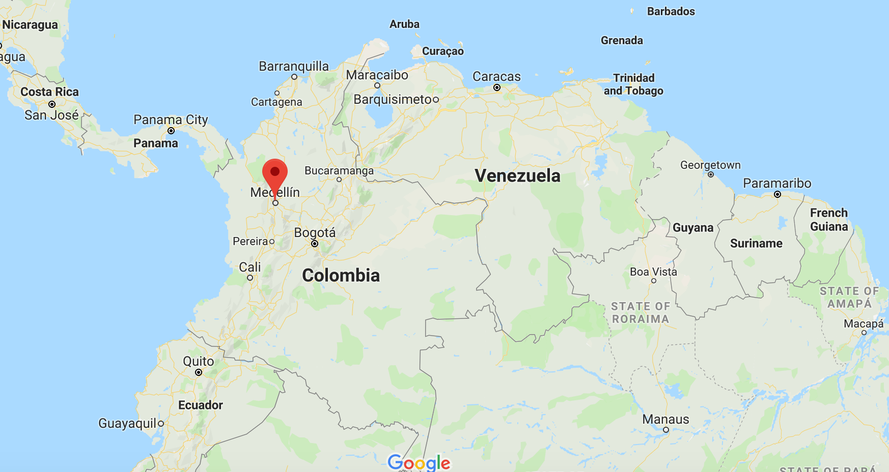
]
]

.pull-right[
.center[
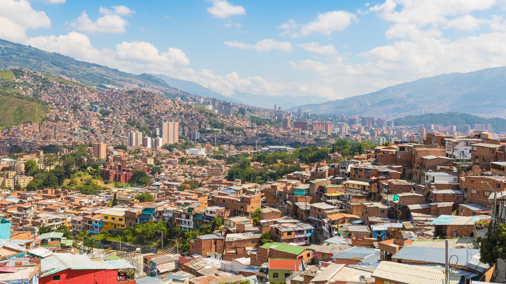
]

]

.source[Blattman, Christopher, Gustavo Duncan, Benjamin Lessing, and Santiago Tobon, 2019, "Gangs of Medellin: How Organized Crime is Organized," Working Paper]

---

# Example 1: Life in Medellin, Colombia II

.pull-left[
- Historically, weak State presence into peripheries
- Hillsides full of displaced people, immigrants, poor
- Limited access to public goods (police, courts, services, etc)
]

.pull-right[
.center[
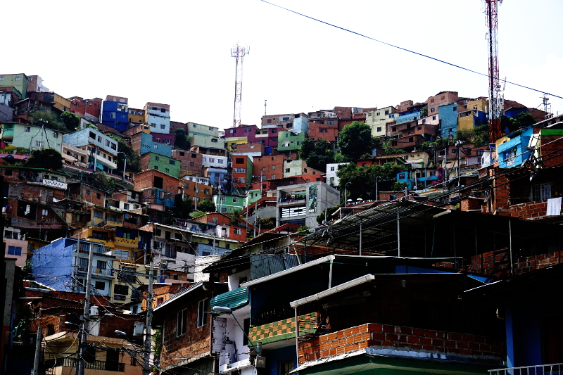
]

]

.source[Blattman, Christopher, Gustavo Duncan, Benjamin Lessing, and Santiago Tobon, 2019, "Gangs of Medellin: How Organized Crime is Organized," Working Paper]

---

# Example 1: Life in Medellin, Colombia III

.pull-left[
- More than 300 local youth gangs
- Began in low income neighborhoods
- with business in illicit trade:
    - Protection rackets
    - Local trafficking
    - Moneylending, loan sharking
    - Voter "mobilization"
]

.pull-right[
.center[
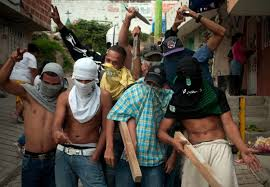
]

]

.source[Blattman, Christopher, Gustavo Duncan, Benjamin Lessing, and Santiago Tobon, 2019, "Gangs of Medellin: How Organized Crime is Organized," Working Paper]

---

# Example 1: Life in Medellin, Colombia IV

.pull-left[
- Gangs take on other "stately" roles:
    - Adjudicating disputes, enforcing property rights
    - Police against (outside) thieves
    - Local employment programs
    - Collecting "taxes" regularly
]

.pull-right[
.center[
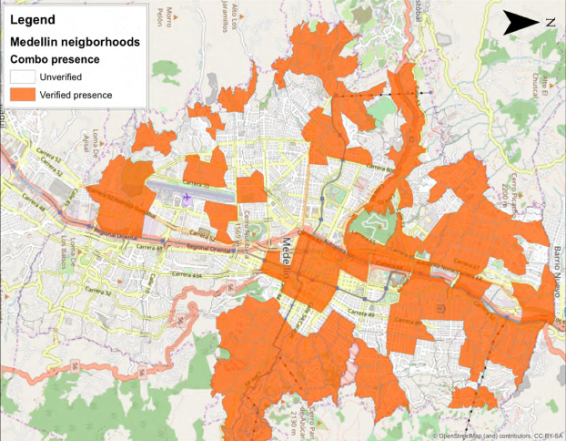
]

]

.source[Blattman, Christopher, Gustavo Duncan, Benjamin Lessing, and Santiago Tobon, 2019, "Gangs of Medellin: How Organized Crime is Organized," Working Paper]

---

# Example 1: Life in Medellin, Colombia V

- Violence has been reduced and stabilized, with periodic flare ups

.center[
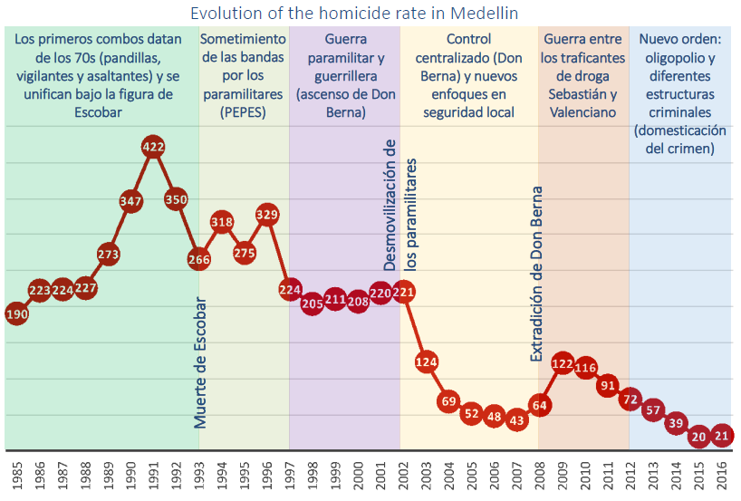
]

.source[Blattman, Christopher, Gustavo Duncan, Benjamin Lessing, and Santiago Tobon, 2019, "Gangs of Medellin: How Organized Crime is Organized," Working Paper]

---

# Example 1: Life in Medellin, Colombia VI

.center[

In what sense is Medellin "underdeveloped?"
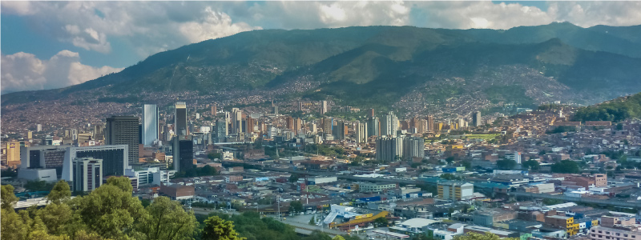
]

---

# Example 2: United States in the 18<sup>th</sup>-19<sup>th</sup> Century I

.pull-left[

- On the one hand:
    - Nation founded on principles that "all men are created equal" and endowed with "unalienable rights [to] life, liberty, and the pursuit of happiness"
    - Vibrant "Town Hall" culture of civic participation in democracy and civil society
    - de Tocqueville: Americans have mastered "the art of association"
]

.pull-right[
.center[
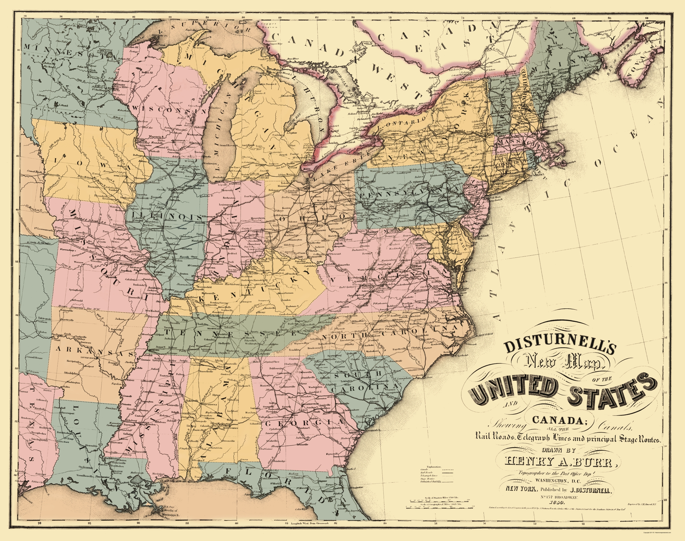
]
]

---

# Example 2: United States in the 18<sup>th</sup>-19<sup>th</sup> Century II

.pull-left[

- On the other hand:
    - Revolution was led by elite land-owners, merchants, and some slave-owners
    - Voting restricted to a small number of male property owners 
]

.pull-right[
.center[

]
]

---

# Example 2: United States in the 18<sup>th</sup>-19<sup>th</sup> Century III

.center[
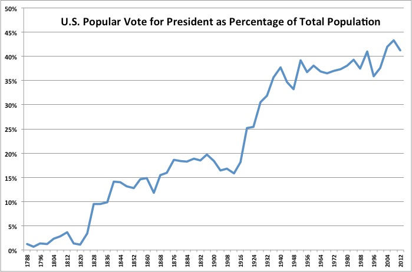
]

.source[Source: [Wikipedia](https://en.wikipedia.org/wiki/Voter_turnout_in_the_United_States_presidential_elections#/media/File:U.S._Vote_for_President_as_Population_Share.png)]

---

# Example 2: United States in the 18<sup>th</sup>-19<sup>th</sup> Century IV

.pull-left[

- U.S. States and Federal Government was *clientelist*<sup>1</sup>, no *professional* bureaucracy until the Pendelton Civil Service Reform Act of 1883
    - Political parties delegated public offices to political allies
    
- Cities governed by "political machines"
    - Vote buying, fraud, intimidation
]

.pull-right[

]

.footnote[<sup>1</sup> Also called "patronage" or "the spoils system". ]

---

# Example 2: United States in the 18<sup>th</sup>-19<sup>th</sup> Century IV

.center[
<iframe width="980" height="550" src="https://www.youtube.com/embed/OQ04YdyQPAc" frameborder="0" allow="accelerometer; autoplay; encrypted-media; gyroscope; picture-in-picture" allowfullscreen></iframe>
]

---

# Example 2: United States in the 18<sup>th</sup>-19<sup>th</sup> Century V

.left-column[

.center[


George Washington Plunkitt

1842-1924
]
]

.right-column[

.smallest[
> EVERYBODY is talkin' these days about Tammany men growin' rich on graft, but nobody thinks of drawin' the distinction between honest graft and dishonest graft. There's all the difference in the world between the two. Yes, many of our men have grown rich in politics. I have myself. I've made a big fortune out of the game, and I'm gettin' richer every day, but I've not gone in for dishonest graft—blackmailin' gamblers, saloonkeepers, disorderly people, etc.—and neither has any of the men who have made big fortunes in politics.

> There's an honest graft, and I'm an example of how it works. I might sum up the whole thing by sayin': "I seen my opportunities and I took 'em." 

]

.source[[*Plunkitt of Tammany Hall*](https://www.gutenberg.org/files/2810/2810-h/2810-h.htm#link2HCH0001), Ch. 1]
]

---

# A Hypothesis to Consider

.pull-left[

- These are characteristics of "normal countries"
    - Middle-income, still industrializing economies
    - Endemic corruption, but can still be consistent with economic growth
        - "honest graft vs. dishonest graft?"

- Note: "normal" $\neq$ "good" or "just"!

- Democratic, politically free countries with open access and low corruption are a *very* new thing historically!
]

.pull-right[


]

.source[Shleifer, Andrei and Daniel Treisman, 2005, "A Normal Country: Russia after Communism," *Journal of Economic Perspectives* 19(1): 151-174]

---

# Political Development and Economic Development I

.pull-left[
.smaller[
- Is a "developed country" *politically* developed?

- What does that mean? .hi[Democracy]?

- Is democracy important for 
    - economic development?
    - human flourishing?
    - (how do those two concepts overlap?)

- If not (or not only) democracy, then what?

- .hi-purple[state capacity]
]
]
.pull-right[

.center[

]
]

---

# Political Development and Economic Development II

.center[
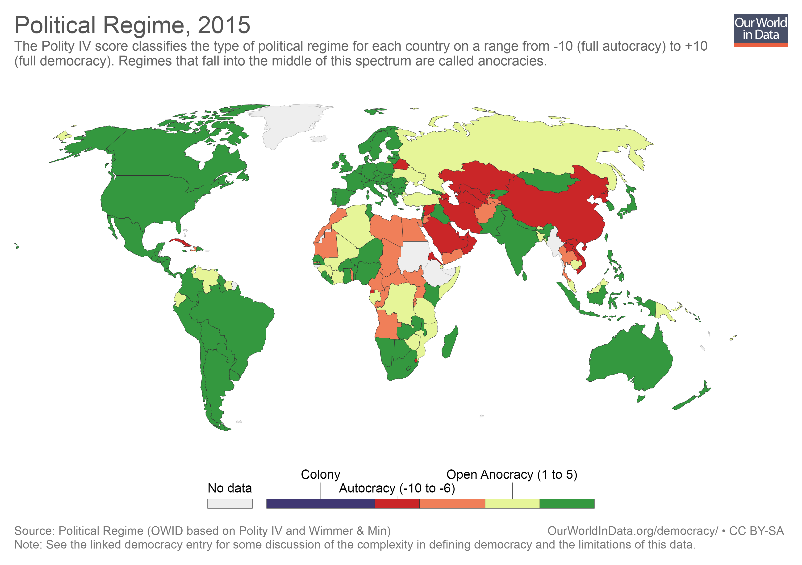
]

.source[Sources: [Our World in Data: Democracy](https://ourworldindata.org/democracy); [Polity IV Data](https://www.systemicpeace.org/polity/polity4.htm)]

---

# Political Development and Economic Development III

.center[
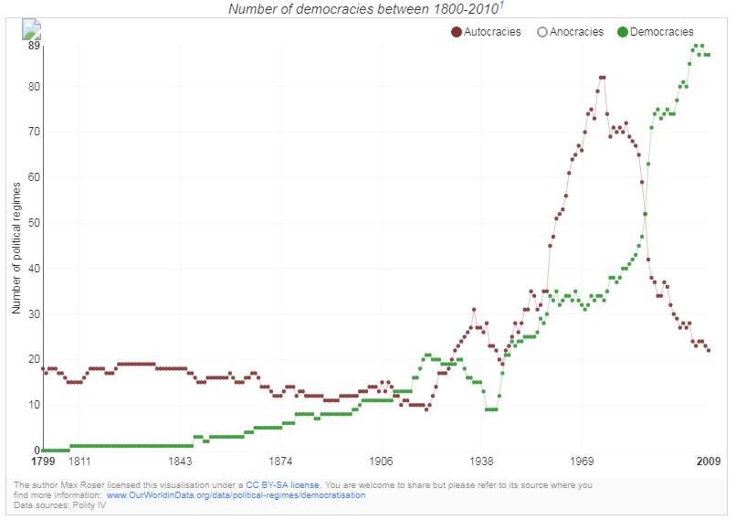
]

.source[Source: [Our World in Data: Democracy](https://ourworldindata.org/democracy)]

---

# Political Development and Economic Development IV

.center[
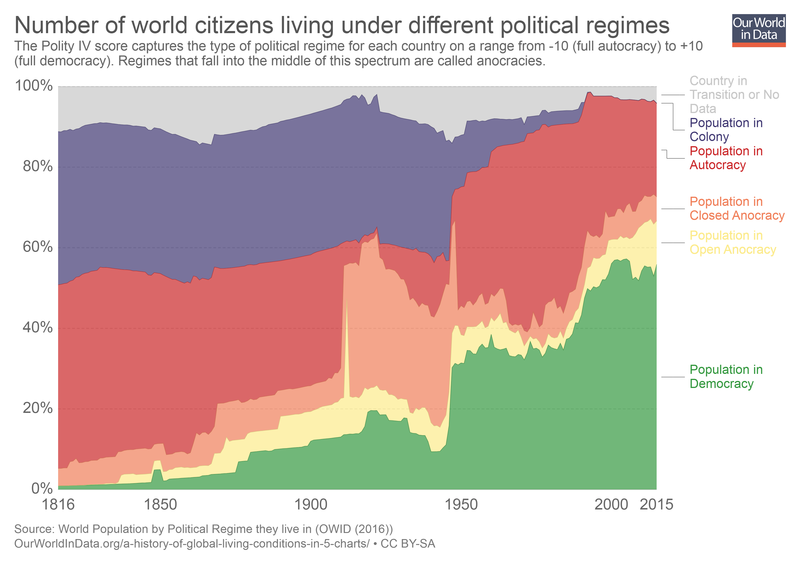
]

.source[Source: [Our World in Data: Democracy](https://ourworldindata.org/democracy)]

---

# Political Development and Economic Development V

.center[
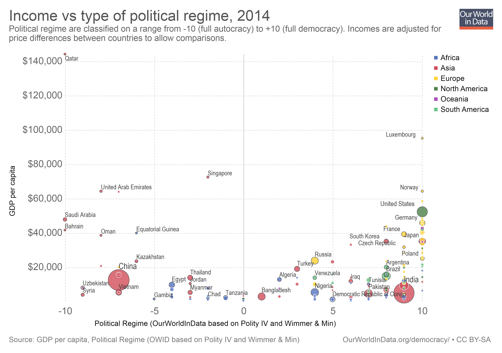
]

.source[Source: [Our World in Data: Democracy](https://ourworldindata.org/democracy)]

---

# Political Development and Economic Development VI

.center[
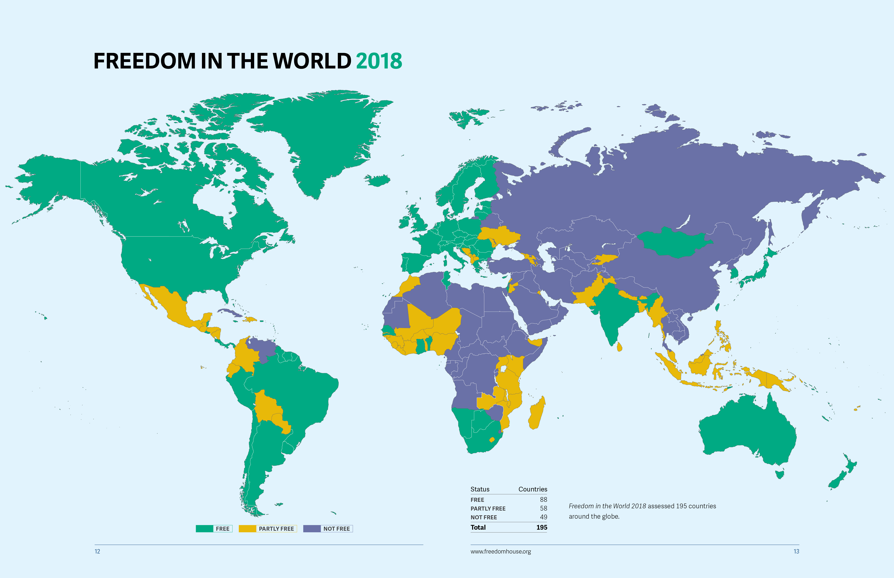
]

.source[Freedom House, 2018, [Freedom of the World](https://freedomhouse.org/report/freedom-world/freedom-world-2018)]

---

# Political Development and Economic Development VII

```{r, load-data, echo=F}
library("tidyverse")
library("here")
library("ggrepel")
polfreedom<-read.csv(here("./static/data/freedomhouse2018.csv"))
econfreedom<-read.csv(here("./static/data/econfreedom.csv"))
```

```{r}
polfreedom2<-polfreedom %>%
  select(Country.Territory, Total)

polfreedom2<-rename(polfreedom2,Country=Country.Territory)

# combine datasets
freedom<-left_join(econfreedom, polfreedom2, by="Country")

interest<-filter(freedom, ISO %in% c("ARG", "SGP", "NOR", "KWT", "MEX", "TUR", "CHN", "JPN", "USA"))

```

.center[
```{r, plot1, echo=F, fig.height=3, out.width="90%", fig.retina=3}
ggplot(data=freedom, aes(x=ef,y=Total))+
  geom_point(aes(color=continent))+
  geom_smooth(data=freedom,method="lm")+
  geom_label_repel(data=interest, aes(ef, Total, label=ISO,color=continent),alpha=0.6)+
  xlab("Economic Freedom Score")+ylab("Political Freedom Score")+theme_bw()+labs(caption="Sources: Frasier Institute, Freedom House")

```
]

.source[Economic Freedom Score (2016) from [Fraser Institute Data](https://www.fraserinstitute.org/economic-freedom/dataset?geozone=world&year=2016&page=dataset); Political Freedom Score from [Freedom House Data](https://freedomhouse.org/content/freedom-world-data-and-resources)
]

---

# Political Development and Economic Development VIII

.center[
```{r, plot2, echo=F, fig.height=3, out.width="90%", fig.retina=3}
ggplot(data=freedom, aes(x=Total,y=gdp))+
  geom_point(aes(color=continent))+
  geom_smooth()+
  geom_label_repel(data=interest, aes(Total, gdp, label=ISO, color=continent),alpha=0.6, nudge_x=1, nudge_y=1)+
  scale_y_continuous(name="GDP per Capita ($)", labels=scales::dollar, breaks=seq(0,100000,20000))+
  xlab("Political Freedom Score")+ylab("GDP per Capita")+labs(caption="Sources: Gapminder, Freedom House")+theme_bw()
```
]

.source[GDP per Capita (2018) from [Gapminder](https://gapminder.org/tools); Political Freedom Score from [Freedom House Data](https://freedomhouse.org/content/freedom-world-data-and-resources)
]

---

class: inverse, center, middle

# Measuring *Economic* Development

---

# What Do We Care About?

.left-column[
.smallest[
Among the major things, macroeconomists care about: 

1. **Economic growth** (rising GDP)

2. **A large working population** (low unemployment rate)

3. **Stable purchasing power** (low inflation rate)

The three most common *macroeconomic* measures of an economy's performance
]
]
.right-column[
.center[

]
]
---

# We Might Also Care About...

.left-column[
- Wealth (in)equality

- Health outcomes

- Life quality/satisfaction

- Environmental quality

- Political stability

- Low corruption

- Human and civil rights (especially for minority groups)
]

.right-column[
.center[

]
]

---

class: inverse, center, middle

# GDP

---

# Gross Domestic Product (GDP)

.pull-left[
.smallest[
- .hi[Gross Domestic Product (GDP)]: market value of all final goods and services produced within a country in a year 
    - market value, measured in current prices (dollars, euros, yen, etc.) 
    - final goods and services 
        - Avoid double-counting intermediate goods
        - Sales of used goods not included 
    - produced within a year (new things only, nothing old)
    - measured within an individual country (inside the borders)
        - includes foreign nationals living here
        - does not include our citizens living abroad (see GNP below)
]
]
.pull-right[
.center[
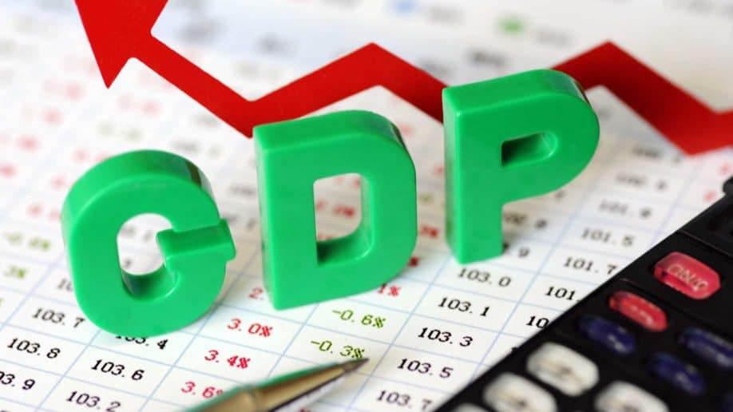
]
]

---

# Gross Domestic Product (GDP)

.pull-left[
- .hi[Gross Domestic Product (GDP)]: the market value of all final goods and services produced within a country in a year 

$$Y=C+I+G+NX$$

- $Y$: national income
- $C$: consumption
- $I$: investment
- $G$: government spending
- $NX$: net exports $=$ exports $(X)-$imports $(M)$
]

.pull-right[
.center[

]
]

---

# GDP in the U.S.

.center[
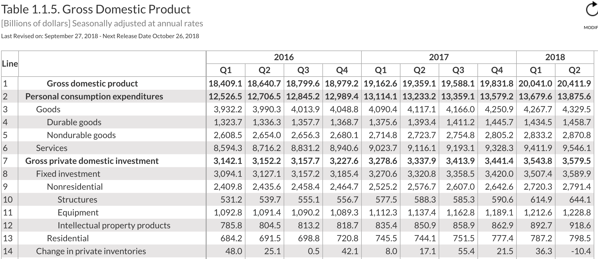

[Bureau of Economic Analysis: GDP Interactive Table](https://apps.bea.gov/iTable/iTable.cfm?isuri=1&reqid=19&step=2&0=survey)
]

---

# Gross National Income

- .hi[Gross National Income (GNI)]<sup>1</sup>: market value of all final goods and services produced by resources owned by a country's citizens both at home *and* abroad
    - i.e. take GDP and add production by Americans *living abroad*

- Comparing GDP to GNP shows how much a nation's citizens' wealth comes from domestic vs. international sources

.footnote[<sup>1</sup> This used to be called Gross National Product (GNP).]

---

# GDP per Capita

.pull-left[
.smallest[
- GDP/GNI is a rough measure 
    - If a tiny country and a large country have the same GDP, who is better off? 
    - Want to weight GDP by the size of a country 
- .hi[GDP per capita] is a measure of **income per person**<sup>1</sup>:
$$\text{GDP per capita}=\frac{\text{Gross Domestic Product}}{\text{Population}}$$

- A better measure of how the "average" person is doing in a country
]
]
.pull-right[
.center[

]
]

.footnote[<sup>1</sup> Capita means person.]

---

# GDP per Capita II

.center[
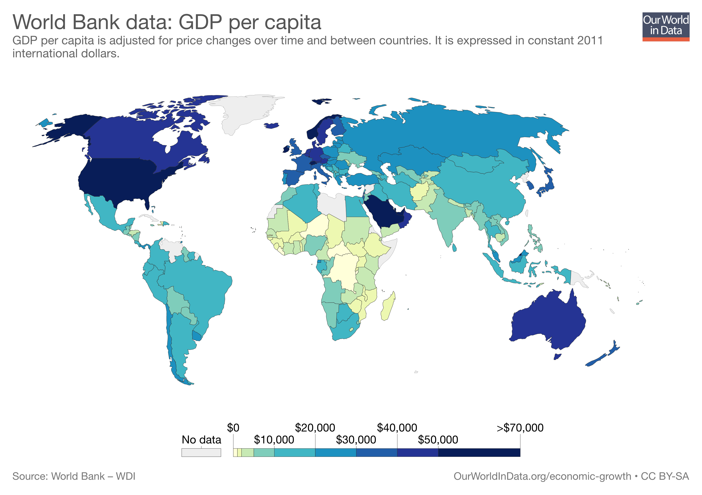
]

---

# Country "Income Levels"

The World Bank [defines](https://datatopics.worldbank.org/world-development-indicators/stories/the-classification-of-countries-by-income.html) as of 1 July 2018 countries as being:

| Income level | GNI per capita | 
|----|----|
| High income | $>12,055$ | 
| Upper-middle income | $3,896-12,055$ | 
| Middle income | $996-3,895$ | 
| Low income | $\leq995$ | 

---

# Country "Income Levels" II

.center[
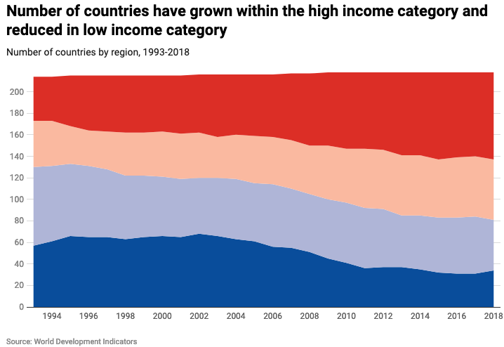
]

.source[Source: [World Bank](https://datatopics.worldbank.org/world-development-indicators/stories/the-classification-of-countries-by-income.html)]

---

# Country "Income Levels" III

.center[
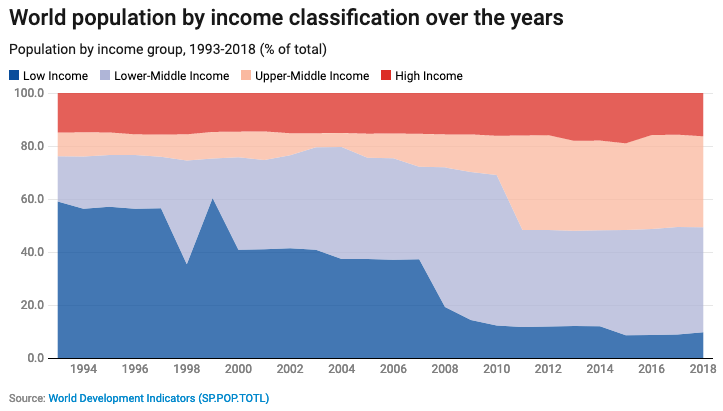
]

.source[Source: [World Bank](https://datatopics.worldbank.org/world-development-indicators/stories/the-classification-of-countries-by-income.html)]

---

# Comparing Across Countries I

.pull-left[

- To compare GDP across countries that use different currencies (e.g. Pounds, Euros, Yen, Yuan), we need a **common denominator** by using an .hi-purple[exchange rate] between currencies

- .hi-purple[Exchange Rates] express the amount of one currency needed to convert to 1 unit of another 

]

.pull-right[
.center[
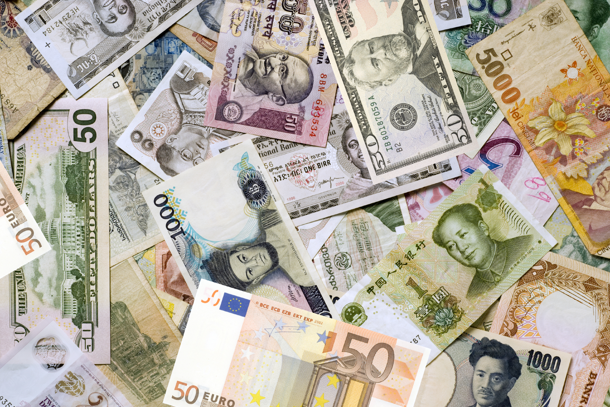
]
]

---

# Comparing Across Countries I

.pull-left[
.smallest[
- To compare GDP across countries that use different currencies (e.g. Pounds, Euros, Yen, Yuan), we need a **common denominator** by using an .hi-purple[exchange rate] between currencies

- .hi-purple[Exchange Rates] express the amount of one currency needed to convert to 1 unit of another 

.bg-washed-green.b--dark-green.ba.bw2.br3.shadow-5.ph4.mt5[
.green[**Example**:]
$$\begin{align*}
0.88 \text{ EUR}&: 1 \text{ USD}\\
0.78 \text{ GBP}&: 1 \text{ USD}\\
1.30 \text{ CAD}&: 1 \text{ USD}\\
\end{align*}$$
]
]
]

.pull-right[
.center[

]
]

---

# Comparing Across Countries II

- To calculate another country's GDP in US Dollars: 


$$\text{Other Country's GDP in USD}=\frac{\text{Other Country's GDP in Local Currency}}{\text{Exchange Rate for 1 USD}}$$

---

# Comparing Across Countries: Example

.bg-washed-green.b--dark-green.ba.bw2.br3.shadow-5.ph4.mt5[
.green[**Example**]: Great Britain's GDP in 2018 is £2.307 trillion GBP. One USD ($) exchanges for 0.88 pounds sterling (£). Calculate British GDP in US Dollars. 

$$\begin{align*}
\text{Britain's GDP in USD}&=\frac{£2.307\text{ trillion}}{\text{£0.88/\$1 }}\\
&=\$2.622\text{ trillion }\\
\end{align*}$$
]

---

# Purchasing Power Parity (PPP) I

.pull-left[

- Economists hypothesize that once converted to a common currency, prices should be roughly identical across countries, i.e. there should be .hi[purchasing power parity]

e.g. whether you buy using Dollars in US or Euros in EU, you should get the same amount of goods on average

]

.pull-right[
.center[

]
]

---

# Purchasing Power Parity (PPP) II

.pull-left[

- PPP is essentially an argument about .hi-purple[arbitrage] and the .hi-purple[law of one price]

.bg-washed-green.b--dark-green.ba.bw2.br3.shadow-5.ph4.mt5[
.green[**Example**]: Suppose a sweater in the U.S. costs 50 USD. 

- Suppose the exchange rate is 100 YEN: 1 USD

- Then the price of the same sweater in Japan should be 5000 YEN

- Otherwise, an arbitrage opportunity!

]

]

.pull-right[
.center[

]
]

---

# Purchasing Power Parity (PPP) II

.pull-left[

- Ah, but transaction costs!
    - Transportation costs
    - Non-tradeable or transportable goods
    - Services?
    - Differences in institutions, culture, property rights
    - Baumol's "cost disease"

- Example: A haircut of similar quality in Norway is $65, $5 in Mexico, and $1 in India
]

.pull-right[
.center[

]
]

---

# Purchasing Power Parity (PPP) III

.pull-left[
.center[
[The Economist: Big Mac Index](https://www.economist.com/news/2019/07/10/the-big-mac-index)

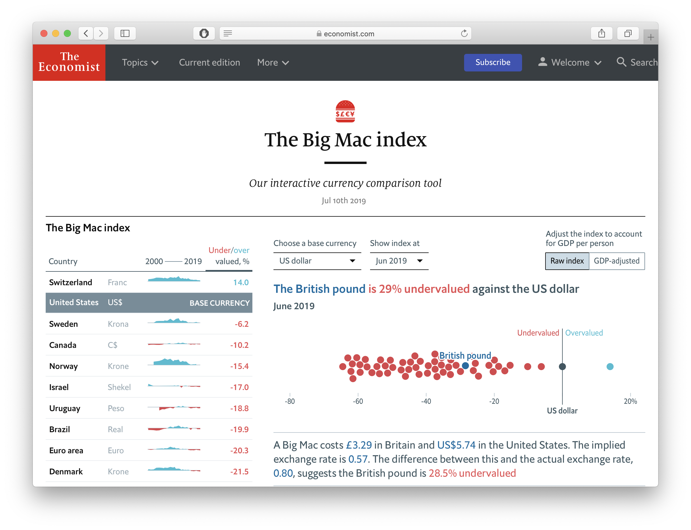

]
]

.pull-right[

.center[

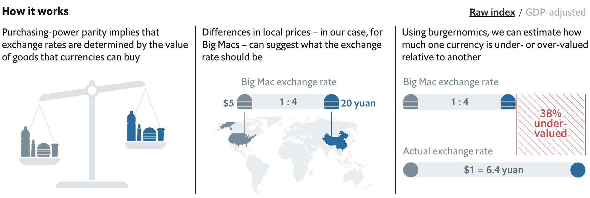

]
]

---

# Purchasing Power Parity (PPP) IV

- Economists often use the Geary-Khamis dollar, aka the ".hi-purple[international dollar]" as the standard hypothetical unit
    - The purchasing power of a US Dollar at a specified year, such as the *2000 US Dollar*

- Again, main purpose is to make accurate comparisons of measures such as GDP per capita across countries

---

# Quantifying Changes I

- Several ways we can talk about how a measure **changes** over time, from time $t_1 \rightarrow t_2$

- .hi-purple[Difference `\\((\Delta)\\)`:] the difference between the value at time $t_1$ and time $t_2$
$$\Delta t=t_2-t_1$$
---

# Quantifying Changes II

- Several ways we can talk about how a measure **changes** over time, from time $t_1 \rightarrow t_2$

- .hi-purple[Difference `\\((\Delta)\\)`:] the difference between the value at time $t_1$ and time $t_2$
$$\Delta t=t_2-t_1$$

- .hi-purple[Relative Difference]: the difference expressed **in terms of the original value**
$$\frac{\Delta t}{t_1} = \frac{t_2-t_1}{t_1}$$
 this becomes a proportion (a decimal)

---

# Quantifying Changes III

- .hi-purple[Percentage Change (Growth Rate)]: **relative** difference expressed as a **percentage**

$$\begin{align*}
\% \Delta &= \frac{\Delta t}{t_1} \times 100\%\\
&=\frac{t_2-t_1}{t_1} \times 100\% \\ 
\end{align*}$$

---

# A Simple Example Growth Rate 

.bg-washed-green.b--dark-green.ba.bw2.br3.shadow-5.ph4.mt5[
.green[**Example**:]
A country's GDP is $100bn in 2019, and $120bn in 2020. Calculate the country's GDP growth rate for 2020:
]

---

# GDP Growth Rates

.center[
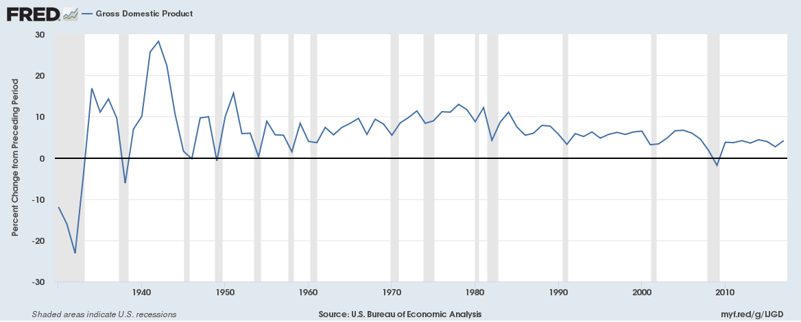

[Federal Reserve Economic Data: GDP Growth Rate](https://fred.stlouisfed.org/series/A191RP1A027NBEA)
]

---

# The Rule of 72 I

.pull-left[
- A good .hi-purple[rule of thumb]: years for economy to *double*

$=\frac{72}{\text{GDP Growth Rate}}$

- This is known as the .hi-purple[Rule of 72]<sup>*</sup>
]
.pull-right[
.center[

]
]

.footnote[<sup>*</sup> Different people use other numbers, like 70. The point is more to make mental calculations easily rather than accurately.]

---

# The Rule of 72 II

.bg-washed-green.b--dark-green.ba.bw2.br3.shadow-5.ph4.mt5[
.green[**Example**:]

- If our economy is growing at **2% per year**, the economy doubles in $\frac{72}{2}=36$ years
]

---

# The Rule of 72 II

.bg-washed-green.b--dark-green.ba.bw2.br3.shadow-5.ph4.mt5[
.green[**Example**:]

- If our economy is growing at **2% per year**, the economy doubles in $\frac{72}{2}=36$ years

- If our economy is growing at **3% per year**, the economy doubles in $\frac{72}{3}=24$ years

]

---

# The Rule of 72 II

.bg-washed-green.b--dark-green.ba.bw2.br3.shadow-5.ph4.mt5[
.green[**Example**:]

- If our economy is growing at **2% per year**, the economy doubles in $\frac{72}{2}=36$ years

- If our economy is growing at **3% per year**, the economy doubles in $\frac{72}{3}=24$ years

- If our economy is growing at **4% per year**, the economy doubles in $\frac{72}{4}=18$ years

]

---

# The Rule of 72 II

.bg-washed-green.b--dark-green.ba.bw2.br3.shadow-5.ph4.mt5[
.green[**Example**:]

- If our economy is growing at **2% per year**, the economy doubles in $\frac{72}{2}=36$ years

- If our economy is growing at **3% per year**, the economy doubles in $\frac{72}{3}=24$ years

- If our economy is growing at **4% per year**, the economy doubles in $\frac{72}{4}=18$ years

- If our economy is growing at **6% per year**, the economy doubles in $\frac{72}{6}=12$ years

]

---

# The Rule of 72 III

.pull-left[
- Growth rates are **unbelievably** important!

- It makes *all the difference in the world* if we grow at 2% vs. 3% per year
    - Our economy would double in size in 36 vs. 24 years!
    
- More importantly, growth compounds! 
    - A 2% increase from 100 is an increase of 2
    - A 2% increase from 1000 is an increase of 20!
]

.pull-right[
.center[

]
]

---

# The Rule of 72 IV

.pull-left[
.bg-washed-green.b--dark-green.ba.bw2.br3.shadow-5.ph4.mt5[
.smallest[
.green[**Example**]: Suppose 2 countries start with the same GDP of $1 Trillion

- Country A grows at 2% per year
- Country B grows at 4% per year

- After 72 years:
    - Country A doubles twice ($4 Trillion)
    - Country B doubles four times ($16 Trillion)
        - Country B is 4x as wealthy as Country A!
]
]
]
.pull-right[
.center[

]
]

---

# Limitations of GDP: Things Not Measured

.pull-left[

- GDP is a good but (like every other measure) an imperfect measure for social welfare and standard of living

- Things *NOT* included in GDP:
    - Increase in leisure time
    - Social media, digital networks (aside from advertising)
    - Increase in nonmarket or domestic activities (housework, unpaid child care)
]

.pull-right[
.center[


]
]

---

# Limitations of GDP: Quality Improvements?

- How do we measure improvements in quality, or new innovations? 

.center[

]

---

# Limitations of GDP: Shadow Economies I

.pull-left[

- GDP by definition cannot measure the .hi[shadow economy] or the ".hi[informal sector]" 

- A major component of developing countries' economies

- Staggering numbers, % of recorded GDP:  
    - Nigeria 1989-1990: 76%
    - Thailand 1989-1990: 71%
    - Russia 1994-1995: 41%
    - Norway 1989-1990: 9%

]

.pull-right[
.center[

]
]

.source[Schneider, Friedrich and Dominik H. Enste, 2000, "Shadow Economies: Sizes, Causes, and Consequences," *Journal of Economic Literature* 37(1): 77-114]

---

# Limitations of GDP: Shadow Economies II

.pull-left[

- Don't just think crime, drugs, and human trafficking!

- For various reasons, many citizens of many countries do not have access to legal  markets for goods and services

- Resort to .hi[informal economies] and .hi[black markets] to exchange goods and services

]

.pull-right[
.center[

]
]

---

# Limitations of GDP: Shadow Economies II

.left-column[

.center[

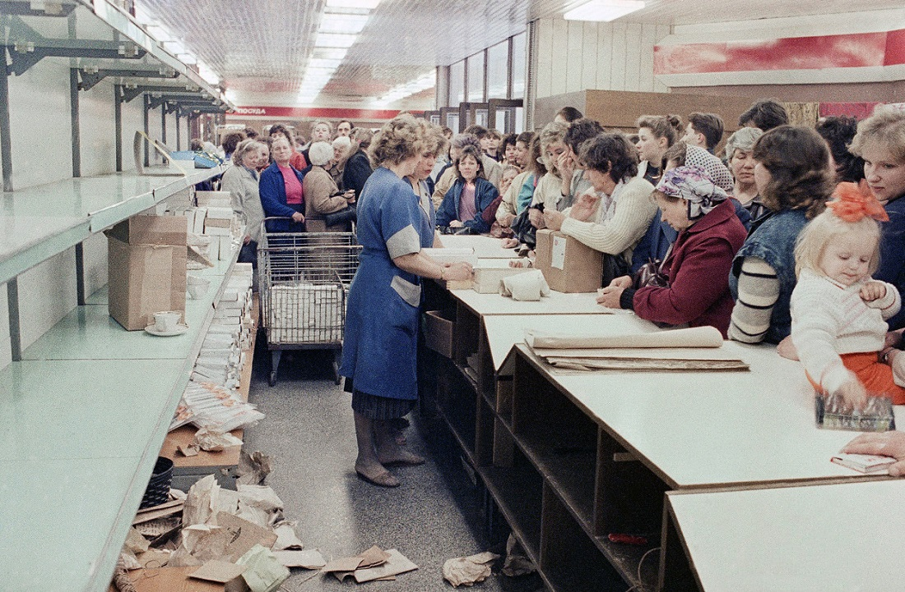

A typical grocery store in Vilnius, Soviet-controlled Lithuania, 1990
]

]

.right-column[

.smallest[
> The list of scarce items is practically endless. They are not permanently out of stock, but their appearance is unpredictable...Leningrad can be overstocked with cross-country skis and yet go several months without soap for washing dishes. In the Armenian capital of Yerevan, I found an ample supply of accordians but local people complained that they had gone for weeks without ordinary kitchen spoons or tea samovars. I knew a Moscow family that spent a frantic month hunting for a child’s potty while radios were a glut on the market...

> In an economy of chronic shortages and carefully parceled-out privileges, blat is an essential lubricant of life. The more rank and power one has, the more blat one normally has ... each has access to things or services that are hard to get and that other people want or need. 

Consumers: The Art of Queuing, in *The Russians*
]

]

.source[Smith, Hedrick, 1976, *The Russians*]

---

# Limitations of GDP: Shadow Economies III

.pull-left[

.center[

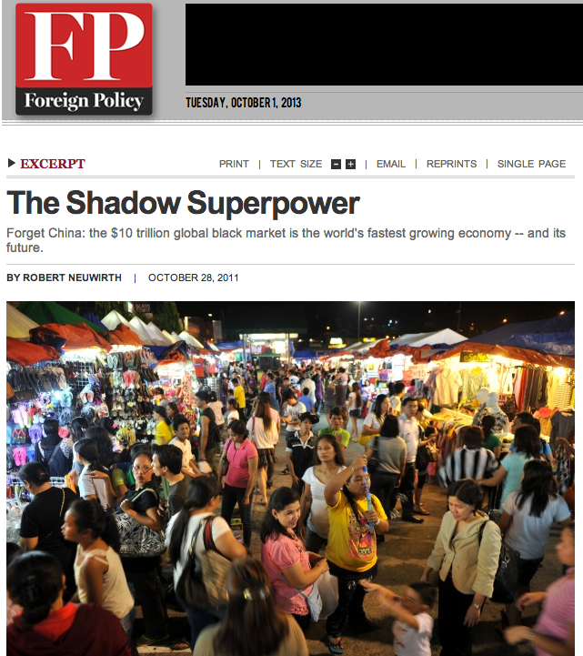

.font80[
Source: [*Foreign Policy*: "The Shadow Superpower" (October 28, 2011)](http://www.foreignpolicy.com/articles/2011/10/28/black_market_global_economy)
]
]

]

.pull-right[

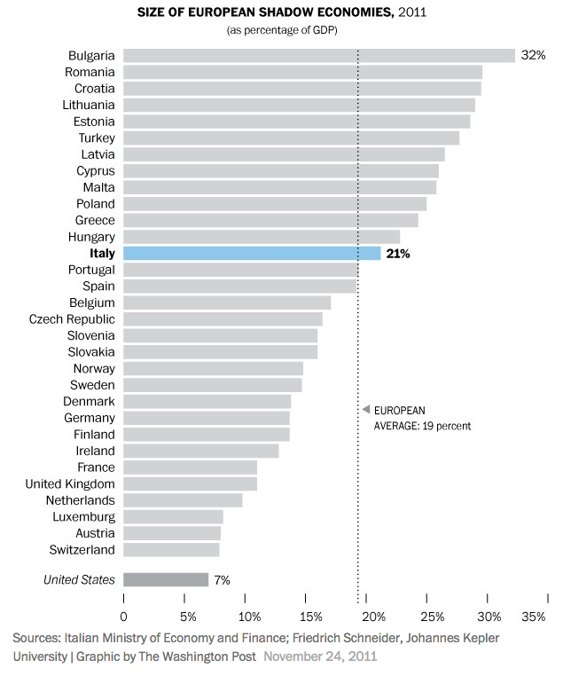

.font80[
Source: [*Washington Post*: "Italy’s tax evasion culture" (November 24, 2011)](https://www.washingtonpost.com/world/italyS^tax-evasion-culture/2011/11/24/gIQAvSletN_graphic.html?utm_term=.f48a96e188a6)
]
]

.source[Smith, Hedrick, 1976, *The Russians*]

---

# Limitations of GDP: Shadow Economies IV

.center[
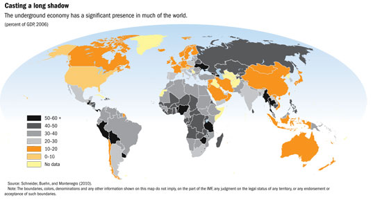

]

.source[Source: [IMF](https://www.imf.org/external/pubs/ft/fandd/2012/06/singh.htm)]

---

# Limitations of GDP: Compared to What?

.pull-left[

- Again, GDP is a flawed measure

- But remember, economists always ask, "compared to what?"

- You will see later on that variation in GDP between countries and over time strongly explain variation in other measures we care about
]

.pull-right[
.center[

]
]