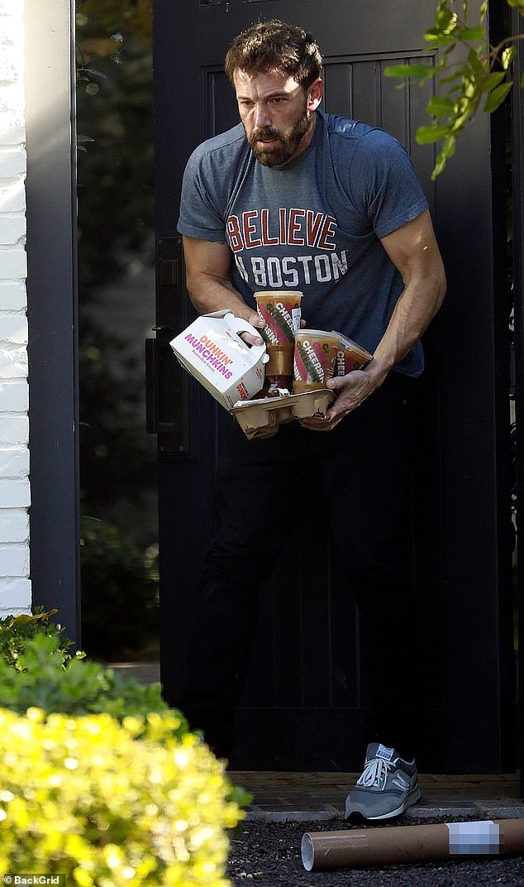

```{r setup, include=FALSE}
options(htmltools.dir.version = FALSE)
knitr::opts_chunk$set(echo=F,
                      message=F,
                      warning=F,
                      fig.retina = 3,
                      fig.align = "center")
library("tidyverse")
library("ggrepel")
library("fontawesome")
xaringanExtra::use_tile_view()
xaringanExtra::use_tachyons()
xaringanExtra::use_freezeframe()

update_geom_defaults("label", list(family = "Fira Sans Condensed"))
update_geom_defaults("text", list(family = "Fira Sans Condensed"))

set.seed(256)

theme_slides <- theme_light() + 
  theme(
    text = element_text(family = "Fira Sans", size = 24)
  )

```

class: inverse

# Outline

### [Development as Freedom](#)
### [Poverty and Basic Human Needs](#)
### [Inequality](#)
### [Why Development Matters](#)

---

class: inverse, middle, center

# Development as Freedom

---

# GDP Ain't Everything

.left-column[

.center[


Robert F. Kennedy

1925-1968
]
]

.right-column[

> Yet the Gross National Product does not allow for the health of our children, the quality of their education or the joy of their play. It does not include the beauty of our poetry, of the strength of our marriages, the intelligence of our public debate or the integrity of our public officials.

> It measures neither our wit nor our courage, neither our wisdom nor our learning, neither our compassion nor our devotion to our country, it measures everything in short, except that which makes life worthwhile.

]
.source[Source: [March 18, 1968 Speech](https://www.jfklibrary.org/learn/about-jfk/the-kennedy-family/robert-f-kennedy/robert-f-kennedy-speeches/remarks-at-the-university-of-kansas-march-18-1968)]

---

# Development as Freedom I

.left-column[
.center[


.smallest[
Amartya Sen

1933-

Economics Nobel 1998
]
]
]

.right-column[

.center[

]
]

---

# Development as Freedom II

.left-column[
.center[

.smallest[
Amartya Sen

1933-

Economics Nobel 1998
]
]
]
.right-column[

.smaller[
> “Insofar as development is concerned with the achievement of a better life, the focus of development analysis has to include the nature of the life that people succeed in living. This incorporates, of course, the length of the life itself, and thus life expectancy data have an immediate relevance to the living standard and through that to the concept of development...People value their ability to do certain things and to achieve certain types of beings (such as being well nourished, being free from avoidable morbidity, being able to move about as desired, and so on). These "doings" and "beings" may be generically called "functionings" of a person,” (p.15).

]

.source[Sen, Amartya, 1998, "The Concept of Development," in H. Chenery and T. N. Srinivasan, eds., *Handbook of Development Economics*, Vol. 1, Elsevier Science Publishers.]

]

---

# Wealth is a Means, not an End

.left-column[
.center[


.smallest[
Aristotle

384 BC-322 BC
]
]
]
.right-column[

> The life of money-making is one undertaken under compulsion, and wealth is evidently not the good we are seeking; for it is merely useful and for the sake of something else.

]

.source[Aristotle, *Nicomachean Ethics*]

---

# Development as Freedom: Overview

.left-column[
.center[

.smallest[
Amartya Sen

1933-

Economics Nobel 1998
]
]
]

.right-column[

- Think about development in terms of ".shout[capabilities]"

- Central aspect of well-being is .shout[functioning]: the freedom of choice and control over one's life

- *Positive* freedoms, vs. *negative* freedoms
    - freedom from hunger
    - freedom from disease
    - freedom from early death
    - freedom from violence
    - freedom from oppression
    - freedom to choose own path
    - ...

]

---

# Human Development Index

.center[

]

.source[Source: [U.N. Development Programme Human Development Reports](http://hdr.undp.org/en/content/human-development-index-hdi)]

---

# Human Development Index II

.center[
<iframe src="https://ourworldindata.org/grapher/human-development-index" style="width: 100%; height: 600px; border: 0px none;"></iframe>
]

---

# Human Development Index III

.center[
<iframe src="https://ourworldindata.org/grapher/human-development-index-escosura?time=1870..2015" style="width: 100%; height: 600px; border: 0px none;"></iframe>
]

---

# Human Development Index IV

.center[
<iframe src="https://ourworldindata.org/grapher/hdi-vs-gdp-per-capita" style="width: 100%; height: 600px; border: 0px none;"></iframe>
]

---

# Capabilities, Freedom, and GDP per Capita I

> "We do not disagree with either Nussbaum or Sen on the shortcomings of the preoccupation with per capita GDP calculations. However, we believe there is a general pattern to be found between the adoption of the institutions that promote the wealth of a nation and the health and well-being of its people. In other words, life expectancy, infant mortality, educational opportunities, and health outcomes are well correlated with GDP" (p.110).

.source[Boettke, Peter J and J Robert Subrick, 2003, "Rule of Law, Development, and Human Capabilities," *Supreme Court Economic Review* 10:  109-126]

---

# Capabilities, Freedom, and GDP per Capita II 

> "Our first conjecture is that the rule of law is a significant factor in explaining economic development. This is hardly controversial...Our second conjecture is that economic development is a significant factor in determining increases in what Sen entitles human capabilities... (p.111).

> "In short, we expect that the rule of law will increase the level of de- velopment, and the level of development will lead to improvements in human capabilities. That is, the rule of law is an institutional fea- ture that promotes economic development that, in turn, leads to in- creases in those capabilities that Nussbaum and Sen argue are neces- sary for living a human life. Economic development, in short, provides the material pre-requisites that enable human flourishing," (p.112).

.source[Boettke, Peter J and J Robert Subrick, 2003, "Rule of Law, Development, and Human Capabilities," *Supreme Court Economic Review* 10:  109-126]

---

# Capabilities, Freedom, and GDP per Capita III

.center[


p. 122
]
.source[Boettke, Peter J and J Robert Subrick, 2003, "Rule of Law, Development, and Human Capabilities," *Supreme Court Economic Review* 10:  109-126]

---

class: inverse, center, middle
# Poverty and Basic Human Needs

---

# Extreme Poverty I

<iframe src="https://ourworldindata.org/grapher/share-of-the-population-living-in-extreme-poverty" style="width: 100%; height: 600px; border: 0px none;"></iframe>

---

# Extreme Poverty II

.center[

]

.source[Source: [Our World in Data: Extreme Poverty](https://ourworldindata.org/extreme-poverty)]

---

# Extreme Poverty III

.center[

]

.source[Source: [Our World in Data: Extreme Poverty](https://ourworldindata.org/extreme-poverty)]

---

# Extreme Poverty IV

.center[

]

.source[Source: [Our World in Data: Extreme Poverty](https://ourworldindata.org/extreme-poverty)]

---

# Extreme Poverty V

.center[

]

.source[Source: [Our World in Data: Extreme Poverty](https://ourworldindata.org/extreme-poverty)]

---

# Poor Countries are Unhappy

.center[

]

.source[Source: [Our World in Data: Extreme Poverty](https://ourworldindata.org/extreme-poverty)]

---

# Ignorance

.center[

]

.source[Source: [Our World in Data: Extreme Poverty](https://ourworldindata.org/extreme-poverty)]

---

# Basic Human Needs Approach

Gordon's proposed poverty threshold is defined as **2 or more deprivations** of:

- **Food deprivation**: Body mass index less than 18.5
- **Water deprivation**:access only to unimproved source such as open wells, open springs or surface water or who have to walk for more than 15 minutes to their water source (30 minutes round-trip)
- **Deprivation of sanitation facilities**: access only to unimproved sanitation facilities
- **Health deprivation**: Treatment not recieved for pregnancy, serious illnesses, no knowledge of safe sex practices (esp. HIV/AIDS)
- **Shelter deprivation**: living in dwellings with 3 or more people per room (overcrowding) or in a house with no flooring (e.g. a mud floor) or inadequate roofing (e.g. natural roofing materials)
- **Education deprivation**: youth who did not complete primary school or who are illiterate
- **Information deprivation**: no access to a radio or television (i.e. broadcast media) at home

.source[[Source](https://www.google.com/url?sa=t&rct=j&q=&esrc=s&source=web&cd=2&cad=rja&uact=8&ved=2ahUKEwiOrN6_ibbkAhWI1lkKHVEcAPUQFjABegQIBBAC&url=http%3A%2F%2Fwww.poverty.ac.uk%2Fsites%2Fdefault%2Ffiles%2Findicators-of-poverty-and-hunger_UNpoverty.pdf&usg=AOvVaw0mlf5jID1rewLlS1W2L3Po)]

---

class: inverse, center, middle
# Inequality

---

# Efficiency and Equality

.pull-left[

- Economists often describe a tradeoff between efficiency and equity in terms of the "economic pie"

- .shout[Efficiency]: efforts to grow the pie
- .shout[Equity]: efforts to divide the pie fairly	

- Economists tend (not exclusively!) to favor efficiency over equity
]

.pull-right[
.center[

]
]

---

# (In)equality *within* Countries: Gini Coefficient I

.center[

]

.source[Source: [Our World in Data: Income Inequality](https://ourworldindata.org/income-inequality)]

---

# (In)equality *within* Countries: Gini Coefficient II

.center[

]

.source[Source: [Wikipedia](https://en.wikipedia.org/wiki/Lorenz_curve#/media/File:Lorenz_curve_global_income_2011.svg)]

---

# (In)equality *within* Countries: Lower in Wealthier Countries

<iframe src="https://ourworldindata.org/grapher/economic-inequality-gini-index" style="width: 100%; height: 600px; border: 0px none;"></iframe>

.source[Source: [Our World in Data: Income Inequality](https://ourworldindata.org/income-inequality)]

---

# (In)equality *within* Countries: But Changing Over Time

.center[

]

.source[Source: [Our World in Data: Income Inequality](https://ourworldindata.org/income-inequality)]

---

# (In)equality *Across* Countries Over Time

.center[

]

.source[Source: [Our World in Data: Income Inequality](https://ourworldindata.org/income-inequality)]

---

# Aside: Equality vs. Equity

.center[

]

---

class: inverse, center, middle
# Why Development Matters

---

# Why Development Matters

.pull-left[

- Economists traditionally care most about .hi[efficiency]

- Achieving a .hi-purple[specified goal] with as .hi-purple[few resources as possible]

- .hi-green[Examples]:
  - driving a car
  - carrying groceries
  - producing jeans
]

.pull-right[
.center[

]
]
---

# Problem: What “Goal” for Society?

.pull-left[

- We will ruminate more on this next class

- .hi-purple[Society, government, etc. has no single, universally-agreed upon goal]
  - It's not maximizing utility, profit, etc!

- “Society” is not a choosing agent!
]

.pull-right[
.center[

]
]

---

# Why Development Matters

.pull-left[

- Preferences are .hi-purple[subjective]
  - .hi-purple[Egalitarianism]: nobody's preferences are dismissed or discounted

- .hi-turquoise[Higher incomes + freedom of choice = greater degree of preference satisfaction]

- Harder to directly evaluate outcomes
  - Better to look at basic processes & mechanisms (e.g. exchange)
]

.pull-right[
.center[

]
]

---

# Smith: Happiness $\neq$ Wealth and Fame

.left-column[
.center[


.smaller[
Adam Smith

1723-1790
]
]

]

.right-column[

> “How many people ruin themselves by laying out money on trinkets of frivolous utility? What pleases these lovers of toys is not so much the utility, as the aptness of the machines are fitted to promote it. All their pockets are stuffed with little conveniencies...They walk about loaded with a multitude of baubles...of which the whole utility is certainly not worth the fatigue of bearing the burden.”

.source[Smith, Adam, 1759, [*The Theory of Moral Sentiments*](https://www.econlib.org/library/Smith/smMS.html)]

]

---

# Smith: Happiness $\neq$ Wealth and Fame

.left-column[
.center[


.smaller[
Adam Smith

1723-1790
]
]

]

.right-column[

.quitesmall[
> “The poor man's son, whom heaven in its anger has visited with ambition, when he begins to look around him, admires the condition of the rich...and fancies he should be lodged more at his ease in a palace...He sees his superiors carried about in machines, and imagines that in one of these he could travel with less inconveniency...He thinks if he had attained all these, he would sit still contentedly, and be quiet, enjoying himself in the thought of the happiness and tranquillity of his situation. He is enchanted with the distant idea of this felicity. It appears in his fancy like the life of some superior rank of beings, and, in order to arrive at it, he devotes himself for ever to the pursuit of wealth and greatness...With the most unrelenting industry he labours night and day to acquire talents superior to all his competitors...For this purpose he makes his court to all mankind; he serves those whom he hates, and is obsequious to those whom he despises...”

]

.source[Smith, Adam, 1759, [*The Theory of Moral Sentiments*](https://www.econlib.org/library/Smith/smMS.html)]

]

---

# Smith: Happiness $\neq$ Wealth and Fame

.left-column[
.center[


.smaller[
Adam Smith

1723-1790
]
]

]

.right-column[

.quitesmall[
> “...Through the whole of his life he pursues the idea of a certain artificial and elegant repose which he may never arrive at, for which he sacrifices a real tranquillity that is at all times in his power, and which, if in the extremity of old age he should at last attain to it, he will find to be in no respect preferable to that humble security and contentment which he had abandoned for it. It is then, in the last dregs of life, his body wasted with toil and diseases, his mind galled and ruffled by the memory of a thousand injuries and disappointments which he imagines he has met with from the injustice of his enemies, or from the perfidy and ingratitude of his friends, that he begins at last to find that wealth and greatness are mere trinkets of frivolous utility, no more adapted for procuring ease of body or tranquility of mind than the tweezer-cases of the lover of toys; and like them too, more troublesome to the person who carries them about with him than all the advantages they can afford him are commodious.”

]

.source[Smith, Adam, 1759, [*The Theory of Moral Sentiments*](https://www.econlib.org/library/Smith/smMS.html)]

]

---

# Smith: But Pursuit of Wealth is *Socially* Useful

.left-column[
.center[


.smaller[
Adam Smith

1723-1790
]
]

]

.right-column[

.quitesmall[
> “The pleasures of wealth and greatness, when considered in this complex view, strike the imagination as something grand and beautiful and noble, of which the attainment is well worth all the toil and anxiety which we are so apt to bestow upon it.

> “And .hi[it is well that nature imposes upon us in this manner]. It is this deception which .hi[rouses and keeps in continual motion the industry of mankind]. It is this which first prompted them to cultivate the ground, to build houses, to found cities and commonwealths, and to invent and improve all the sciences and arts, which ennoble and embellish human life; which have entirely changed the whole face of the globe, have turned the rude forests of nature into agreeable and fertile plains, and made the trackless and barren ocean a new fund of subsistence, and the great high road of communication to the different nations of the earth. The earth by these labours of mankind has been obliged to redouble her natural fertility, and to maintain a greater multitude of inhabitants...They are .hi[led by an invisible hand]...hi[.without intending it, without knowing it], .hi[advance the interest of the society], and afford means to the multiplication of the species”

]

.source[Smith, Adam, 1759, [*The Theory of Moral Sentiments*](https://www.econlib.org/library/Smith/smMS.html)]

]

---

# Why Development Matters II

.left-column[
.center[


.smallest[
William Easterly

1957-

]
]
]
.right-column[

> "The majority of the world’s people live in poor nations where women are oppressed, far too many babies die, and far too many people don’t have enough to eat. We care about economic growth for the poor nations because it makes the lives of poor people like those in Gulvera better. Economic growth frees the poor from hunger and disease. Economy-wide GDP growth per capita translates into rising incomes for the poorest of the poor, lifting them out of poverty," (p.8)


.source[Easterly, William, 2010, *The Elusive Quest for Growth: Economists Adventures and Misadventures in the Tropics* Cambridge: MIT Press]
]

---

# Why Development Matters III

.left-column[
.center[


.smallest[
William Easterly

1957-

]

]
]
.right-column[

.smallest[
> "The typical rate of infant mortality in the richest fifth of countries is 4 out of every 1,000 births; in the poorest fifth of countries, it is 200 out of every 1,000 births. Parents in the poorest countries are fifty times more likely than in the richest countries to know grief rather than joy from the birth of a child. Researchers have found that a 10 percent decrease in income is associated with about a 6 percent higher infant mortality rate.," (p.9)

> "The deaths of about half a million children in 1990 would have been averted if Africa’s growth in the 1980s had been 1.5 percentage points higher," (p.10)
]

.source[Easterly, William, 2010, *The Elusive Quest for Growth: Economists Adventures and Misadventures in the Tropics* Cambridge: MIT Press]
]

---

# Why Development Matters IV

.left-column[
.center[


.smallest[
William Easterly

1957-

]

]
]
.right-column[

> "The improvement in hunger, mortality, and poverty as GDP per capita rises over time motivates us on our quest for growth. Poverty is not just low GDP; it is dying babies, starving children, and oppression of women and the downtrodden. The well-being of the next generation in poor countries depends on whether our quest to make poor countries rich is successful," (pp.14-15)


.source[Easterly, William, 2010, *The Elusive Quest for Growth: Economists Adventures and Misadventures in the Tropics* Cambridge: MIT Press]

]

---

# Why Development Matters

<iframe width="980" height="550" src="https://www.youtube.com/embed/BZoKfap4g4w" title="YouTube video player" frameborder="0" allow="accelerometer; autoplay; clipboard-write; encrypted-media; gyroscope; picture-in-picture" allowfullscreen></iframe>

---

# Good Sources for Data

- [IMF](https://www.imf.org/en/Data)
- [World Bank World Development Indicators](https://datacatalog.worldbank.org/dataset/world-development-indicators)
- [gapminder.org/tools](http://gapminder.org/tools/)
- [CIA World Factbook](https://www.cia.gov/library/publications/the-world-factbook/)
- [Quality of Government](https://qog.pol.gu.se/data/datadownloads/qogstandarddata)
- [Polity IV](https://www.systemicpeace.org/polity/polity4.htm)
- [Fraser Institute: Economic Freedom](https://www.fraserinstitute.org/economic-freedom/map)
- [Freedom House: Freedom in the World](https://freedomhouse.org/report/freedom-world/freedom-world-2018)