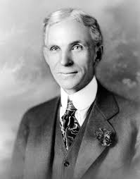

```{r setup, include=FALSE}
options(htmltools.dir.version = FALSE)
knitr::opts_chunk$set(echo=F,
                      message=F,
                      warning=F,
                      fig.retina = 3,
                      fig.align = "center")
library("tidyverse")
library("ggrepel")
library("fontawesome")
xaringanExtra::use_tile_view()
xaringanExtra::use_tachyons()
xaringanExtra::use_freezeframe()

update_geom_defaults("label", list(family = "Fira Sans Condensed"))
update_geom_defaults("text", list(family = "Fira Sans Condensed"))

set.seed(256)

theme_slides <- theme_light() + 
  theme(
    text = element_text(family = "Fira Sans", size = 24)
  )

```

class: inverse

# Outline

### [The Fundamental Purpose of Markets](#3)
### [The Static Benefits of Markets](#13)
### [The Dynamic Benefits of Markets](#24)
### [The Socialist Calculation Debate, Redux](#52)

---

class: inverse, center, middle
# The Fundamental Purpose of Markets

---

# The Origins of Exchange I

.pull-left[
- Why do we trade?

- .hi-purple[Resources are in the wrong place!]

- People have *better* uses of resources than they are currently being used! 

]

.pull-right[
.center[

]
]

---

# The Origins of Exchange II

.pull-left[
- *Why* are resources in the wrong place?

- .hi-purple[We have the *same* stuff but different preferences]


]

.pull-right[
.center[


]
]

---

# The Origins of Exchange III

.pull-left[
- *Why* are resources in the wrong place?

- .hi-purple[We have *different* stuff and different preferences]

]

.pull-right[
.center[


]
]

---

# Transaction Costs and Exchange I

.pull-left[
- But .hi[Transaction costs]!
  - .hi-purple[Search costs]: cost of finding trading partners
  - .hi-purple[Bargaining costs]: cost of reaching an agreement
  - .hi-purple[Enforcement costs]: **trust** between parties, cost of upholding agreement, dealing with unforeseen contingencies, punishing defection, using police and courts 
]

.pull-right[
.center[

]
]

---

# Transaction Costs and Exchange II

.pull-left[
- With high transaction costs, resources *cannot* be traded

- Resources *cannot* be switched to higher-valued uses

- If others value goods higher than their current owners, resources are *inefficiently* allocated!
]

.pull-right[
.center[

]
]

---

# Transaction Costs and Exchange III

.pull-left[
.center[

]
]

.pull-right[
- .hi[Markets] are institutions that facilitate voluntary *impersonal* exchange and reduce transaction costs

- There's a lot of background institutions necessary to facilitate markets: 
  - Prices, profits and losses, property rights, rule of law, contract enforcement, dispute resolution, protection, trust

]

---

# Transaction Costs and Exchange III

.pull-left[
.center[

]
]

.pull-right[
- All of those are **assumed** to exist and work well when we model markets in economics courses!!

- Other PSCI/ECON courses: how do various *political & social institutions* enable markets to flourish? (some of my courses):
  - [ECON 315: Economics of the Law](https://laws21.classes.ryansafner.com)
  - ECON 317: Economics of Development
  - [ECON 324: Industrial Organization](https://ios20.classes.ryansafner.com)
  - [ECON 470: Public Economics](https://publics20.classes.ryansafner.com)
]

---

# Social Problems that Markets Solve Well 

.pull-left[
.center[

]
]

.pull-right[
- .hi[Problem 1]: Resources have multiple uses and are rivalrous

- .hi[Problem 2]: Different people have different subjective valuations for uses of resources

- .hi-purple[It is inefficient (immoral?) to use a resource in a way that prevents someone else who values it more from using it!]
]


---

# Social Problems that Markets Solve Well 

.pull-left[
.center[

]
]

.pull-right[

- **Solution**: Prices in a functioning market accurately measure .hi[opportunity cost] of using resources in a particular way

- .hi-purple[The price of a resource is the amount someone else is willing to pay to acquire it from its current use/owner]
]


---

class: inverse, center, middle

# The Static Benefits of Markets

---

# Perfectly Competitive Market

.pull-left[
```{r, fig.retina=3, fig.height=4.5}
demand<-function(x){10-x}
supply<-function(x){x}
demand_firm<-function(x){10}
mc_cc<-function(x){3*x^2-8*x+9}
ac_cc<-function(x){x^2-4*x+10+10/x}

pc<-ggplot(data.frame(x=c(0,10)), aes(x=x))+
  stat_function(fun=demand_firm, geom="line", size=2, color = "blue")+
  geom_label(aes(x=4.5,y=demand_firm(4.5)), color = "blue", label="Demand", size = 5)+
    stat_function(fun=mc_cc, geom="line", size=2, color = "red")+
  geom_label(aes(x=3.5,y=mc_cc(3.5)), color = "red", label="MC(q)", size = 5)+
    stat_function(fun=ac_cc, geom="line", size=2, color = "orange")+
  geom_label(aes(x=4.5,y=ac_cc(4.5)), color = "orange", label="AC(q)", size = 5)+
  geom_segment(x=2.8, xend=2.8, y=0, yend=10, size=1, linetype="dotted")+
    scale_x_continuous(breaks=NULL,
                     limits=c(0,5),
                     expand=expand_scale(mult=c(0,0.1)))+
  scale_y_continuous(breaks=NULL,
                     limits=c(0,20),
                     expand=expand_scale(mult=c(0,0.1)))+
  guides(fill=F)+
  labs(title = "Representative Firm",
       x = "Quantity",
       y = "Price")+
  theme_classic(base_family = "Fira Sans Condensed", base_size=20)
pc
```
]

.pull-right[
```{r, fig.retina=3, fig.height=4.5}
cs_1<-tribble(
  ~x, ~y,
  0, 10,
  0, 5,
  5, 5
)
ps_1<-tribble(
  ~x, ~y,
  0, 0,
  0, 5,
  5, 5
)

ggplot(data.frame(x=c(0,10)), aes(x=x))+
  geom_polygon(data=cs_1, aes(x=x,y=y), fill="blue", alpha=0.5)+
  geom_polygon(data=ps_1, aes(x=x,y=y), fill="red", alpha=0.5)+
  stat_function(fun=demand, geom="line", size=2, color = "blue")+
    geom_label(aes(x=9,y=demand(9)), color = "blue", label="Demand", size = 5)+
  stat_function(fun=supply, geom="line", size=2, color = "red")+
    geom_label(aes(x=9,y=supply(9)), color = "red", label="Supply", size = 5)+
  geom_segment(x=5, xend=5, y=0, yend=5, size=1, linetype="dotted")+
  geom_segment(x=0, xend=5, y=5, yend=5, size=1, linetype="dotted")+
  
  # point A
  geom_point(x = 5, y = 5, size=3)+
  geom_text(x = 5, y = 5.5, label = "A", size=5)+
  
    scale_x_continuous(breaks=NULL,
                     limits=c(0,10),
                     expand=expand_scale(mult=c(0,0.1)))+
  scale_y_continuous(breaks=NULL,
                     limits=c(0,10),
                     expand=expand_scale(mult=c(0,0.1)))+
  guides(fill=F)+
  labs(title = "Industry",
       x = "Quantity",
       y = "Price")+
  theme_classic(base_family = "Fira Sans Condensed", base_size=20)
```
]

.smallest[
- In a .hi[competitive market] in .hi[long run equilibrium]:
  - .hi-purple[Economic profit] is driven to $0; resources (factors of production) optimally allocated
  - .hi-purple[Allocatively efficient]: $p=MC(q)$, maximized .blue[CS] $+$ .red[PS]
  - .hi-purple[Productively efficient]: $p=AC(q)_{min}$ (otherwise firms would enter/exit)
]

---

# Allocative Efficiency in Competitive Equilibrium I

.pull-left[

```{r, fig.retina=3}
Demand=function(x){10-x}
Supply=function(x){x}
eq<-tribble(
  ~letter, ~x, ~y,
  "A", 5, 5
)

CS<-tibble(x=c(0,0,5),
           y=c(5,10,5))

PS<-tibble(x=c(0,0,5),
           y=c(0,5,5))

p<-ggplot(data.frame(x=c(0,10)), aes(x=x))+
  stat_function(fun=Demand, geom="line", size=2, color = "blue")+
  stat_function(fun=Supply, geom="line", size=2, color = "red")+
  geom_label(aes(x=9,y=Demand(9)), color = "blue", label="Demand = MB", size = 6)+
  geom_label(aes(x=9,y=Supply(9)), color = "red", label="Supply = MC", size = 6)+
  geom_segment(aes(x=0, xend=5, y=5, yend=5),size=1, linetype="dotted")+
  geom_segment(aes(x=5, xend=5, y=5, yend=0),size=1, linetype="dotted")+
  geom_polygon(data=CS, aes(x=x,y=y), fill="blue", alpha=0.5)+ #CS
  geom_polygon(data=PS, aes(x=x,y=y), fill="red", alpha=0.5)+ #PS
  geom_label(aes(x=1.5, y= 3), label="PS", color="red", size =6)+
  geom_label(aes(x=1.5, y= 7), label="CS", color="blue", size =6)+
  geom_point(data = eq,
             mapping=aes(x=x, y=y),
             size = 4)+
  geom_text_repel(data = eq,
             mapping=aes(x=x, y=y,
             label = letter),
             size = 6)+
    scale_x_continuous(breaks=seq(0,10,1),
                     limits=c(0,10),
                     expand=expand_scale(mult=c(0,0.1)))+
  scale_y_continuous(breaks=seq(0,10,1),
                     limits=c(0,10),
                     expand=expand_scale(mult=c(0,0.1)))+
  guides(fill=F)+
  labs(x = "Quantity",
       y = "Price")+
  theme_classic(base_family = "Fira Sans Condensed", base_size=20)
p
```

]

.pull-right[

- .hi[Allocative efficiency]: resources are allocated to highest-valued uses
  - Goods are produced up to the point where .blue[marginal benefit] $=$ .red[marginal costs]
]

---

# Allocative Efficiency in Competitive Equilibrium II

.pull-left[

```{r, fig.retina=3}
p
```

]

.pull-right[

- .hi-purple[Economic surplus] = .blue[Consumer surplus] + .red[Producer surplus]

- Maximized in competitive equilibrium

- Resources flow away from those who value them the lowest (min WTA) to those that value them the highest (max WTP)
  - creating .red[PS] and .blue[CS]

- .hi-purple[The social value of resources is **maximized** by allocating them to their highest valued uses!]

]

---

# Markets and Pareto Efficiency

.pull-left[
.smallest[
- Suppose we start from some initial allocation (.blue[A])

]
]

.pull-right[
```{r}
pareto_points<-tribble(
  ~x, ~y, ~letter, ~fill,
  4, 5, "A", "Endowment",
  2, 5, "B", "No",
  2, 7, "C", "No",
  4, 9, "D", "Yes",
  6, 8, "E", "Yes",
  8, 7, "F", "Yes",
  9, 5, "G", "Yes",
  7, 3, "H", "No",
  4, 3, "I", "No"
)

ggplot(data = tibble(x=1:10),aes(x=x))+
  geom_label(data = subset(pareto_points, letter=="A"), aes(x=x, y=y, label = letter, fill = fill), color = "white")+
  labs(x = "Person 1’s Goods",
       y = "Person 2’s Goods")+
  scale_fill_manual("Improvement?",
                    values = c("Endowment" = "blue", "Yes" = "green", "No" = "red"))+
  scale_x_continuous(breaks=seq(0,10,1),
                     limits = c(0,10),
                     expand=c(0,0))+
  scale_y_continuous(breaks=seq(0,10,1),
                     limits = c(0,10),
                     expand=c(0,0))+
  ggthemes::theme_pander(base_family = "Fira Sans Condensed", base_size = 16)

```

]

---

# Markets and Pareto Efficiency

.pull-left[
.smallest[
- Suppose we start from some initial allocation (.blue[A])

- .hi[Pareto Improvement]: at least one party is better off, and no party is worse off
  - .green[D, E, F, G] are improvements
  - .red[B, C, H, I] are not

]
]

.pull-right[
```{r}
pareto<-ggplot(data = tibble(x=1:10),aes(x=x))+
  geom_label(data = pareto_points, aes(x=x, y=y, label = letter, fill = fill), color = "white")+
  labs(x = "Person 1’s Goods",
       y = "Person 2’s Goods")+
  scale_fill_manual("Improvement?",
                    values = c("Endowment" = "blue", "Yes" = "green", "No" = "red"))+
  scale_x_continuous(breaks=seq(0,10,1),
                     limits = c(0,10),
                     expand=c(0,0))+
  scale_y_continuous(breaks=seq(0,10,1),
                     limits = c(0,10),
                     expand=c(0,0))+
  ggthemes::theme_pander(base_family = "Fira Sans Condensed", base_size = 16)
pareto
```
]

---

# Markets and Pareto Efficiency

.pull-left[
.smallest[
- Suppose we start from some initial allocation (.blue[A])

- .hi[Pareto Improvement]: at least one party is better off, and no party is worse off
  - .green[D, E, F, G] are improvements
  - .red[B, C, H, I] are not

- .hi[Pareto optimal/efficient]: no possible Pareto improvements
  - Set of Pareto efficient points often called the .hi-green[Pareto frontier]
  - Many possible efficient points!

]

]

.pull-right[
```{r}
pareto+annotate("segment", x = 4, xend = 4, y = 5, yend = 10, color = "purple", size=2, alpha=1, arrow=arrow(length=unit(0.5,"cm"), ends="last", type="closed"))+
  annotate("segment", x = 4, xend = 10, y = 5, yend = 5, color = "purple", size=2, alpha=1, arrow=arrow(length=unit(0.5,"cm"), ends="last", type="closed"))+
  geom_rect(xmin=4,xmax=10,ymin=5,ymax=10,fill="green",alpha=0.025)+
  geom_segment(x = 4, y = 9, xend=6, yend=8, color = "green", size = 2)+
  geom_segment(x = 6, y = 8, xend=8, yend=7, color = "green", size = 2)+
  geom_segment(x = 8, y = 7, xend=9, yend=5, color = "green", size = 2)
```
]


---

# Markets and Pareto Efficiency

.pull-left[
.smallest[
- Voluntary exchange in markets is a .hi[Pareto improvement]

- *In equilibrium*, markets are .hi[Pareto efficient]: there are no more possible Pareto improvements
  - all gains from trade exhausted, $q_S=q_D$, no pressure for change

- Note Pareto efficiency contains a normative claim about .hi-purple[equity]
  - It might be possible to improve the *total* welfare of *society*
  - But if this comes *at the expense of even 1 individual*, it’s not a Pareto improvement!
]
]
.pull-right[

.center[

]
]

---

# Welfare Economics
.pull-left[
.smallest[
- .hi[1st Fundamental Welfare Theorem]: markets in competitive equilibrium maximize (allocative, Pareto, productive) efficiency
  - initial endowments does not affect efficiency but does affect final distribution

- .hi[2nd Fundamental Welfare Theorem]: any desired Pareto efficient distribution can be achieved with a *one-time* redistribution, and *then* let markets operate freely
  - allows a desired distribution to be achieved without sacrificing efficiency

]
]

.pull-right[
.center[

]
]

---

# Welfare Economics

.smallest[
- **Markets are great when:**
  1. They are .hi-purple[Competitive]: many buyers and many sellers
  2. They each .hi-purple[equilibrium] (.hi-purple[prices are free to adjust]): absence of transactions costs or policies *preventing prices from adjusting* to meet supply and demand
  3. .hi-purple[There are no externalities]<sup>.magenta[†]</sup> are present: costs and benefits are fully internalized by the parties to transactions 
]

--

.smallest[
- If any of these conditions are not met, we have .hi[market failure]
  - May be a role for governments, other institutions, or entrepreneurs to fix
]

.footnote[<sup>.magenta[†]</sup> Or public goods, or asymmetric information. But in essence, I am treating these as special cases of more common externalities.]

---

class: inverse, center, middle

# The Dynamic Benefits of Markets

---

# The Law of One Price I

.pull-left[
- .hi[Law of One Price]: *all* units of the *same* good exchanged on the market will tend to have the same market price (the market-clearing price, $p^*)$
]

.pull-right[

```{r, fig.retina=3}
library("mosaic")
library("ggrepel")
update_geom_defaults("label", list(family = "Fira Sans Condensed"))

Demand=function(x){10-x}
Supply=function(x){x}

eq<-tribble(
  ~letter, ~x, ~y,
  "A", 5, 5
)

ggplot(data.frame(x=c(0,10)), aes(x=x))+
  stat_function(fun=Demand, geom="line", size=2, color = "blue")+
  stat_function(fun=Supply, geom="line", size=2, color = "red")+
  geom_label(aes(x=9,y=Demand(9)), color = "blue", label="Demand", size = 6)+
  geom_label(aes(x=9,y=Supply(9)), color = "red", label="Supply", size = 6)+
  geom_segment(aes(x=0, xend=5, y=5, yend=5),size=1, linetype="dotted")+
  geom_segment(aes(x=5, xend=5, y=5, yend=0),size=1, linetype="dotted")+
  geom_point(data = eq,
             mapping=aes(x=x, y=y),
             size = 4)+
  geom_text_repel(data = eq,
             mapping=aes(x=x, y=y,
             label = letter),
             size = 6)+
    scale_x_continuous(breaks=seq(0,10,1),
                     limits=c(0,10),
                     expand=expand_scale(mult=c(0,0.1)))+
  scale_y_continuous(breaks=seq(0,10,1),
                     limits=c(0,10),
                     expand=expand_scale(mult=c(0,0.1)))+
  coord_cartesian(clip="off")+
  labs(x = "Quantity",
       y = "Price")+
  theme_classic(base_family = "Fira Sans Condensed", base_size=20)

```

]

---

# The Law of One Price II

.pull-left[
.center[

]
]

.pull-right[
.smaller[
- Consider if there are *multiple* different prices for *same* good:

- .hi-purple[Arbitrage] opportunities: optimizing individuals recognize **profit opportunity**:
    - Buy at low price, resell at high price!
    - There are possible gains from trade or gains from innovation to be had
    
- .hi-purple[Entrepreneurship]: recognizing profit opportunities and entering a market as a seller to try to capture gains from trade/innovation
]
]


---

# Arbitrage and Entrepreneurship I

.center[

]

---

# Arbitrage and Entrepreneurship II

.center[
<iframe width="980" height="550" src="https://www.youtube.com/embed/HiB9L3dG-Aw" frameborder="0" allow="accelerometer; autoplay; encrypted-media; gyroscope; picture-in-picture" allowfullscreen></iframe>
]

---

# Arbitrage and Entrepreneurship III

.center[
<iframe width="980" height="550" src="https://www.youtube.com/embed/yGf6LNWY9AI" frameborder="0" allow="accelerometer; autoplay; encrypted-media; gyroscope; picture-in-picture" allowfullscreen></iframe>
]

---

# Uncertainty vs. Risk

.center[

<iframe width="980" height="550" src="https://www.youtube.com/embed/GiPe1OiKQuk" frameborder="0" allow="accelerometer; autoplay; encrypted-media; gyroscope; picture-in-picture" allowfullscreen></iframe>

]

---

# Uncertainty vs. Risk

.left-column[
.center[

]
]

.right-column[

- **“Known knowns”**: .hi-purple[perfect information]

- **“Known unknowns”**: .hi-purple[risk]
  - We know the probability distribution of states that *could* happen
  - We just don't know *which* state will be realized
  - We can estimate probabilities, maximize expected value, minimize variance, etc.

]

---

# Uncertainty vs. Risk

.left-column[
.center[

]
]

.right-column[

- **“Unknown unknowns”**: .hi[uncertainty]
  - We don’t even know the probability distribution of states that *could* happen
  - *No model to optimize* in a world of uncertainty!
]

---

# The Role of Entrepreneurial Judgment

.left-column[
.center[


]
]

.right-column[

- Under true .hi[uncertainty], it’s not that we can’t assign probabilities to each outcome; we do not even have the knowledge necessary to list all possible outcomes!

- Requires .hi-purple[entrepreneurial judgment] to *both*:
  1. estimate possible actions *and*
  2. estimate the likelihood of their success

- .hi[Entrepreneur] is central player, earns pure profits (a residual) for *bearing uncertainty*
]

---

# Entrepreneurial Judgment

.left-column[
.center[

.smallest[
Henry Ford

1863-1947
]
]

]

.right-column[

> “If I had asked people what they wanted, they would have said **faster horses**.” - Henry Ford

]

---

# Entrepreneurial Judgment

.pull-left[
.center[

]
]

.pull-right[

> “It's really hard to design products by focus groups. A lot of times, **people don't know what they want until you show it to them**.” - Steve Jobs
]

---

# Uncertainty and Entrepreneurship

.left-column[
.center[


Mark Zuckerberg

1984-
]
]

.right-column[

> "Why were we the ones to build [Facebook]? We were just students. We had way fewer resources than big companies. If they had focused on this problem, they could have done it. 
The only answer I can think of is: **we just cared more**. 
**While some doubted** that connecting the world was actually important, **we were building**. While others doubted that this would be sustainable, **we were forming lasting connections**."
]


---

# How Markets Get to Equilibrium I

.pull-left[
.center[

]
]

.pull-right[
.smaller[
- .hi-turquoise[Nobody knows “the right price” for things]

- Each buyer and seller only know **their own** reservation prices

- Buyers and sellers adjust their bids/asks 

- Markets do not *start* competitive, but *become* competitive!

- New entrepreneurs enter to try to capture gains from trade/innovation

- As these gains are exhausted, prices converge to equilibrium 
]
]


---

# How Markets Get to Equilibrium II

.pull-left[
.center[

]
]

.pull-right[
.smaller[
- Errors and imperfect information $\implies$ multiple prices 
    - $\implies$ arbitrage opportunities $\implies$ entrepreneurship
    - $\implies$ correcting mistakes $\implies$ people update their behavior & expectations  

- Markets are .hi-purple[discovery processes] that *discover* the right prices, the optimal uses of resources, and cheapest production methods, none of which can be known in advance!
]

]

---

# How Markets Get to Equilibrium III

.pull-left[
.center[

]
]


.pull-right[
.smallest[
- Economy as a cat-and-mouse game between:
  - **Mouse**: preferences, technologies, alternative uses of resources
  - **Cat**: market prices, least-cost technologies

- Cat always chasing mouse
  - Mouse *always* moving
  - Any time cat hasn’t caught mouse: profit opportunities

- **IF** mouse *froze*, market would rest at equilibrium 
]

]

---

# Prices are Signals

.pull-left[
.center[

]
]

.pull-right[
.smallest[
- .hi-purple[Markets are social *processes* that generate information via prices]

- .hi-purple[Prices are never "given"], prices .hi-purple[emerge] dynamically from negotiation and market decisions of entrepreneurs and consumers

- **Competition**: is a .hi-purple[discovery process] which *discovers* what consumer preferences are and what technologies are lowest cost, and how to allocate resources accordingly

]
]

---

# The Social Functions of Prices I

.pull-left[

.center[

]
]

.pull-right[
.smaller[
A relatively high price:

- .hi-purple[Conveys information]: good is relatively scarce

- .hi-purple[Creates incentives for]:
  - **Buyers**: conserve use of this good, seek substitutes
  - **Sellers**: produce more of this good
  - **Entrepreneurs**: find substitutes and innovations to satisfy this unmet need
]
]

---

# The Social Functions of Prices II

.pull-left[

]

.pull-right[

.smaller[
A relatively low price

- .hi-purple[Conveys information]: good is relatively abundant

- .hi-purple[Creates incentives for]:
  - **Buyers**: substitute away from expensive goods towards this good
  - **Sellers**: Produce less of this good, talents better served elsewhere
  - **Entrepreneurs**: talents better served elsewhere: find more severe unmet needs

]
]

---

# The Social Functions of Prices III

.pull-left[
.center[

]
]

.pull-right[

.smaller[
- .hi-purple[Prices tell us how to allocate scarce resources among competing uses]

- Think of diminishing marginal utility:
  - allocate scarce good to highest-valued use first
  - as supply becomes more plentiful (price falls), can allocate more units of the good to lower-valued uses (higher-valued uses already satisfied)
]
]

---

# Uncertainty, Tacit Information, and Profit I

.pull-left[

- **Economic theory**: in a perfectly competitive market, in the long run, economic profit $\rightarrow$ to zero

- **Real world**: there *are* often economic profits

- Our blackboard models assume perfect information

- In reality we have to deal with .hi-purple[uncertainty]


]

.pull-right[
.center[

]
]

---

# Uncertainty, Tacit Information, and Profit II

.pull-left[
.smaller[
- Imperfect information: mispricing and multiple prices $\rightarrow$ arbitrage/profit opportunities
  - Some people recognize opportunities ($20 bills) that others do not see

- .hi-purple[In a world of certainty, there would be no profit]
  - The model world of perfect competition is a fictional world of certainty
  - The real world, *because* it’s uncertain, *has* profit opportunities!

]
]
.pull-right[
.center[

]
]

---

# Uncertainty, Tacit Information, and Profit III

.pull-left[
.smallest[
- Firms don’t actually *maximize* profits, just a convenient assumption
  - In a world of uncertainty (unlike mere risk), there’s no way to *maximize* anything!

- Real world is not merely a constrained maximization problem!

- Better to think in **evolutionary** terms
  - Firms that *best* adapt to market circumstances will earn profit and merely *survive*
  - Whether by skill and talent or just dumb luck!
]
]
.pull-right[
.center[

]
]

---

# Uncertainty, Tacit Information, and Profit IV

.center[
<iframe width="980" height="550" src="https://www.youtube.com/embed/KUxMY77i0q4" frameborder="0" allow="accelerometer; autoplay; encrypted-media; gyroscope; picture-in-picture" allowfullscreen></iframe>
]

---

# Profits and Entrepreneurship

.pull-left[

.center[

]
]

.pull-right[
.smaller[
- In markets, production faces .hi[profit-test]:
  - <span class="hi-purple">Is consumer's willingness to pay $>$ opportunity cost of inputs?</span>

- Profits are an indication that **value is being created for society**

- Losses are an indication that **value is being destroyed for society**

- Survival for sellers in markets *requires* firms continually create value and earn profits or die
]
]

---

# Why We Need Prices, Profits, and Losses I

.pull-left[

.center[

]
]

.pull-right[
.smaller[
- People often confuse the .hi[economic problem] with a .hi-purple[technological problem]

- .hi-purple[Technological problem]: how to allocate scarce resources to accomplish a particular goal
    - e.g. buy the right combination of goods to maximize utility
    - e.g. buy the right combination of inputs and produce output to maximize profits 
    - given stable prices, preferences, and technologies, **a computer can solve this problem**

]
]

---

# Why We Need Prices, Profits, and Losses II

.pull-left[

.center[

]
]

.pull-right[

- .hi[Economic calculation problem]: how to determine which of the infinite technologically-feasible options are *economically* viable?

- .hi-purple[How to best make use of dispersed knowledge to coordinate conflicting plans of individuals for their own ends?]

- ONLY can be **discovered** through competition, prices, profits & losses

]


---

# What if there Were No Prices? I

.center[
<iframe width="980" height="550" src="https://www.youtube.com/embed/zkPGfTEZ_r4" frameborder="0" allow="accelerometer; autoplay; encrypted-media; gyroscope; picture-in-picture" allowfullscreen></iframe>
]

---

class: inverse, center, middle
# The Socialist Calculation Debate, Redux

---

# Aside: Returning to the Socialist Calculation Debate

.pull-left[

- Neoclassical economists and market socialists (Lange, Lerner, Bergson, etc) argued that central planning can, **in theory**, **replicate** the **optimal outcomes of markets in competitive equilibrium** without the problems of capitalism:
  - Externalities
  - Monopolies
  - Inequality
  - Unemployment
  - Business cycles

]

.pull-right[


]

---

# The Neoclassical/Socialist View of Prices I

.pull-left[

- .hi-purple[Prices as sufficient statistics in static equilibrium]

- **Efficiency of prices**: function in equilibrium market-clearing & achieving Pareto optimality

- When prices changes, they don't lose their parametric function, and every individual always takes "the price" as given (price-taking behavior)

]

.pull-right[


]

---

# The Neoclassical/Socialist View of Prices II

.pull-left[

- **Competition** $\equiv$ an optimal end-state (“perfect competition”):
  - Consumers have maximized utility
  - Producers have minimized cost
  - Economic profits are zero
  - No surpluses or shortages

- If you find the right vector of prices, **given** consumer preferences and **given** production functions, you can **calculate this optimal outcome**!

]

.pull-right[


]

---

# Hayek's Realization From Mises

.pull-left[
.smallest[
- Competition is not an optimal **end-state**, it is a .hi-purple[discovery process]!

- Competition is not a *noun* (perfect competition), it's an (active) *verb*!

  - It **cannot** be known in advance!
]
]

.pull-right[
.center[

]
]

---

# Hayek: Markets as a Discovery Process I

.left-column[
.center[


F. A. Hayek

1899-1992

Economics Nobel 1974
]
]

.right-column[

> "Planning in the specific sense in which the term is used in contemporary controversy necessarily means central planning - direction of the whole economic system according to one unified plan. Competition, on the other hand, means decentralized planning by many separate persons," (pp.519-520).


.source[Hayek, F. A., 1945, "The Use of Knowledge in Society," *American Economic Review* 35(4): 519-530]
]

---

# Hayek: Markets as a Discovery Process II

.left-column[
.center[


F. A. Hayek

1899-1992

Economics Nobel 1974
]
]

.right-column[

> ".hi[The economic problem of society is thus not merely a problem of how to allocate given resources if given is taken to mean given to a single mind which deliberately solves the problem set by these data.] It is rather a problem of how to secure the best use of resources known to any of the members of society, for ends whose relative importance only these individuals know. Or, to put it briefly, .hi[it is a problem of the utilization of knowledge which is not given to anyone in its totality]," (pp.519-520).


.source[Hayek, F. A., 1945, "The Use of Knowledge in Society," *American Economic Review* 35(4): 519-530]
]

---

# Hayek: Markets as a Discovery Process II

.center[

]

---


# Hayek: Markets as a Discovery Process III

.left-column[
.center[


F. A. Hayek

1899-1992

Economics Nobel 1974
]
]

.right-column[

> "Which of the systems is likely to be more efficient...depends on whether we are more likely to succeed in putting at the disposal of a single central authority all the knowledge which ought to be used but which is initially dispersed among many different individuals, or in conveying to the individuals such additional knowledge as they need in order to enable them to fit their plans with those of others," (pp.519-520).


.source[Hayek, F. A., 1945, "The Use of Knowledge in Society," *American Economic Review* 35(4): 519-530]

]
---

# Hayek: Markets as a Discovery Process IV

.left-column[
.center[


F. A. Hayek

1899-1992

Economics Nobel 1974
]
]

.right-column[

> "The marvel is that in a case like that of a scarcity of a raw material, without an order being issued, without more than perhaps a handful of people knowing the cause, tens of thousands of people whose identity could not be ascertained by months of investigation, are made to use the material or its products more sparingly," (pp.527).


.source[Hayek, F. A., 1945, "The Use of Knowledge in Society," *American Economic Review* 35(4): 519-530]

]

---

# Hayek: Markets as a Discovery Process IV

.left-column[
.center[


F. A. Hayek

1899-1992

Economics Nobel 1974
]
]

.right-column[

.smallest[

> "The problem arises because one of the most important forces which in a truly competitive economy brings about the reduction of costs to the minimum discoverable will be absent, namely, price competition...[T]he question is frequently treated as if the cost curves were objectively given facts. What is forgotten is that the method which under given conditions is the cheapest is a thing which has to be discovered, and to be discovered anew, sometimes almost from day to day, by the entrepreneur, and that, in spite of the strong inducement, it is by no means regularly the established entrepreneur, the man in charge of the existing plant, who will discover what is the best method," (p.196).
]


.source[Hayek, F. A., 1948, "Socialist Calculation II: The Competitive Solution," *Individualism and Economic Order*]

]
---

# Hayek: Markets as a Discovery Process V

.left-column[
.center[


F. A. Hayek

1899-1992

Economics Nobel 1974
]
]

.right-column[

> "The force which in a competitive society brings about the reduction of price to the lowest cost...is the opportunity for anybody who knows a cheaper method to come in at his own risk and to attract customers by underbidding the existing producers. But, if prices are fixed by the authority, this method is excluded," (p.196).
]

.source[Hayek, F. A., 1948, "Socialist Calculation II: The Competitive Solution," *Individualism and Economic Order*]

---

# Mises-Hayek View of Prices

.pull-left[

- .hi-purple[Prices are knowledge surrogates in dynamic disequilibrium]

- **Efficiency of prices**: use distributed knowledge and incentivize local actors to exploit opportunities, which reduce error and bring about greater social coordination

- **Prices are never "given"**, prices **emerge** dynamically from negotiation and market decisions of entrepreneurs and consumers

- **Competition**: is a **discovery process** which *discovers* what consumer preferences are and what technologies are lowest cost, and how to allocate resources accordingly

]

.pull-right[
.center[

]
]

---

# The Social Functions of Prices

.left-column[
.center[


F. A. Hayek

1899-1992

Economics Nobel 1974
]
]

.right-column[

> "The most significant fact about this system is the economy of knowledge with which it operates...by a kind of symbol [the price], only the most essential information is passed on and passed on only to those concerned...The marvel is that in a case like that of a scarcity of a raw material, without an order being issued, without more than perhaps a handful of people knowing the cause, tens of thousands of people whose identity could not be ascertained by months of investigation, are made to use the material or its products more sparingly," (p.527).
]

.source[Hayek, F. A., 1945, "The Use of Knowledge in Society," *American Economic Review* 35(4): 519-530]

---

# Scientific vs. Tacit Knowledge

.left-column[
.center[


F. A. Hayek

1899-1992

Economics Nobel 1974
]
]

.right-column[
.smallest[
> "Today it is almost heresy to suggest that scientific knowledge is not the sum of all knowledge. But a little reflection will show that there is beyond question a body of very important but unorganized knowledge which cannot possibly be called scientific in the sense of knowledge of general rules: the knowledge of the particular circumstances of time and place. It is with respect to this that practically every individual has some advantage over all others in that he possesses unique information of which beneficial use might be made, but of which use can be made only if the decisions depending on it are left to him or are made with his active cooperation," (pp.521-522).

]

.source[Hayek, F. A., 1945, "The Use of Knowledge in Society," *American Economic Review* 35(4): 519-530]
]

---

# The Socialist Calculation Debate In Retrospect III

.pull-left[
.quitesmall[
- Main disagreement is about **rivalry**

- **Marxists**: .hi-purple[rivalry as inherent flaw] in capitalism leading to conflict; central planning removes rivalry and leads to pre-coordinated harmony

- **Mises-Hayek**: .hi-purple[rivalry] under specific institutions (market prices, property rights) .hi-purple[is the only way to generate the information] necessary to rationally allocate resources

- **Neoclassical economists**: .hi-purple[assume rivalry away] in perfect competition models, viewing prices as just parametric statistics, allowing a central planner to achieve the same optimal outcome
]

.source[Lavoie, Don, 1985, *Rivalry and Central Planning: The Socialist Calculation Debate Reconsidered*, p.25]

]

.pull-right[

.center[

]

]
