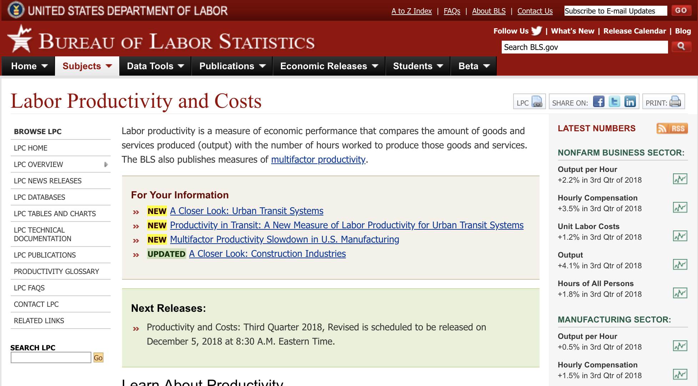
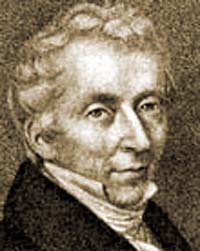
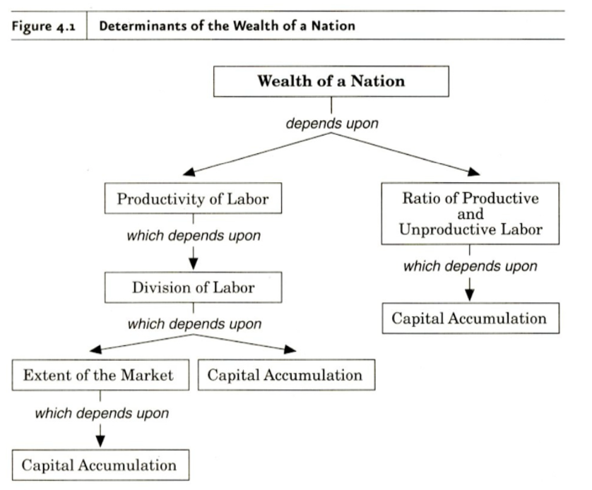
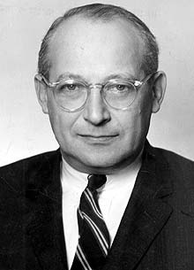
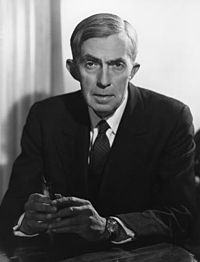
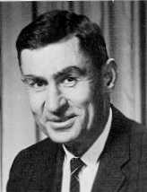
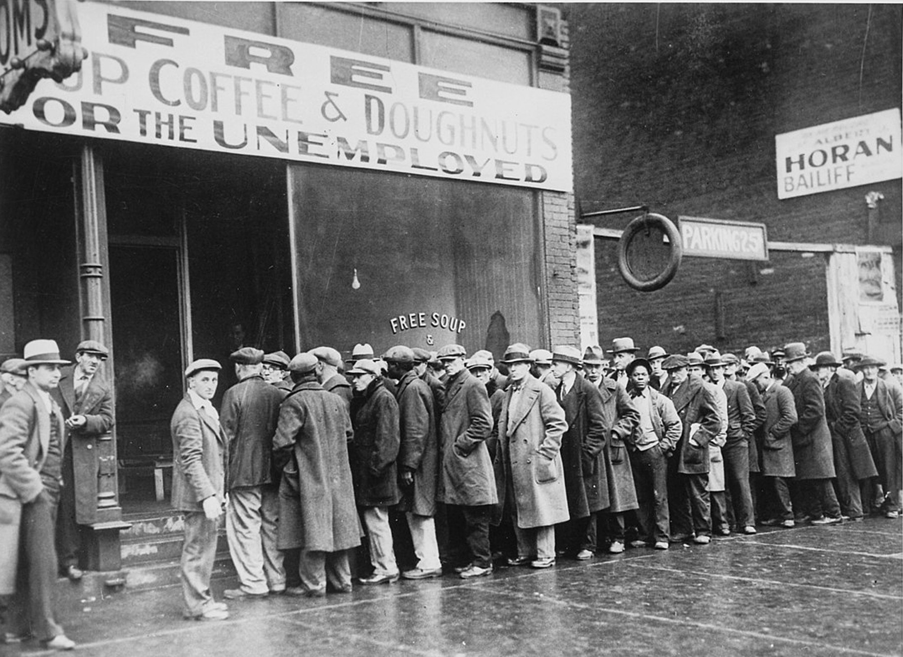

```{r setup, include=FALSE}
options(htmltools.dir.version = FALSE)
knitr::opts_chunk$set(echo=F,
                      message=F,
                      warning=F,
                      fig.retina = 3,
                      fig.align = "center")
library("tidyverse")
library("ggrepel")
library("fontawesome")
xaringanExtra::use_tile_view()
xaringanExtra::use_tachyons()
xaringanExtra::use_freezeframe()

update_geom_defaults("label", list(family = "Fira Sans Condensed"))
update_geom_defaults("text", list(family = "Fira Sans Condensed"))

set.seed(256)

theme_slides <- theme_light() + 
  theme(
    text = element_text(family = "Fira Sans", size = 24)
  )

```

class: inverse

# Outline

### [Real Productivity](#3)
### [Growth Models: A History](#13)
### [20th Century Neoclassical Growth Models](#24)
### [Working Tools](#52)

---

class: inverse, center, middle
# Real Productivity

---

# Real Productivity

.pull-left[

- The **only** way to increase income and standards of living (i.e. GDP per capita) is to increase .hi[real productivity], the amount of output produced per unit of input (i.e. per work-hour)

]

.pull-right[
.center[

]
]

---

# Measuring Productivity I

.center[


[Bureau of Labor Statistics: Labor Productivity and Costs](https://www.bls.gov/lpc/)

]

---

# Real Productivity Increases I

.center[

.smallest[
Work time (minutes) required to purchase various products in the United States at median wage (1900—1999)
]

.tiny[

| Product | 1900 | 1950 | 1999 |
|---------|-----:|-----:|-----:|
| Half gallon of milk | 56 | 16 | 7.0 |
| Loaf of bread | - | 6 | 3.5 |
| Dozen oranges | - | 21 | 9.0 |
| Chocolate bar | 20 | 2 | 2.1 |
| Gallon of gas | - | 2 | 2.1 |
| Movie ticket | - | 18 | 19.0 |
| Pair of jeans | 540 | 240 | 180.0 |
| 3-lb. chicken | 160 | 77 | 24.0
| McDonalds Big Mac | - | 240 | 60.0 |
| 100kw of electricity | 6437 | 120 | 14.0 |
| 3 minute coast-to-coast phone call | - | 104 | 2.0 |
| 100 miles of air travel | - | 7 | 2.0 |
| 1 MIPS of computing power | - | 515,000 lifetimes | 9

]

]

.source[Cox, Michael and Richard Alm, 1999, *Myths of Rich and Poor*, p. 43]

---

# Real Productivity Increases II

.center[

Amount of calories a day's wages can buy

| Year | Calories | Increase from 1600 |
|------|-----:|-----:|
| 1600 | 2,500 | - |
| 1800 | 3,000 | 20% |
| 1875 | 5,000 | 100% |
| 2012 | 2,400,000 | 95,900% |

]

.footnote[ Biologically, a human needs approximately 2,500 calories a day to survive, with obvious variations based on height, weight, and sex.]

.source[Source: [J. Bradford Delong](http://bradford-delong.com)]

---

# Real Productivity Increases III

.center[

Hours of labor needed to buy 1,000 lumens of light

.smallest[
| Year | Hours |
|------|------:|
| c.500,000 B.C. | 58.0000 |
| 38,000—9,000 B.C. | 50.0000 |
| 1750 B.C. | 41.5000 |
| 1800 | 5.3870 |
| 1850 | 2.9980 |
| 1900 | 0.2200 |
| 1950 | 0.0019 |
| 1999 | 0.0006 |
]

]

.source[Nordhaus, William D, 1996, ["Do Real-Output and Real-Wage Measures Capture Reality?"](https://www.nber.org/chapters/c6064.pdf), *NBER Working Paper Series*]

---

# What Causes Productivity (Differences)?

.pull-left[

- Why isn't the whole world equally productive?

- Different countries have different resources (factors of production)
    - Land, labor, capital, education, technology, etc. 

- Why not take machines and technology from wealthy countries and transfer them to poor countries?
]

.pull-right[
.center[

]
]

---

class: inverse, center, middle

# Growth Models: A History

---

# A Major Pre-Classical View: Mercantilism

.left-column[


Thomas Mun

(1571-1641)
]

.right-column[

> "The ordinary means therefore to encrease our wealth and treasure is by Forraign Trade, wherein wee must ever observe this rule; to sell more to strangers yearly than wee consume of theirs in value. [sic]"

]

.source[Mun, Thomas, 1664, *England's Treasure by Forraign Trade or the Ballance of our Forraign Trade is the Rule of our Treasure*]

---

# Smith on Division of Labor 

.left-column[
.center[


Adam Smith

1723-1790
]
]
.right-column[

> The greatest improvement in the productive powers of labour, and the greater part of the skill, dexterity, and judgment with which it is any where directed, or applied, seem to have been the effects of the division of labour. (Book I, Chapter I)

]

.source[Smith, Adam, 1776, *An Enquiry into the Nature and Causes of the Wealth of Nations*]

---

# Smith on Self-Interest

.left-column[
.center[


Adam Smith

1723-1790
]
]
.right-column[

> The natural effort of every individual to better his own condition...is so powerful, that it is alone, and without any assistance, not only capable of carrying on the society to wealth and prosperity, but of surmounting a hundred impertinent obstructions with which the folly of human laws too often encumbers its operations. (Book IV, Chapter V)

]

.source[Smith, Adam, 1776, *An Enquiry into the Nature and Causes of the Wealth of Nations*]

---

# Smith on a Policy for Growth

.left-column[
.center[


Adam Smith

1723-1790
]
]
.right-column[

> Little else is requisite to carry a state to the highest degree of opulence from the lowest barbarism, but peace, easy taxes, and a tolerable administration of justice: all the rest being brought about by the natural course of things.

]

.source[Lecture in 1755, quoted in Dugald Stewart, *Account Of The Life And Writings Of Adam Smith LLD*, Section IV, 25.]

---

# Smith on the Goal of Production

.left-column[
.center[


Adam Smith

1723-1790
]
]

.right-column[

> "Consumption is the sole end and purpose of all production; and the interest of the producer ought to be attended to only so far as it may be necessary for promoting that of the consumer," (Book IV, Chapter 9)
]

.source[Smith, Adam, 1776, [*An Enquiry into the Nature and Causes of the Wealth of Nations*](https://www.econlib.org/library/Smith/smWN.html)]

---

# Smith on Capital & Capital Accumulation

.left-column[
.center[


Adam Smith

1723-1790
]
]

.right-column[

.smallest[
> “.hi[Capitals are increased by parsimony] and diminished by prodigality and misconduct.”

> “.hi[Whatever a person saves from his revenue he adds to his capital], and either employs it himself in .hi[maintaining an additional number of productive hands, or enables some other person to do so], by lending it to him for an interest, that is, for a share of the profits. As .hi[the capital of an individual can be increased only by what he saves from his annual revenue]...so the capital of a society, which is the same with that of all the individuals who compose it, can be increased only in the same manner,” (Book II, Chapter 3).

]
]

.source[Smith, Adam, 1776, [*An Enquiry into the Nature and Causes of the Wealth of Nations*](https://www.econlib.org/library/Smith/smWN.html)]

---

# Smith on Capital & Capital Accumulation

.left-column[
.center[


Adam Smith

1723-1790
]
]

.right-column[

.smallest[
> “The annual produce of the land and labour of any nation can be increased in its value by no other means, but by increasing either the number of its productive labourers, or the productive powers of those labourers who had before been employed. The number of its productive labourers, it is evident, can never be much increased, but in consequence of an increase of capital, or of the funds destined for maintaining them. The productive powers of the same number of labourers cannot be increased, but in consequence either of some addition and improvement to those machines and instruments which facilitate and abridge labour; or of a more proper division and distribution of employment. In either case an additional capital is almost always required,” (Book II, Chapter 3).

]
]

.source[Smith, Adam, 1776, [*An Enquiry into the Nature and Causes of the Wealth of Nations*](https://www.econlib.org/library/Smith/smWN.html)]

---

# Division of Labor Depends on Capital Accumulation

.center[

]

---

# Ricardo on The Wealth of Nations

.left-column[
.center[


David Ricardo

1772-1823
]
]

.right-column[

> "A nation is rich, not according to the abundance of its money, nor to the high money value at which its commodities circulate, but according to the abundance of its commodities, contributing to its comforts and enjoyments."

.source[Ricardo, David, 1815, [*Essay on the Influence of a Low Price of Corn on the Profits of Stock*](https://www.google.com/url?sa=t&rct=j&q=&esrc=s&source=web&cd=1&cad=rja&uact=8&ved=2ahUKEwjT0tP91OTkAhVmmuAKHbUQCgIQFjAAegQIABAC&url=http%3A%2F%2Fla.utexas.edu%2Fusers%2Fhcleaver%2F368%2F368RicardoCornLawstable.pdf&usg=AOvVaw1SUmPWe09ERsqp2x-o-iMb)]

]

---

# Ricardo on Diminishing Returns

.left-column[
.center[


David Ricardo

1772-1823
]
]

.right-column[

.quitesmall[
> "After all the fertile land in the immediate neighbourhood of the first settlers were cultivated, if capital and population increased, more food would be required, and it could only be procured from land not so advantageously situated. Supposing then the land to be equally fertile, the necessity of employing more labourers, horses, &c. to carry the produce from the place where it was grown, to the place where it was to be consumed, although no alteration were to take place in the wages of labour, would make it necessary that more capital should be permanently employed to obtain the same produce." (Book IV, Chapter 9)

> "Thus by bringing successively land of a worse quality, or less favourably situated into cultivation, rent would rise on the land previously cultivated, and precisely in the same degree would profits fall; and if the smallness of profits do not check accumulation, there are hardly any limits to the rise of rent, and the fall of profit,"

]

.source[Ricardo, David, 1815, [*Essay on the Influence of a Low Price of Corn on the Profits of Stock*](https://www.google.com/url?sa=t&rct=j&q=&esrc=s&source=web&cd=1&cad=rja&uact=8&ved=2ahUKEwjT0tP91OTkAhVmmuAKHbUQCgIQFjAAegQIABAC&url=http%3A%2F%2Fla.utexas.edu%2Fusers%2Fhcleaver%2F368%2F368RicardoCornLawstable.pdf&usg=AOvVaw1SUmPWe09ERsqp2x-o-iMb)]
]

---

# Ricardo on Diminishing Returns

.pull-left[

.smaller[

- .hi-purple[Diminishing Returns]: adding more of one factor of production holding all others constant will result in successively lower increases in output
  - Conversely, to get more output, must use more of all factors!

- We'll talk more about this and bring it into its modern form later today

- Reductio ad absurdum: if diminishing returns did not exist, we could grow the entire world’s food supply in a single flowerpot!
]
]

.pull-right[
.center[

]
]

---

# Ricardo on Diminishing Returns

.left-column[
.center[


David Ricardo

1772-1823
]
]

.right-column[

- In Ricardo's view, **land** was a **fixed** factor (certainly made sense for 19th century England) with **diminishing returns**

- Start cultivation on most (agriculturally) productive land first
  - Extend cultivation into worse marginal land and worse marginal land...
  - As more land is used, more and more labor and capital would be needed to increase output (diminishing returns to land)

]

---

# Ricardo on Land and Rent

.left-column[
.center[


David Ricardo

1772-1823
]
]

.right-column[

> “If all land had the same properties, if it were unlimited in quantity, and uniform in quality, no charge could be made for its use, unless where it possessed peculiar advantages of situation...It is only, then, because land is not unlimited in quantity and uniform in quality...that rent is ever paid for the use of it.”

> “[R]ent invariably proceeds from the employment of an additional quantity of labour with a proportionally less return”

]

---

# Ricardo on Long-Run Equilibrium

.left-column[
.center[


David Ricardo

1772-1823
]
]

.right-column[
.smallest[
- In long run equilibrium, marginal product of land would fall to 0 $\implies$ economy in a permanent stationary state
  - Profits to capital fall to 0
  - Wages to laborers fall to subsistence level
  - Rents to land skyrocket due to land being the fixed factor

- All land ends up being used
  - the marginal (last, worst) land earns no rent — owner breaks even
  - all superior “inframarginal” land earns .hi[rents]
  - rents equalize all profit opportunities between investing in different tracts of land, to 0
]
]

---

# Smith On Land and Rent

.left-column[
.center[


Adam Smith

1723-1790
]
]

.right-column[
.smallest[
> “As soon as the land of any country has all become private property, the landlords, like all other men, love to reap where they never sowed, and demand a rent even for its natural produce. The wood of the forest, the grass of the field, and all the natural fruits of the earth, which, when land was in common, cost the labourer only the trouble of gathering them, come, even to him, to have an additional price fixed upon them. He must then pay for the licence to gather them; and must give up to the landlord a portion of what his labour either collects or produces. This portion, or, what comes to the same thing, the price of this portion, constitutes the rent of land.” (Book I, Chapter 11).

]


.source[Smith, Adam, 1776, [*An Enquiry into the Nature and Causes of the Wealth of Nations*](https://www.econlib.org/library/Smith/smWN.html)]

]
---

# Smith On Land and Rent

.left-column[
.center[


Adam Smith

1723-1790
]
]

.right-column[

> “The .hi[rent of land], therefore, considered as the price paid for the use of the land, .hi[is naturally a monopoly price]. It is not at all proportioned to what the landlord may have laid out upon the improvement of the land, or to what he can afford to take; but to what the farmer can afford to give,” (Book I, Chapter 11).

]
.source[Smith, Adam, 1776, [*An Enquiry into the Nature and Causes of the Wealth of Nations*](https://www.econlib.org/library/Smith/smWN.html)]

---

# Classical Economists on Growth

.left-column[
.center[


David Ricardo

1772-1823
]
]

.right-column[

- Most of the classical economists thought landowners were parasites, their interests opposed to the rest of a growing society

- In Ricardo's steady-state equilibrium, no more profitable opportunities for investment, workers earn subsistence wages, but landlords are making out like bandits with high rents

]

---

# Classical Economists on Growth

.left-column[
.center[


David Ricardo

1772-1823
]
]

.right-column[

- Ricardo was more concerned with predicting the distribution of income across landlords, capitalist, and workers in equilibrium than a model “growth” per se

- Important ideas from Ricardo that we'll need
  1. Diminishing returns
  2. .hi-purple[Economic rent] (.hi-purple[“Ricardian rent”]) — return earned above opportunity cost, arises due to relative quality differences and scarcity of some fixed factor
      - permission for using something the possessor did not produce
      - an enormous *political* problem, “rent-seeking” behavior
]

---

# Malthus on Population

.left-column[
.center[


Rev. Thomas Malthus

1766-1834
]
]

.right-column[

> "Population, when unchecked, increases in a geometrical ratio. Subsistence increases only in an arithmetical ratio. A slight acquaintance with numbers will shew the immensity of the first power in comparison of the second."

> "The power of population is so superior to the power of the earth to produce subsistence for man, that premature death must in some shape or other visit the human race." 

]

.source[Malthus, Thomas, 1798, [*An Essay on the Principle of Population*](https://www.econlib.org/library/Malthus/malPop.html)]
---

# Malthus on Population

.left-column[
.center[


Rev. Thomas Malthus

1766-1834
]
]

.right-column[

- .hi["Malthusian" Trap]: finite resources place a hard constraint on population growth
    - When societies grow too large, scarce resources kill off population (famine, disease, warfare)

- Enormously important concept, we'll explore it in more detail in a later lesson
]

.source[Malthus, Thomas, 1798, [*An Essay on the Principle of Population*](https://www.econlib.org/library/Malthus/malPop.html)]

---

# Classical Economists on Growth

.left-column[
.center[


David Ricardo

1772-1823
]
]

.right-column[

- Smith more optimistic and dynamic, again seeks to explain why countries grow wealthy

- Ricardo has a pessimistic vision of the future: a static long-run equilibrium steady-state
  - “The Ricardian vice” of using highly abstract simple models for econoomic analysis

- Economics as the “dismal science”

]

---

# Classical Economists on Growth

.pull-left[
.smallest[
- “Political economy” (as the Classicals called it) then turned more inward for the next 100 years or so

- The more technical science of economics
  - fixes mistakes of the Classicals on value, prices, etc
  - more mathematical tools
  - focus on finding conditions for optimal allocation of resources (marginal analysis)

- Not until mid-20<sup>th</sup> century that (most) economists return to the “big” macro questions that motivated Smith and Ricardo
]
]
.pull-right[
.center[

]
]

---
class: inverse, center, middle

# 20th Century Neoclassical Growth Models

---

# Rostow's Stages of Growth

.left-column[
.center[


Walt Whitman Rostow

(1916-2003)
]
]

.right-column[

```{r, fig.retina=3, fig.height=6, fig.align="center"}
update_geom_defaults("label", list(family = "Fira Sans Condensed"))
update_geom_defaults("text", list(family = "Fira Sans Condensed"))

ggplot(data.frame(x=c(0,10)), aes(x=x))+
  stat_function(fun=pnorm, args=list(mean=5,sd=1), geom="line", size=2, color = "#73D055FF")+
    #geom_label(aes(x=9,y=mpl(9)), color = "#73D055FF", label="", size = 6)+
  geom_segment(aes(x=2, xend=2, y=0, yend=1), linetype="dashed")+
  geom_text(aes(x=1,y=1.05), label="Traditional")+
  geom_segment(aes(x=4, xend=4, y=0, yend=1), linetype="dashed")+
  geom_text(aes(x=3,y=1.05), label="Preconditions")+
  geom_segment(aes(x=6, xend=6, y=0, yend=1), linetype="dashed")+
  geom_text(aes(x=5,y=1.05), label="Takeoff")+
  geom_segment(aes(x=8, xend=8, y=0, yend=1), linetype="dashed")+
  geom_text(aes(x=7,y=1.05), label="Maturity")+
  geom_text(aes(x=9,y=1.05), label="Mass Consumption")+
    scale_x_continuous(breaks=NULL,
                     limits=c(0,10),
                     expand=expand_scale(mult=c(0,0.1)))+
  scale_y_continuous(breaks=NULL,
                     limits=c(0,1.1),
                     expand=expand_scale(mult=c(0,0.1)))+
  #scale_colour_manual("Curves", values = line_colors, guide=F)+
  labs(x = "Time",
       y = "GDP Growth Rate")+
  theme_classic(base_family = "Fira Sans Condensed", base_size=20)
```

]

.source[Rostow, W. W, 1960, *The Stages of Economic Growth: A Non-Communist Manifesto*]

---

# The Harrod-Domar Model I

.left-column[

.center[
 

**L**: Roy Harrod (1900-1978)

**R**: Evsey Domar (1914-1997)

]
]

.right-column[

- .hi[Harrod-Domar Model] of economic growth

- Based off of Keynesian macroeconomic concepts:
    - **Marginal Propensity to Save (MPS)**, $\frac{\Delta S}{\Delta Y}$: proportion of (changes in) income saved $\in [0,1]$
    - **Incremental Capital-Output Ratio (ICOR)**, $\frac{\Delta K}{\Delta Y}$<sup>1</sup>: addition to capital stock $K$ needed to produce an extra dollar of output $Y$


.footnote[<sup>.red[1]</sup> Or `\\(\frac{\Delta I}{\Delta Y}\\)`, where `\\(I\\)` is *net investment*, the change in capital stock.]

]

---

# The Harrod-Domar Model I

.left-column[

.center[
 

**L**: Roy Harrod (1900-1978)

**R**: Evsey Domar (1914-1997)

]
]

.right-column[

- .hi[Harrod-Domar Model] of economic growth

- An economy's **equilibrium growth rate** $=\frac{MPS}{ICOR}$
    - $\uparrow K \implies \uparrow Y \implies \uparrow S$
    - We can impute the conditions necessary to yield a desired growth rate

]

---

# The Harrod-Domar Model II

.left-column[

.center[
 

**L**: Roy Harrod (1900-1978)

**R**: Evsey Domar (1914-1997)

]
]

.right-column[
.smaller[
- **“Knife's Edge” equilibrium**: a single savings rate and ICOR that permits stable growth
    - Growth too low $\implies$ depression
    - Growth too high $\implies$ hyperinflation

- Highly simplistic, yet extremely influential
    - Focus on unconsumed *surplus* to be used for investment
    - GDP growth rate $\propto$ Investment share of GDP
    - Tendency to think "Development" $=$ Growth $=$ Industrialization
    - Ripe for top-down development policy & planning
]
]


---

# The Harrod-Domar Model III

.left-column[

.center[
 

**L**: Roy Harrod (1900-1978)

**R**: Evsey Domar (1914-1997)

]
]

.right-column[

- .hi[“Financing gap”] between “required” investment rate (predicted from model) and a country's *actual* saving rate

- Low income countries can't increase savings $\implies$.hi-turquoise[foreign aid] from countries with higher savings will lead directly to rapid growth<sup>.red[1]</sup>

]

.footnote[<sup>.red[1]</sup> **Remember this argument!**]

---

# The Harrod-Domar Model IV

.left-column[
.center[


William Easterly

1957-

]
]
.right-column[

> “To sum up, Domar's model was not intended as a growth model, made no sense as a growth model, and was repudiated as a growth model. So it was ironic that Domar's growth model became, and continues to be today, the most widely applied growth model in economic history,” (p.28).

]
.source[Easterly, William, 2010, *The Elusive Quest for Growth: Economists Adventures and Misadventures in the Tropics* Cambridge: MIT Press]

---

# Some Historical Context: 1930s-1960s

.pull-left[
.polaroid[

]
]

.pull-right[
.center[
.polaroid[

]
]
]