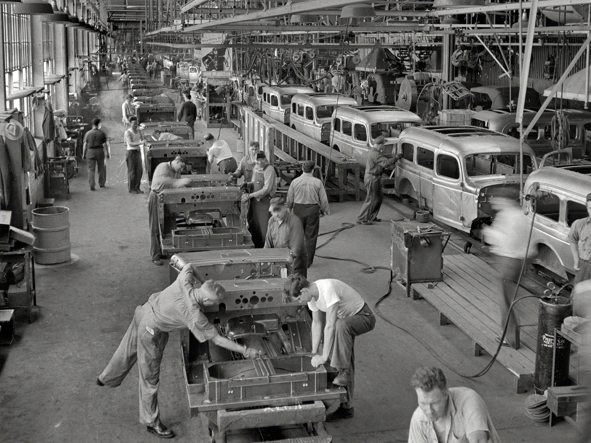
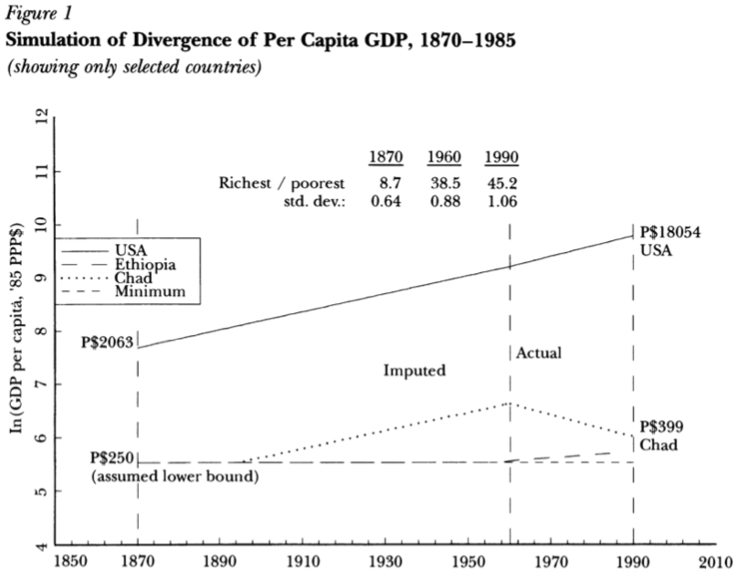
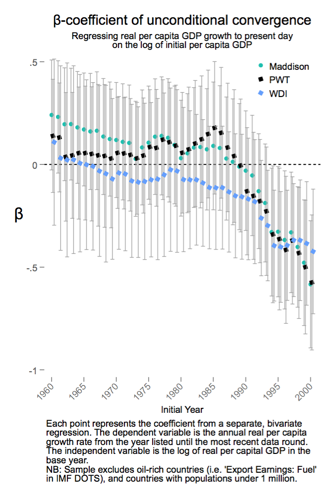
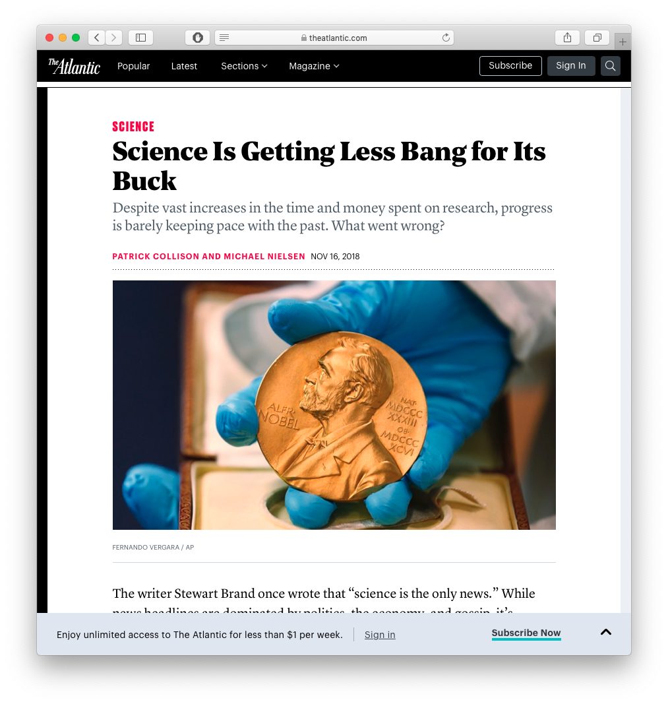
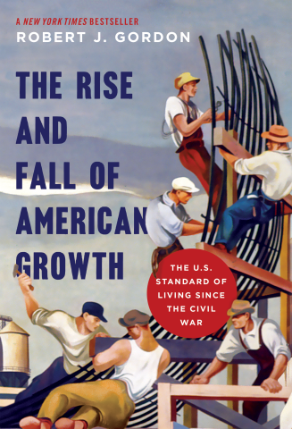
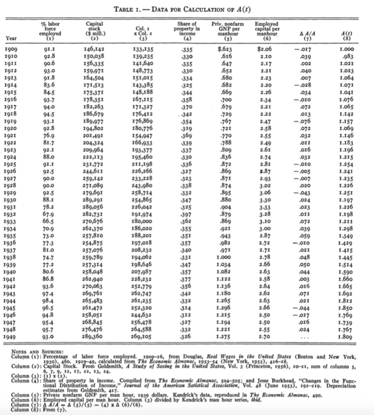

```{r setup, include=FALSE}
options(htmltools.dir.version = FALSE)
knitr::opts_chunk$set(echo=F,
                      message=F,
                      warning=F,
                      fig.retina = 3,
                      fig.align = "center")
library("tidyverse")
library("ggrepel")
library("fontawesome")
xaringanExtra::use_tile_view()
xaringanExtra::use_tachyons()
xaringanExtra::use_freezeframe()

update_geom_defaults("label", list(family = "Fira Sans Condensed"))
update_geom_defaults("text", list(family = "Fira Sans Condensed"))

set.seed(256)

theme_slides <- theme_light() + 
  theme(
    text = element_text(family = "Fira Sans", size = 24)
  )

```

class: inverse

# Outline

### [Neoclassical Working Tools](#3)
### [The “Simple” Solow Model](#15)
### [The “Full” Solow Model](#42)
### [Cross-Country Comparisons](#47)
### [Growth Accounting](#60)

---

class: inverse, center, middle
# Neoclassical Working Tools

---

# An Aggregate Production Function I

.pull-left[

.smallest[
- .hi[Aggregate production function]: rate at which an economy converts inputs into output<sup>.magenta[1]</sup>

$$Y=A*f(L,K,T)$$

- Economists often classify inputs into broad categories:

]

.quitesmall[
```{r,results="asis"}
tribble(
  ~"Factor", ~"Owned By", ~"Earns",
  "Land (T)", "Landowners", "Rent",
  "Labor (L)", "Laborers", "Wages",
  "Capital (K)", "Capitalists", "Interest"
) %>%
  knitr::kable(., format="html")
```

]

.smallest[
- "A" is called .hi-purple[total factor productivity], augments all factors to improve output
  - Often called "technology" but more like "ideas, incentives, and institutions"

]

]

.pull-right[
.center[

]
]

---

# Theoretical Microfoundations I

.pull-left[

- Assume $N$ firms $(i=1,2,\cdots, N)$ all have the **same** production technology
$$y_i=a*f(L_i,K_i,T_i)$$

- All firms minimize cost of production and face the same factor prices:<sup>.magenta[1]</sup>
    - $p_L=w=MP_L$
    - $p_K=i=MP_K$
    - $p_T=r=MP_T$

]

.pull-right[
.center[

]
]

.footnote[<sup>.magenta[1]</sup> Assuming competitive markets, all factor prices (wages, interest, rents) are equal to the marginal productivity of labor, capital, and land, respectively.]

---

# Theoretical Microfoundations II

.pull-left[

- The economy behaves “as if” there is a single firm with technology:
$$Y=A*f(L,K,T)$$
and facing factor prices, where aggregate inputs and output are:

$$\begin{align*}
L&=l_1+l_2+ \cdots + l_N\\
K&=k_1+k_2+ \cdots + k_N\\
T&=t_1+t_2+ \cdots + t_N\\
Y&=y_1+y_2+ \cdots + y_N\\
\end{align*}$$

]

.pull-right[
.center[

]
]
---

# An Aggregate Production Function: Implications
.smaller[
Assuming constant returns to scale (output and all inputs scale at the same proportionate rate):

- If two countries have the same technology, there is no economic advantage to size

- Labor productivity $\left(\frac{Y}{L}\right)$, output-per-worker/hour, is determined only by $\left(\frac{K}{L}\right)$, capital-per-worker/hour

$$Y = MP_LL + MP_KK + MP_T T$$

- With competitive markets, firms pay each factor its marginal product, firms earn no profits<sup>.magenta[1]</sup>
]

.footnote[<sup>.magenta[1]</sup> This is also called the "product exhaustion theorem," and comes from [Euler's Theorem for homogeneous functions](https://en.wikipedia.org/wiki/Homogeneous_function#Positive_homogeneity) (constant returns functions are homogeneous of degree 1).]

---

# An Aggregate Production Function: Cobb-Douglas I

.pull-left[
.smallest[
- Common functional form in economics: .hi[Cobb-Douglas]

$$Y=AK^{\alpha}L^{1-\alpha}$$

- Exponents $(\alpha)$ and $(1-\alpha)$ are “output-elasticities”
    - A 1% increase in K (L) will yield an $\alpha$% $(1-\alpha)%$ increase in Y

- Constant returns to scale<sup>.magenta[1]</sup>: a k% increase in *all* inputs will yield a k% increase in $Y$

- [More about Cobb-Douglas functions](http://microf21.classes.ryansafner.com/content/1.4-content)

]
]

.pull-right[

$$Y = K^{0.5}L^{0.5}$$

```{r, fig.retina=3, fig.height=5.5, fig.align="center"}
library("plotly")
x_vec = seq(0,10,1)
y_vec = seq(0,10,1)
x_matrix = matrix(c(x_vec), nrow = 10, ncol = 1)
y_matrix = matrix(c(y_vec), nrow = 1, ncol = 10)
z_matrix = matrix(c(sqrt(x_matrix %*% y_matrix)),nrow=10,ncol=10)

plot_ly(x = x_vec,
           y = y_vec,
           z = z_matrix) %>%
  add_surface() %>%
  layout(scene = list(xaxis = list(title="K"),
                      yaxis = list(title="L"),
                      zaxis = list(title="Output")))
```

]

.footnote[<sup>.magenta[1]</sup> Only when all exponents sum to 1. In technical terms, the production function is "homogeneous of degree 1"]

---

# An Aggregate Production Function: Cobb-Douglas I

.pull-left[

.smallest[
$$Y=AK^{\alpha}L^{1-\alpha}$$

- GDP $(Y)$: “Total Output” $=$ “Total Income” for all factor-owners

- Exponents $\alpha$ and $(1-\alpha)$ are the .hi-purple[Factor Shares] of National Income
    - $\alpha$: capital's share of national income
    - $(1-\alpha)$: labor's share of national income

- Empirically, very stable: 
    - Capital's share: $\alpha \approx 0.3$
    - Labor's share: $1-\alpha \approx 0.7$
]
]

.pull-right[

$$Y = K^{0.3}L^{0.7}$$

```{r, fig.retina=3, fig.height=5.5, fig.align="center"}
library("plotly")
x_vec = seq(0,10,1)
y_vec = seq(0,10,1)
x_matrix = matrix(c(x_vec), nrow = 10, ncol = 1)
y_matrix = matrix(c(y_vec), nrow = 1, ncol = 10)
z_matrix = matrix(c((x_matrix^(0.3) %*% y_matrix^(0.7))),nrow=10,ncol=10)

plot_ly(x = x_vec,
           y = y_vec,
           z = z_matrix) %>%
  add_surface() %>%
  layout(scene = list(xaxis = list(title="K"),
                      yaxis = list(title="L"),
                      zaxis = list(title="Output")))
```

]

---

# Aggregate Production Function: Labor I

.pull-left[

- Look at Labor, holding other factors constant:<sup>.magenta[1]</sup>

.bg-washed-green.b--dark-green.ba.bw2.br3.shadow-5.ph4.mt5[
.green[**Example**]: When `\\(\bar{K}=9\\)`
]
$$Y=3L^{0.5}$$

]

.pull-right[

```{r}
srl=function(x){3*x^(0.5)} 
```

```{r, fig.retina=3, fig.height=5, fig.align="center"}
ggplot(data.frame(x=c(0,10)), aes(x=x))+
  stat_function(fun=srl, geom="line", size=2, color = "#73D055FF")+
    geom_label(aes(x=8,y=srl(8)), color = "#73D055FF", label=expression(Y=3*L^{0.5}), size = 6)+
    scale_x_continuous(breaks=seq(0,10,1),
                     limits=c(0,10),
                     expand=expand_scale(mult=c(0,0.1)))+
  scale_y_continuous(breaks=seq(0,10,1),
                     limits=c(0,10),
                     expand=expand_scale(mult=c(0,0.1)))+
  #scale_colour_manual("Curves", values = line_colors, guide=F)+
  labs(x = "Labor (L)",
       y = "Output (Y)")+
  theme_classic(base_family = "Fira Sans Condensed", base_size=20)
```

]

.footnote[<sup>.magenta[1]</sup> We often consider "the short run" where `\\(K\\)` is fixed, and production functions are simply functions of labor with fixed capital `\\(y=f(\bar{k},l)\\)`.]

---

# Aggregate Production Function: Labor II

.pull-left[
.smallest[
- Look at Labor, holding other factors constant: 

- The .hi[marginal product of labor]: the additional output produced by an additional unit of labor (holding other factors constant)

$$MP_L=\frac{\Delta Y}{\Delta L}$$

- The .hi[average product of labor]: output per worker

$$AP_L=\frac{Y}{L}$$

]
]
.pull-right[

```{r}
mpl=function(x){1.5*x^(-0.5)}
apl=function(x){3*x^(-0.5)}
```

```{r, fig.retina=3, fig.height=5, fig.align="center"}
ggplot(data.frame(x=c(0,10)), aes(x=x))+
  stat_function(fun=mpl, geom="line", size=2, color = "blue")+
  stat_function(fun=apl, geom="line", size=2, color = "red")+
    geom_label(aes(x=8,y=mpl(8)), color = "blue", label=expression(MP[L]), size = 6)+
    geom_label(aes(x=6,y=apl(6)), color = "red", label=expression(AP[L]), size = 6)+
    scale_x_continuous(breaks=seq(0,10,1),
                     limits=c(0,10),
                     expand=expand_scale(mult=c(0,0.1)))+
  scale_y_continuous(breaks=seq(0,10,1),
                     limits=c(0,10),
                     expand=expand_scale(mult=c(0,0.1)))+
  #scale_colour_manual("Curves", values = line_colors, guide=F)+
  labs(x = "Labor (L)",
       y = "Output Per Worker")+
  theme_classic(base_family = "Fira Sans Condensed", base_size=20)
```

]

---

# Aggregate Production Function: Capital I

.pull-left[
.smallest[
- Look at Capital, holding other factors constant:

.bg-washed-green.b--dark-green.ba.bw2.br3.shadow-5.ph4.mt5[
.green[**Example**]: When `\\(\bar{L}=9\\)`
]
$$Y=3K^{0.5}$$

]
]

.pull-right[

```{r}
srk=function(x){3*x^(0.5)} 
```

```{r, fig.retina=3, fig.height=5, fig.align="center"}
ggplot(data.frame(x=c(0,10)), aes(x=x))+
  stat_function(fun=srk, geom="line", size=2, color = "#73D055FF")+
    geom_label(aes(x=8,y=srk(8)), color = "#73D055FF", label=expression(Y=3*K^{0.5}), size = 6)+
    scale_x_continuous(breaks=seq(0,10,1),
                     limits=c(0,10),
                     expand=expand_scale(mult=c(0,0.1)))+
  scale_y_continuous(breaks=seq(0,10,1),
                     limits=c(0,10),
                     expand=expand_scale(mult=c(0,0.1)))+
  #scale_colour_manual("Curves", values = line_colors, guide=F)+
  labs(x = "Capital (K)",
       y = "Output (Y)")+
  theme_classic(base_family = "Fira Sans Condensed", base_size=20)
```

]

---

# Aggregate Production Function: Capital II

.pull-left[

- The .hi[marginal product of capital]: the additional output produced by an additional unit of capital (holding other factors constant)

$$MP_K=\frac{\Delta Y}{\Delta K}$$

- The .hi[average product of capital]: output per unit of capital

$$AP_K=\frac{Y}{K}$$

]

.pull-right[

```{r}
mpl=function(x){1.5*x^(-0.5)}
apl=function(x){3*x^(-0.5)}
```

```{r, fig.retina=3, fig.height=5, fig.align="center"}
ggplot(data.frame(x=c(0,10)), aes(x=x))+
  stat_function(fun=mpl, geom="line", size=2, color = "blue")+
  stat_function(fun=apl, geom="line", size=2, color = "red")+
    geom_label(aes(x=8,y=mpl(8)), color = "blue", label=expression(MP[K]), size = 6)+
    geom_label(aes(x=6,y=apl(6)), color = "red", label=expression(AP[K]), size = 6)+
    scale_x_continuous(breaks=seq(0,10,1),
                     limits=c(0,10),
                     expand=expand_scale(mult=c(0,0.1)))+
  scale_y_continuous(breaks=seq(0,10,1),
                     limits=c(0,10),
                     expand=expand_scale(mult=c(0,0.1)))+
  #scale_colour_manual("Curves", values = line_colors, guide=F)+
  labs(x = "Capital (K)",
       y = "Output per Unit of Capital")+
  theme_classic(base_family = "Fira Sans Condensed", base_size=20)
```

]

---

# Capital and Labor

.pull-left[

- Often compare **capital-to-labor ratio** $\left(\frac{K}{L} \right)$

- .hi[Capital "widening"]: stock of capital increases, but capital per worker $\left(\frac{K}{L}\right)$ does not change
    - Increase in $K$ is same rate as increase in labor and depreciation

- .hi[Capital "deepening"]: stock of capital per worker $\left(\frac{K}{L}\right)$ is increasing  

]

.pull-right[
.center[

]

]

---

class: inverse, center, middle
# The Solow Model

---

# Kaldor's Stylized Facts About Growth

.left-column[

.center[


Nicholas Kaldor

(1908-1986)

]
]

.right-column[

.smallest[
> "A satisfactory model concerning the nature of the growth process in a capitalist economy must also account for the remarkable historical constancies revealed by recent empirical investigations." (p.591)

1. Output per worker grows over time

2. Capital per worker grows over time

3. The capital-to-output ratio is approximately constant over time

4. Capital and labor's share of output is approximately constant over time

5. The return to capital is approximately constant over time

6. Levels of output per person vary widely across countries


]

.source[Kaldor, Nicholas, 1957, "A Model of Economic Growth," *Economic Journal* 67(268): 591-624]

]

---

# The Solow (Neoclassical) Growth Model

.left-column[

.center[

.smallest[
Robert Solow

(1924-)

Economics Nobel 1987
]
]
]

.right-column[

.smallest[
> "All theory depends on assumptions which are not quite true. That is what makes it theory. The art of successful theorizing is to make the inevitable simplifying assumptions in such a way that the final results are not very sensitive," (p.65)

> "The characteristic and powerful conclusion of the Harrod-Domar line of thought is that even for the long run the economic system is at best balanced on a knife-edge of equilibrium growth...The bulk of [Solow's] paper is devoted to a model of long-run growth which accepts all of the Harrod-Domar assumptions [but] instead I suppose that [output] is produced by labor and capital under the **standard neoclassical conditions**," (pp.65-66)

]


.source[Solow, Robert, 1956, "A Contribution to the Theory of Economic Growth," *Quarterly Journal of Economics* 70(1): 65-94]

]
---

# The “Simple” Solow Model: Key Assumptions

- An aggregate Cobb-Douglas production function
- Diminishing returns to factors, $\downarrow MP_L$ and $\downarrow MP_K$
- Can accumulate physical capital $(K)$
- Technology grows .hi-purple[exogenously] (some fixed rate determined outside of the model)
- Constant rate of Savings and of Investment $(s)$

- I am going to leave out excess parts of the model: role of taxes, interest rates, etc, on consumption, saving, and investment<sup>.magenta[1]</sup>

.footnote[<sup>.magenta[1]</sup> This isn't a macroeconomics course!]

---

# The “Simple” Solow Model: Equations

(1) $C_t+I_t=Y_t=f(K,L)$
  - Income is equal to consumption plus investment
  - Output is equal to the production function
  - Income = Output 

--

(2) $I_t=sf(K_t,L_t)$
  - Investment is equal to the fraction of income (output) saved $s$ times output

--

(3) $K_{t+1}=K_t (1-\delta) + I_t$
  - The stock of capital $K$ changes over time from depreciation $(\delta)$ and new investment $I_t$

--

(4) $L_t=L$
  - The stock of labor is constant over time
    
---

# The “Simple” Solow Model: Implications

- $K_{t+1}=K_t(1-\delta)+sf(K_t,L_t)$
    - Plugging equation 2 into equation 3

--

- .hi-purple[Steady-State equilibrium]: $\delta K = sf(K,L)$
    - Amount of capital depreciation is equal to the amount saved & invested in new capital formation
    - Capital growth “breaks even” to have a constant amount of $K$ over time

---


# Equations and Implications, in Terms of $k$

- Restate model in terms of $k \equiv \frac{K}{L}$, i.e. divide everything by $L$ to get “per worker”
  - $y = \frac{Y}{L}$, output per worker
  - $k = \frac{K}{L}$, capital per worker

--

1. $c_t+i_t=y_t=f(k_t)$

2. $i_t=sf(k_t)$

3. $k_{t+1}=k_t(1-\delta)+i_t$

--

- Implications

1. $k_{t+1}=k_t(1-\delta)+sf(k_t)$

2. Steady-State equilibrium: $\delta k = sf(k)$

---

```{r original-solow-parameters}
output=function(x){x^a}
invest=function(x){s*(x)^a}
deprec=function(x){(d+n+g)*x}
s<-0.3
n<-0.00
d<-0.02
g<-0.00
a<-0.50 # capital share, alpha
k<-1 # capital

# calculate k*
kstar<-(s/(n+g+d))^(1/(1-a))
ystar<-(kstar)^a
    
# calculate output for input k 
y<-k^a

solow_colors<-c("Output" = "green", "Investment" = "blue", "Depreciation" = "red")
```


# Graphically: Capital and Depreciation I

.pull-left[

- Whenever .green[Investment] $>$ .red[Depreciation]:
    - Capital stock is **growing** over time, $g_K > 0$
    - Adding more *new* capital than is *lost* to depreciation
    - Movement to the right on graph $k \rightarrow$
]

.pull-right[

```{r, fig.retina=3}
ggplot(data = tibble(x=c(0,10)))+
  aes(x = x)+
  stat_function(fun = output, geom = "line", size =2, aes(color = "Output"))+
  geom_label(aes(x = 350, y = output(350), color = "Output"), label = "Output")+
  stat_function(fun = invest, geom = "line", size =2, aes(color = "Investment"))+
  geom_label(aes(x = 350, y = invest(350), color = "Investment"), label = "Investment")+
  stat_function(fun = deprec, geom = "line", size =2, aes(color = "Depreciation"))+
  geom_label(aes(x = 350, y = deprec(350), color = "Depreciation"), label = "Depreciation")+
  
  # lines, fill, and arrow 
  geom_segment(x=100,xend=100,y=0,yend=output(100), linetype="dashed")+
  geom_segment(x=0,xend=100,y=output(100),yend=output(100), linetype="dashed")+
  geom_segment(x=0,xend=100,y=deprec(100),yend=deprec(100), linetype="dashed")+
  geom_segment(x=0,xend=100,y=invest(100),yend=invest(100), linetype="dashed")+
  geom_rect(xmin=0, xmax=100,ymin=deprec(100), ymax=invest(100), fill="green", alpha=0.5)+
  annotate("segment", x = 100, xend = 150, y = 5, yend = 5, color = "black", size=2, alpha=0.9, arrow=arrow(length=unit(0.5,"cm"), ends="last", type="closed"))+
  annotate("segment", x = 150, xend = 200, y = 5, yend = 5, color = "black", size=2, alpha=0.9, arrow=arrow(length=unit(0.5,"cm"), ends="last", type="closed"))+

  scale_x_continuous(breaks=seq(0,400,50),
                     limits=c(0,400),
                     expand=expand_scale(mult=c(0,0.1)))+
  scale_y_continuous(breaks=seq(0,20,5),
                     limits=c(0,20),
                     expand=expand_scale(mult=c(0,0.1)))+
  guides(color = F)+
  labs(x = "Capital per worker (k)",
       y = "Output per worker (y)",
       caption = expression(paste("Solow Model for ",y==k^{0.5}, ", ",delta==0.02, ", ",s==0.30)))+
  ggthemes::theme_pander(base_family = "Fira Sans Condensed", base_size=20)
```


]

---

# Graphically: Capital and Depreciation II

.pull-left[

- Whenever .green[Investment] $<$ .red[Depreciation]:
    - Capital stock is **shrinking** over time, $g_K < 0$
    - Adding less *new* capital than is *lost* to depreciation
    - Movement to the left on graph $\leftarrow k$
]

.pull-right[

```{r, fig.retina=3}
ggplot(data = tibble(x=c(0,10)))+
  aes(x = x)+
  stat_function(fun = output, geom = "line", size =2, aes(color = "Output"))+
  geom_label(aes(x = 350, y = output(350), color = "Output"), label = "Output")+
  stat_function(fun = invest, geom = "line", size =2, aes(color = "Investment"))+
  geom_label(aes(x = 350, y = invest(350), color = "Investment"), label = "Investment")+
  stat_function(fun = deprec, geom = "line", size =2, aes(color = "Depreciation"))+
  geom_label(aes(x = 350, y = deprec(350), color = "Depreciation"), label = "Depreciation")+
  
  # lines, fill, and arrow 
  geom_segment(x=300,xend=300,y=0,yend=output(300), linetype="dashed")+
  geom_segment(x=0,xend=300,y=output(300),yend=output(300), linetype="dashed")+
  geom_segment(x=0,xend=300,y=deprec(300),yend=deprec(300), linetype="dashed")+
  geom_segment(x=0,xend=300,y=invest(300),yend=invest(300), linetype="dashed")+
  geom_rect(xmin=0, xmax=300,ymin=deprec(300), ymax=invest(300), fill="red", alpha=0.5)+
  annotate("segment", x = 300, xend = 250, y = 10, yend = 10, color = "black", size=2, alpha=0.9, arrow=arrow(length=unit(0.5,"cm"), ends="last", type="closed"))+
    annotate("segment", x = 250, xend = 200, y = 10, yend = 10, color = "black", size=2, alpha=0.9, arrow=arrow(length=unit(0.5,"cm"), ends="last", type="closed"))+
  scale_x_continuous(breaks=seq(0,400,50),
                     limits=c(0,400),
                     expand=expand_scale(mult=c(0,0.1)))+
  scale_y_continuous(breaks=seq(0,20,5),
                     limits=c(0,20),
                     expand=expand_scale(mult=c(0,0.1)))+
  guides(color = F)+
  labs(x = "Capital per worker (k)",
       y = "Output per worker (y)",
       caption = expression(paste("Solow Model for ",y==k^{0.5}, ", ",delta==0.02, ", ",s==0.30)))+
  theme_classic(base_family = "Fira Sans Condensed", base_size=20)
```


]

---

# Graphically: Capital & the Steady State

.pull-left[

.smallest[
- Whenever .green[Investment] $=$ .red[Depreciation]
  - Capital stock reaches a **steady state**, $g_K = 0$
  - Adding exactly as much *new* capital that is *lost* to depreciation
  - No movement on graph

- .green[**Steady State level** of capital]: $k_t^*: sf(k_t)=\delta k_t, \, g_k=0$

- .blue[**Steady State level** of output]
  - .purple[Amount available for consumption], $c_t^*=y_t^*-i_t^*$
]

]

.pull-right[

```{r, fig.retina=3}
sp<-ggplot(data = tibble(x=c(0,10)))+
  aes(x = x)+
  stat_function(fun = output, geom = "line", size =2, aes(color = "Output"))+
  geom_label(aes(x = 350, y = output(350), color = "Output"), label = "Output")+
  stat_function(fun = invest, geom = "line", size =2, aes(color = "Investment"))+
  geom_label(aes(x = 350, y = invest(350), color = "Investment"), label = "Investment")+
  stat_function(fun = deprec, geom = "line", size =2, aes(color = "Depreciation"))+
  geom_label(aes(x = 350, y = deprec(350), color = "Depreciation"), label = "Depreciation")+
  geom_segment(x=0,xend=kstar,y=output(kstar),yend=output(kstar), linetype="dashed")+
  geom_segment(x=0,xend=kstar,y=deprec(kstar),yend=deprec(kstar), linetype="dashed")+
  geom_segment(x=kstar,xend=kstar,y=0,yend=ystar, linetype="dashed")+
  annotate("segment", x = kstar, xend = kstar, y = invest(kstar), yend = output(kstar), color = "purple", size=2, alpha=0.9, arrow=arrow(length=unit(0.5,"cm"), ends="both", type="closed"))+
  geom_label(aes(x=kstar+5, y=10), label="Consumption Available", color="purple")+
  scale_x_continuous(breaks=seq(0,400,50),
                     limits=c(0,400),
                     expand=expand_scale(mult=c(0,0.1)))+
  scale_y_continuous(breaks=seq(0,20,5),
                     limits=c(0,20),
                     expand=expand_scale(mult=c(0,0.1)))+
  #scale_colour_manual("Lines", values = solow_colors)+
  guides(color = F)+
  labs(x = "Capital per worker (k)",
       y = "Output per worker (y)",
       caption = expression(paste("Solow Model for ",y==k^{0.5}, ", ",delta==0.02, ", ",s==0.30)))+
  theme_classic(base_family = "Fira Sans Condensed", base_size=20)
sp
```


]

---

# Comparative Statics: A Change in Savings I

.pull-left[

- What if consumers decide to **save more**? 
    - $s_1=0.30$
    - $s_2=0.50$

]

.pull-right[

```{r, fig.retina=3}
s2<-0.5

invest2=function(x){s2*(x)^a}
deprec=function(x){(d+n+g)*x}

# calculate k*
kstar2<-(s2/(n+g+d))^(1/(1-a))
ystar2<-(kstar2)^a

ggplot(data = tibble(x=c(0,10)))+
  aes(x = x)+
  stat_function(fun = output, geom = "line", size =2, aes(color = "Output"))+
  geom_label(aes(x = 900, y = output(900), color = "Output"), label = "Output")+
  stat_function(fun = invest, geom = "line", size =2, aes(color = "Investment"))+
  geom_label(aes(x = 900, y = invest(900), color = "Investment"), label = "Investment")+
  stat_function(fun = deprec, geom = "line", size =2, aes(color = "Depreciation"))+
  geom_label(aes(x = 900, y = deprec(900), color = "Depreciation"), label = "Depreciation")+
  geom_segment(x=0,xend=kstar,y=output(kstar),yend=output(kstar), linetype="dashed")+
  geom_segment(x=0,xend=kstar,y=deprec(kstar),yend=deprec(kstar), linetype="dashed")+
  geom_segment(x=kstar,xend=kstar,y=0,yend=ystar, linetype="dashed")+
  annotate("segment", x = kstar, xend = kstar, y = invest(kstar), yend = output(kstar), color = "purple", size=2, alpha=0.9, arrow=arrow(length=unit(0.5,"cm"), ends="both", type="closed"))+
  geom_label(aes(x=kstar+5, y=10), label="Consumption", color="purple")+
  scale_x_continuous(breaks=seq(0,1000,100),
                     limits=c(0,1000),
                     expand=expand_scale(mult=c(0,0.1)))+
  scale_y_continuous(breaks=seq(0,40,5),
                     limits=c(0,40),
                     expand=expand_scale(mult=c(0,0.1)))+
  #scale_colour_manual("Lines", values = solow_colors)+
  guides(color = F)+
  labs(x = "Capital per worker (k)",
       y = "Output per worker (y)",
       caption = expression(paste("Solow Model for ",y==k^{0.5}, ", ",delta==0.02, ", ",s[1]==0.30, ", ", s[2]==0.50)))+
  theme_classic(base_family = "Fira Sans Condensed", base_size=20)
```


]

---

# Comparative Statics: A Change in Savings II

.pull-left[

- What if consumers decide to **save more**? 
    - $s_1=0.30$
    - $s_2=0.50$

- Investment $i_t$ increases

- Steady state level of capital $k_t^*$ increases

- Steady state output increases $y_t^*$

- Steady state amount of consumption
    - Decreases at first from more savings 
    - Increases from more output produced
]

.pull-right[

```{r saving-change}
s2<-0.5

invest2=function(x){s2*(x)^a}
deprec=function(x){(d+n+g)*x}

# calculate k*
kstar2<-(s2/(n+g+d))^(1/(1-a))
ystar2<-(kstar2)^a
```

```{r, fig.retina=3}
ggplot(data = tibble(x=c(0,10)))+
  aes(x = x)+
  stat_function(fun = output, geom = "line", size =2, aes(color = "Output"))+
  geom_label(aes(x = 900, y = output(900), color = "Output"), label = "Output")+
  stat_function(fun = invest, geom = "line", size =2, aes(color = "Investment"))+
  geom_label(aes(x = 900, y = invest(900), color = "Investment"), label = "Investment")+
  stat_function(fun = deprec, geom = "line", size =2, aes(color = "Depreciation"))+
  geom_label(aes(x = 900, y = deprec(900), color = "Depreciation"), label = "Depreciation")+
  geom_segment(x=0,xend=kstar,y=output(kstar),yend=output(kstar), linetype="dashed")+
  geom_segment(x=0,xend=kstar,y=deprec(kstar),yend=deprec(kstar), linetype="dashed")+
  geom_segment(x=kstar,xend=kstar,y=0,yend=ystar, linetype="dashed")+
  annotate("segment", x = kstar, xend = kstar, y = invest(kstar), yend = output(kstar), color = "purple", size=2, alpha=0.9, arrow=arrow(length=unit(0.5,"cm"), ends="both", type="closed"))+
  geom_label(aes(x=kstar+5, y=10), label="Old Consumption", color="purple")+
  
  # new equilibrium
  
  stat_function(fun = invest2, geom = "line", size =2, linetype = "dashed", aes(color = "Investment"))+
  geom_label(aes(x = 900, y = invest2(900), color = "Investment"), label = "NEW Investment")+
  geom_segment(x=0,xend=kstar2,y=output(kstar2),yend=output(kstar2), linetype="dashed")+
  geom_segment(x=0,xend=kstar2,y=deprec(kstar2),yend=deprec(kstar2), linetype="dashed")+
  geom_segment(x=kstar2,xend=kstar2,y=0,yend=ystar2, linetype="dashed")+
  annotate("segment", x = kstar2, xend = kstar2, y = invest2(kstar2), yend = output(kstar2), color = "purple", size=2, alpha=0.9, arrow=arrow(length=unit(0.5,"cm"), ends="both", type="closed"))+
  geom_label(aes(x=kstar2+5, y=20), label="NEW Consumption", color="purple")+

  annotate("segment", x = kstar, xend = kstar2, y = 15, yend = 15, color = "black", size=2, alpha=0.9, arrow=arrow(length=unit(0.5,"cm"), ends="last", type="closed"))+

  scale_x_continuous(breaks=seq(0,1000,100),
                     limits=c(0,1000),
                     expand=expand_scale(mult=c(0,0.1)))+
  scale_y_continuous(breaks=seq(0,40,5),
                     limits=c(0,40),
                     expand=expand_scale(mult=c(0,0.1)))+
  #scale_colour_manual("Lines", values = solow_colors)+
  guides(color = F)+
  labs(x = "Capital per worker (k)",
       y = "Output per worker (y)",
       caption = expression(paste("Solow Model for ",y==k^{0.5}, ", ",delta==0.02, ", ",s[1]==0.30, ", ", s[2]==0.50)))+
  theme_classic(base_family = "Fira Sans Condensed", base_size=20)
```


]

---

# Comparative Statics: A Change in Depreciation I

.pull-left[

- What if depreciation costs increase?
    - $\delta_1=0.02$
    - $\delta_2=0.04$

]

.pull-right[

```{r depreciation-change}
d2<-0.03

deprec2=function(x){(d2+n+g)*x}

# calculate k*
kstar3<-(s/(n+g+d2))^(1/(1-a))
ystar3<-(kstar3)^a
```

```{r, fig.retina=3}
ggplot(data = tibble(x=c(0,10)))+
  aes(x = x)+
  stat_function(fun = output, geom = "line", size =2, aes(color = "Output"))+
  geom_label(aes(x = 275, y = output(275), color = "Output"), label = "Output")+
  stat_function(fun = deprec, geom = "line", size =2, aes(color = "Depreciation"))+
  geom_label(aes(x = 275, y = deprec(275), color = "Depreciation"), label = "Depreciation")+
  stat_function(fun = invest, geom = "line", size =2, aes(color = "Investment"))+
  geom_label(aes(x = 275, y = invest(275), color = "Investment"), label = "Investment")+
  geom_segment(x=0,xend=kstar,y=output(kstar),yend=output(kstar), linetype="dashed")+
  geom_segment(x=0,xend=kstar,y=deprec(kstar),yend=deprec(kstar), linetype="dashed")+
  geom_segment(x=kstar,xend=kstar,y=0,yend=ystar, linetype="dashed")+
  annotate("segment", x = kstar, xend = kstar, y = invest(kstar), yend = output(kstar), color = "purple", size=2, alpha=0.9, arrow=arrow(length=unit(0.5,"cm"), ends="both", type="closed"))+
  geom_label(aes(x=kstar+5, y=10), label="Old Consumption", color="purple")+
  scale_x_continuous(breaks=seq(0,300,50),
                     limits=c(0,300),
                     expand=expand_scale(mult=c(0,0.1)))+
  scale_y_continuous(breaks=seq(0,20,5),
                     limits=c(0,20),
                     expand=expand_scale(mult=c(0,0.1)))+
  #scale_colour_manual("Lines", values = solow_colors)+
  guides(color = F)+
  labs(x = "Capital per worker (k)",
       y = "Output per worker (y)",
       caption = expression(paste("Solow Model for ",y==k^{0.5}, ", ",delta[1]==0.02, ", ",delta[2]==0.04, ", ", s==0.30)))+
  theme_classic(base_family = "Fira Sans Condensed", base_size=20)
```

]

---

# Comparative Statics: A Change in Depreciation II

.pull-left[

- What if depreciation costs increase?
    - $\delta_1=0.02$
    - $\delta_2=0.04$

- Investment $i_t$ decreases

- Steady state level of capital $k_t^*$ decreases

- Steady state output decreases $y_t^*$

- Steady state amount of consumption $c_t^*$ decreases 
]

.pull-right[

```{r, fig.retina=3}
ggplot(data = tibble(x=c(0,10)))+
  aes(x = x)+
  stat_function(fun = output, geom = "line", size =2, aes(color = "Output"))+
  geom_label(aes(x = 275, y = output(275), color = "Output"), label = "Output")+
  stat_function(fun = invest, geom = "line", size =2, aes(color = "Investment"))+
  geom_label(aes(x = 275, y = deprec(275), color = "Depreciation"), label = "Depreciation")+
  geom_label(aes(x = 275, y = invest(275), color = "Investment"), label = "Investment")+
  stat_function(fun = deprec, geom = "line", size =2, aes(color = "Depreciation"))+
  geom_segment(x=0,xend=kstar,y=output(kstar),yend=output(kstar), linetype="dashed")+
  geom_segment(x=0,xend=kstar,y=deprec(kstar),yend=deprec(kstar), linetype="dashed")+
  geom_segment(x=kstar,xend=kstar,y=0,yend=ystar, linetype="dashed")+
  annotate("segment", x = kstar, xend = kstar, y = invest(kstar), yend = output(kstar), color = "purple", size=2, alpha=0.9, arrow=arrow(length=unit(0.5,"cm"), ends="both", type="closed"))+
  geom_label(aes(x=kstar+5, y=10), label="Old Consumption", color="purple")+
  
  # new equilibrium
  
  stat_function(fun = deprec2, geom = "line", size =2, linetype = "dashed", aes(color = "Depreciation"))+
  geom_label(aes(x = 275, y = deprec2(275), color = "Depreciation"), label = "NEW Depreciation")+
  geom_segment(x=0,xend=kstar3,y=output(kstar3),yend=output(kstar3), linetype="dashed")+
  geom_segment(x=0,xend=kstar3,y=invest(kstar3),yend=invest(kstar3), linetype="dashed")+
  geom_segment(x=kstar3,xend=kstar3,y=0,yend=ystar3, linetype="dashed")+
  
  annotate("segment", x = kstar3, xend = kstar3, y = invest(kstar3), yend = output(kstar3), color = "purple", size=2, alpha=0.9, arrow=arrow(length=unit(0.5,"cm"), ends="both", type="closed"))+
  geom_label(aes(x=kstar+5, y=10), label="NEW Consumption", color="purple")+

  annotate("segment", x = kstar, xend = kstar3, y = 9, yend = 9, color = "purple", size=2, alpha=0.9, arrow=arrow(length=unit(0.5,"cm"), ends="last", type="closed"))+


  scale_x_continuous(breaks=seq(0,300,50),
                     limits=c(0,300),
                     expand=expand_scale(mult=c(0,0.1)))+
  scale_y_continuous(breaks=seq(0,20,5),
                     limits=c(0,20),
                     expand=expand_scale(mult=c(0,0.1)))+
  #scale_colour_manual("Lines", values = solow_colors)+
  guides(color = F)+
  labs(x = "Capital per worker (k)",
       y = "Output per worker (y)",
       caption = expression(paste("Solow Model for ",y==k^{0.5}, ", ",delta[1]==0.02, ", ",delta[2]==0.04, ", ", s==0.30)))+
  theme_classic(base_family = "Fira Sans Condensed", base_size=20)
```


]

---

# The Golden Rule Level of k I

.pull-left[

.smallest[
- Different values of $s$ lead to different steady state levels of $k^*$, which is *best*?

- The best steady state is one where there is the highest possible consumption per person 
$$c^*=(1-s)f(k^*)$$

- Increase in $s$
    - Reduces consumption's share of income $(1-s)$
    - Results in higher $k^*$ and higher $y^*$

- Find the value of $s$ (and $k^*)$ that *maximize* $c^*$
]
]

.pull-right[

```{r, fig.retina=3}
sp
```


]

---

# The Golden Rule Level of k II

.pull-left[

$$\max_{c^*} c^* = \underbrace{f(k^*)}_{y^*} - \underbrace{\delta k^*}_{=i^* \text{ in SS}}$$

$$\begin{align*}
\frac{d \, c^*}{d \, k^*} &= \frac{d \, f(k^*)}{d \, k^*} - \frac{d \, \delta k^*}{d \, k^*}\\ 
0 & = MP_K - \delta \\
MP_K & = \delta \\
\end{align*}$$

- **Golden Rule level of** $\mathbf{k^*_{GR}}$ where slope of depreciation line $=$ slope of production function, $f(k^*)$

]

.pull-right[

```{r, fig.retina=3}
k_gr<-(a/d)^(1/a)
tangent_gr<-function(x){0.02*x+12.5}

ggplot(data = tibble(x=c(0,10)))+
  aes(x = x)+
  stat_function(fun = output, geom = "line", size =2, aes(color = "Output"))+
  geom_label(aes(x = 900, y = output(900), color = "Output"), label = "Output")+
  #stat_function(fun = invest, geom = "line", size =1, aes(color = "Investment"))+
  #geom_label(aes(x = 350, y = invest(350), color = "Investment"), label = "Investment")+
  stat_function(fun = deprec, geom = "line", size =2, aes(color = "Depreciation"))+
  geom_label(aes(x = 900, y = deprec(900), color = "Depreciation"), label = "Depreciation")+
  stat_function(fun = tangent_gr, geom = "line", size =2, linetype="dashed")+
  geom_segment(x=0,xend=k_gr,y=output(k_gr),yend=output(k_gr), linetype="dashed")+
  geom_segment(x=0,xend=k_gr,y=deprec(k_gr),yend=deprec(k_gr), linetype="dashed")+
  geom_segment(x=k_gr,xend=k_gr,y=0,yend=output(k_gr), linetype="dashed")+
  
  annotate("segment", x = k_gr, xend = k_gr, y = deprec(k_gr), yend = output(k_gr), color = "purple", size=2, alpha=0.9, arrow=arrow(length=unit(0.5,"cm"), ends="both", type="closed"))+
  geom_label(aes(x=k_gr, y=20), label="Max Consumption", color="purple")+
  
  scale_x_continuous(breaks=seq(0,1000,100),
                     limits=c(0,1000),
                     expand=expand_scale(mult=c(0,0.1)))+
  scale_y_continuous(breaks=seq(0,30,5),
                     limits=c(0,30),
                     expand=expand_scale(mult=c(0,0.1)))+
  #scale_colour_manual("Lines", values = solow_colors)+
  guides(color = F)+
  labs(x = "Steady-State Capital per worker (k*)",
       y = "Steady-State Output per worker (y*)",
       caption = expression(paste("Solow Model for ",y==k^{0.5}, ", ",delta==0.02, ", s=?")))+
  theme_classic(base_family = "Fira Sans Condensed", base_size=20)
```

]

---

# The Golden Rule Level of k III

.pull-left[

- **Golden Rule level of** $\mathbf{k^*_{GR}}$ where slope of depreciation line $=$ slope of production function, $f(k^*)$

- **Golden Rule level of** $s_{GR} = \frac{\delta k^*_{GR}}{y^*_{GR}}$
    - In this example, $s_{GR}=\frac{0.02(625)}{25}=0.50$

- Optimal level of savings is 0.50 or 50%!
]

.pull-right[

```{r, fig.retina=3}
k_gr<-(a/d)^(1/a) #625
tangent_gr<-function(x){0.02*x+12.5}
y_gr<-output(k_gr) # 25
deprec_gr<-deprec(k_gr) # 12.5
s_gr<-(deprec_gr/y_gr) # 0.5

invest_gr<-function(x){s_gr*(x)^a}

solow_gr<-ggplot(data = tibble(x=c(0,10)))+
  aes(x = x)+
  stat_function(fun = output, geom = "line", size =2, aes(color = "Output"))+
  geom_label(aes(x = 900, y = output(900), color = "Output"), label = "Output")+
  stat_function(fun = invest_gr, geom = "line", size =2, aes(color = "Investment"))+
  geom_label(aes(x = 900, y = invest_gr(900), color = "Investment"), label = "Investment (At GR s)")+
  stat_function(fun = deprec, geom = "line", size =2, aes(color = "Depreciation"))+
  geom_label(aes(x = 900, y = deprec(900), color = "Depreciation"), label = "Depreciation")+
  stat_function(fun = tangent_gr, geom = "line", size =2, linetype="dashed")+
  geom_segment(x=0,xend=k_gr,y=output(k_gr),yend=output(k_gr), linetype="dashed")+
  geom_segment(x=0,xend=k_gr,y=deprec(k_gr),yend=deprec(k_gr), linetype="dashed")+
  geom_segment(x=k_gr,xend=k_gr,y=0,yend=output(k_gr), linetype="dashed")+
  annotate("segment", x = k_gr, xend = k_gr, y = deprec(k_gr), yend = output(k_gr), color = "purple", size=2, alpha=0.9, arrow=arrow(length=unit(0.5,"cm"), ends="both", type="closed"))+
  geom_label(aes(x=k_gr, y=20), label="Max Consumption", color="purple")+
  
  scale_x_continuous(breaks=seq(0,1000,100),
                     limits=c(0,1000),
                     expand=expand_scale(mult=c(0,0.1)))+
  scale_y_continuous(breaks=seq(0,30,5),
                     limits=c(0,30),
                     expand=expand_scale(mult=c(0,0.1)))+
  #scale_colour_manual("Lines", values = solow_colors)+
  guides(color = F)+
  labs(x = "Steady-State Capital per worker (k*)",
       y = "Steady-State Output per worker (y*)",
       caption = expression(paste("Solow Model for ",y==k^{0.5}, ", ",delta==0.02, ", ",s[GR]==0.50)))+
  theme_classic(base_family = "Fira Sans Condensed", base_size=20)
solow_gr
```

]

---

# The Golden Rule Level of k IV

.pull-left[

- Policy implications: policymakers can choose $s$ to $\max c_i^*$ at $k^*_{GR}$

- Change taxes or government spending

]

.pull-right[

```{r, fig.retina=3}
solow_gr
```

]

---

# Main Properties of the Solow Model

.pull-left[

1. There exists a unique steady state capital to labor ratio, $k^*$
    - Where investment = depreciation
    - $sf(k)=\delta(k)$

2. Higher savings rate $s$ implies a higher steady state value of $k^*$

3. An economy **converges** over time to the steady state level of $k^*$

]

.pull-right[

```{r, fig.retina=3}
sp
```
]

---

# The "Simple" Solow Model and Kaldor's Facts

1. In steady state, $g_y=0$ and $g_k=0$: output and capital (per worker) do now grow!

2. The only explanation that fits with Kaldor's facts (1-2) is that all countries must be BELOW their steady states

3. Growth would have to be slowing down over time

- These are motivations for the "full Solow" model

---

class: inverse, center, middle

# The “Full” Solow Model

---

# The “Full” Solow Model I

.pull-left[

.quitesmall[
- Add two new "laws of motion" beyond just capital: 

- **Population** grows at constant rate $n$ over time
  - $L_{t+1}=L_t(1+n)$
  - $g_L = n$

- **Technology** grows at constant rate $g$ over time
  - $A_{t+1}=A_t(1+g)$
  - $g_A = g$ $(g$: growth rate of technology)

- Redefine $k \equiv \frac{K_t}{A_tL_t}$ as capital per *effective* worker
  - Labor augmented by technology, hence $A_t \times L_t$
  - $A_{t+1}L_{t+1} = A_tL_t(1+n)(1+g)$
]
]

.pull-right[
.center[

]
]

---

# The “Full” Solow Model II

- Long story short, our new takeaway implications:

1. $\Delta k = sf(k_t)-(\delta+n+g)k_t$
  - Capital per effective worker is equal to investment (first term) minus **break-even investment**

2. Break even investment: $(\delta+n+g)k$
  - Amount of investment necessary to keep $k$ constant, consists of:
      - $\delta k$: to replace capital depreciation
      - $nk$: to provide capital to new workers
      - $gk$: to provide capital for new "effective workers" created by technology

---

# The “Full” Solow Model: Graphically I

.pull-left[

- Whenever .green[Investment] $=$ .red[Break-even Investment]
    - Capital stock reaches a **steady state**, $g_K = 0$
    - Adding exactly as much *new* capital that is *needed* to break-even
    - No movement on graph

- .green[**Steady State level** of capital]: $k_t^*: sf(k_t)=(\delta+n+g)k_t, \, g_k=0$

- .blue[**Steady State level** of output]
    - Amount available for consumption, $c_t^*=y_t^*-i_t^*$

]

.pull-right[

```{r, fig.retina=3}
sp2<-ggplot(data = tibble(x=c(0,10)))+
  aes(x = x)+
  stat_function(fun = output, geom = "line", size =2, aes(color = "Output"))+
  geom_label(aes(x = 350, y = output(350), color = "Output"), label = "Output")+
  stat_function(fun = invest, geom = "line", size =2, aes(color = "Investment"))+
  geom_label(aes(x = 350, y = invest(350), color = "Investment"), label = "Investment")+
  stat_function(fun = deprec, geom = "line", size =2, aes(color = "Depreciation"))+
  geom_label(aes(x = 350, y = deprec(350), color = "Depreciation"), label = "Break-Even")+
  geom_segment(x=0,xend=kstar,y=output(kstar),yend=output(kstar), linetype="dashed")+
  geom_segment(x=0,xend=kstar,y=deprec(kstar),yend=deprec(kstar), linetype="dashed")+
  geom_segment(x=kstar,xend=kstar,y=0,yend=ystar, linetype="dashed")+
  geom_segment(x=kstar, xend=kstar, y=invest(kstar), yend=output(kstar), size =1, color="blue")+
  geom_label(aes(x=kstar+5, y=10), label="Consumption Available", color="blue")+
  scale_x_continuous(breaks=seq(0,400,50),
                     limits=c(0,400),
                     expand=expand_scale(mult=c(0,0.1)))+
  scale_y_continuous(breaks=seq(0,20,5),
                     limits=c(0,20),
                     expand=expand_scale(mult=c(0,0.1)))+
  #scale_colour_manual("Lines", values = solow_colors)+
  guides(color = F)+
  labs(x = "Capital per worker (k)",
       y = "Output per worker (y)",
       caption = expression(paste("Solow Model for ",y==k^{0.5}, ", ",delta==0.02, ", ",s==0.30)))+
  theme_classic(base_family = "Fira Sans Condensed", base_size=20)
sp2
```


]

---

# The “Full” Solow Model: Graphically II

.pull-left[

.smallest[
- Growth rates in the *steady state*:
]

.quitesmall[
| Variable | Symbol | Growth Rate |
|----------|--------|-------------|
| Capital per effective worker | $k=\frac{K}{AL}$ | 0 |
| Output per effective worker | $y=\frac{Y}{AL}$ | 0 |
| Output per worker | $\frac{Y}{L}=Ay$ | $g$ |
| TFP | $A$ | $g$ |
| Labor (population) | $L$ | $n$ |
| Total Capital | $K=ALk$ | $n+g$ |
| Total Output | $Y = yAL$ | $n+g$ |

]

.smallest[
- Interesting: growth rate of output per worker grows *solely* from rate of TFP progress $(g)$!
]
]

.pull-right[

```{r, fig.retina=3}
sp2
```


]

---

# The “Full” Solow Model and Kaldor's Facts

1. Output per worker grows at rate $g$ (Kaldor's Fact 1)

2. Capital per worker grows at rate $g$ (Kaldor's Fact 2)

3. Capital and output grow at the same rate over time (Kaldor's Fact 3)

4. Capital and labor's share of output $(\alpha$ and $1-\alpha$, respectively) do not change over time (Kaldor's Fact 4)

5. The return to capital is constant (it can be shown to be $r=\alpha(k^*)^{\alpha-1}$)

- What about Kaldor's Fact 6: levels of output per worker vary widely across countries?

---

class: inverse, center, middle
# c

---

# Solow Model Cross-Country Comparisons: Convergence

.pull-left[

- All else equal, poor countries (low $\frac{Y}{L}$ and $\frac{K}{L})$ should grow faster than rich ones (high $\frac{Y}{L}$ and $\frac{K}{L})$

- Income gap between wealthy and poor countries should cause living standards to .hi[converge] over time
]

.pull-right[
.center[

]
]

---

# Convergence: Technical

- Near the balanced growth path $k \rightarrow (k^*)$ at a speed proportional to its distance from $k^*$:

$$k(t) \approx k^* + e^{-[1-\alpha k^*](n+g+\delta) t}(k_0-k^*)$$

- In other words - **the further away from (closer to) $k^*$ your country is, the faster (slower) you should grow**

---

# Convergence? I

```{r imf-data-tidying}
library(readxl)
# Downloaded from https://www.imf.org/external/datamapper/PPPPC@WEO/OEMDC/ADVEC/WEOWORLD
IMF<-read_xls("../data/imf-dm-export-20190605.xls",
              na="no data")

IMF<- IMF %>% 
  slice(2:194) %>%
  rename(country=`GDP per capita, current prices (Purchasing power parity; international dollars per capita)`)
IMF_tidy <- IMF %>%
  gather(`1980`:`2024`,
         key=year,
         value=GDPperCap) %>%
  mutate(year=as.numeric(year),
         country=replace(country, country=="China, People's Republic of", "China")) %>% # Rename "China..." to "China" for space
   mutate(country=replace(country, country=="Russian Federation", "Russia")) %>% # same for Russia
  mutate(country=replace(country, country=="Korea, Republic of", "South Korea")) %>% # and South Korea
  filter(year<2020) # how does data go to 2024?
```

```{r, fig.retina=3, fig.align="center"}
IMF_tidy %>%
  filter(country %in% c("Brazil", "Japan", "Germany", "Russia", "China", "Singapore", "United States", "South Korea")) %>%
  ggplot(.,aes(x = year,
               y = GDPperCap,
               color = country))+
  geom_line(size=1)+
  labs(x = "Year",
       y = "GDP per Capita",
       caption = "Data Source: IMF",
       color = "")+
  scale_y_continuous(breaks=seq(0,100000,20000),
                                labels = scales::dollar)+
  theme_classic(base_family = "Fira Sans Condensed", base_size=20)+
  theme(legend.position="top")
```


---

# Convergence? II

.left-column[
.center[


James Bessen

1958-
]
]

.right-column[

.smallest[
> "By the early twentieth century, British textile equipment manufacturers were shipping power looms and other textile equipment around the globe. Mills in India, China, and elsewhere not only used the same equipment as British mills, but they were often run by experienced British managers aided by British master weavers and spinners and engineers. Nevertheless, their output per worker was far less than that of the English or American mills because their workers -- using the exact same machines -- lacked the same knowledge and skills. Western weavers were 6.5 times more productive. The English and American cotton textile industries held a sustained economic advantage for decades, despite paying much higher wages," (pp.18-19).
]

.source[Bessen, James, 2015, *Learning by Doing: The Real Connection between Innovation, Wages, and Wealth*, New Haven, CT: Yale University Press]

]

---

# Convergence? III

.left-column[
.center[


James Bessen

1958-
]
]

.right-column[

.smallest[
> "[T]he technical knowledge needed to install, manage, and operate this technology, along with the necessary institutiosn and organizations to allow large numbers of workers to acquire this knowledge, did not appear in these countries for many decades. Cotton textile workers in China, India, and Japan in 1910 had the same machines as those in England, but their productivity was far less than that of the English or American workers because they lacked the same knowledge and skills. Even when English managers ran mills in India and China, productivity tended to be low because the English managers had to adapt their knowledge to a different environment and culture.," (p.98).
]

.source[Bessen, James, 2015, *Learning by Doing: The Real Connection between Innovation, Wages, and Wealth*, New Haven, CT: Yale University Press]

]

---

# Convergence? IV

.pull-left[

- All else is not equal! 

- Solow model predicts .hi[conditional convergence]: countries converge to their *own* steady states determined by saving, population growth, and education $(s, n, g)$

- *IF* countries had similar institutions, then they should converge
]

.pull-right[
.center[


[From MR University](https://mru.org/courses/principles-economics-macroeconomics/solow-model-economic-growth)
]
]

---

# Conditional Convergence

```{r, fig.retina=3, fig.align="center"}
convergence<-read_csv("../data/convergence.csv")

convergence %>%
  ggplot(.,aes(x = gdp1870,
               y = `gr1980-94`,
               color = country))+
  geom_point(size=2)+
  geom_smooth(method = "lm", color="black")+
  geom_text_repel(aes(color=country, label=country))+
  labs(x = "GDP in 1870",
       y = "Average GDP Growth Rate (1980-1994)",
       caption = "Data Source: Pritchett (1997) Table I")+
  guides(color = F)+
  scale_x_continuous(labels = scales::dollar)+
  scale_y_continuous(breaks = 1:3, labels = function(x){paste(x, "%")})+
  theme_classic(base_family = "Fira Sans Condensed", base_size=20)+
  theme(legend.position="top")

```

.source[Pritchett, Lant, 1997, "Divergence, Big Time," *Journal of Economic Perspectives* 11(3): 3-17]

---

# Divergence, Big Time

.pull-left[
.center[

]
]

.pull-right[

> "[F]rom 1870 to 1990 the ratio of per capita incomes between the richest and the poorest countries increased by roughly a factor of five and that the difference in income between the richest country and all others has increased by an order of magnitude."

]

.source[Pritchett, Lant, 1997, "Divergence, Big Time," *Journal of Economic Perspectives* 11(3): 3-17]

---

# And Now *Convergence*, Big Time? 

.pull-left[
.center[

]
]

.pull-right[

> "While unconditional convergence was singularly absent in the past, there has been unconditional convergence, beginning (weakly) around 1990 and emphatically for the last two decades."

]

.source[Johnson, Paul and Chris Papageorgiou, 2018, "What Remains of Cross-Country Convergence?" *Journal of Economic Literature*, forthcoming]

---

# Convergence

.pull-left[

- Consider two types of economic growth

- .blue["Cutting-edge Growth"]
    - tends to be much slower
    - has to push out the PPF with *new* innovation and progress
    
- .red["Catching-up Growth"]
    - tends to be much faster
    - can *mimic* and import *existing* innovation from other countries

]

.pull-right[

```{r}
ppf <- function(x){100-x^2}
ppf_2 <- function(x){25-x^2}
ppf_3 <- function(x){36-x^2}
ppf_4 <- function(x){49-x^2}

points_ppf = tribble(
  ~x, ~y, ~country,
  5, ppf(5), "U.S.",
  2.5, ppf_2(2.5), "China"
)

ggplot(tibble(x=1:10))+
  aes(x = x)+
  stat_function(fun = ppf, size = 1.5, color="blue")+
  stat_function(fun = ppf_2, size = 1.5, color="red")+
  stat_function(fun = ppf_3, size = 1.5, color="red", alpha=0.6)+
  stat_function(fun = ppf_4, size = 1.5, color="red", alpha=0.4)+
  annotate("segment", x = 2.5, xend = 5, y = ppf_2(2.5), yend = ppf(5), color = "purple", size=2.5, alpha=0.5, arrow=arrow(length=unit(0.5,"cm"), ends="last", type="closed"))+
  geom_point(data = points_ppf, aes(x = x, y = y, color = country), size =3)+
  geom_label_repel(data = points_ppf, aes(x = x, y = y, label = country, color = country), size =6)+
  scale_x_continuous(breaks=NULL,
                     limits=c(0,10),
                     expand=expand_scale(mult=c(0,0.1)))+
  scale_y_continuous(breaks=NULL,
                     limits=c(0,100),
                     expand=expand_scale(mult=c(0,0.1)))+
  labs(x = "Agriculture",
       y = "Industry")+
  guides(color = F)+
  theme_classic(base_family = "Fira Sans Condensed", base_size=20)

```
]

---

# Growth on the Frontier is Hard I

.pull-left[

.center[


Source: [The Atlantic (Nov 16, 2018)](https://www.theatlantic.com/science/archive/2018/11/diminishing-returns-science/575665/)
]
]

.pull-right[
.center[


Source: [Freakonomics (Nov 29, 2017)](http://freakonomics.com/podcast/no-new-ideas/)
]

]

---

# Growth on the Frontier is Hard II

.pull-left[
.center[

]
]

.pull-right[
.center[

]
]

---

class: inverse, center, middle
# Growth Accounting

---

# The Solow Model: Growth Accounting I

.smallest[
$$g_Y=\frac{F_A A}{Y}*g_A+ \alpha g_K+(1-\alpha)g_L$$

- Output growth $g_Y$ can be explained as the growth of "technology" $g_A$ and the growth of factors $(\alpha g_K + (1-\alpha)g_L)$<sup>.magenta[1]</sup>

.footnote[<sup>.magenta[1]</sup> All `\\(g\\)`'s stand for growth rates, or percentage change, of the relevant variable `\\((Y, A, K, L)\\)`. See the [class notes page](/content/2.4-content) for a derivation of Growth Accounting based on Solow (1957)]

]

--

.smallest[
- Used to determine how much of total output can be explained by growth in factors and "everything else," known as the .hi[Solow Residual] - often interpreted as "technology" 
]

--

.smallest[
- We can directly measure (roughly) $Y, L, K$ and $\alpha$, but not $\frac{F_A A}{Y}$, the Solow residual
    - Measure it as $\text{Solow Residual}=g_Y- \alpha g_K-(1-\alpha)g_L$
]


.source[Solow, Robert, 1957, "Technical Change and the Aggregate Production Function," *The Review of Economics and Statistics* 39(3): 312-320]

---

# The Solow Model: Growth Accounting II

.left-column[

.center[


.smallest[
Robert Solow

(1924-)

Economics Nobel 1987
]
]
]

.right-column[

.center[

]

]

.source[Solow, Robert, 1957, "Technical Change and the Aggregate Production Function," *The Review of Economics and Statistics* 39(3): 312-320]

---

# The Solow Model: Growth Accounting III
.left-column[

.center[


.smallest[
Robert Solow

(1924-)

Economics Nobel 1987
]
]
]

.right-column[

.smallest[
Solow's findings for 1909-1949 in the United States:

1. Output per worker grew by about 100%
2. Capital-to-labor ratio grew by about 30% ("capital-deepening")
3. Technology grew by about 87.5%
    - i.e. 87.5% of the growth in output per worker came from Technology; 12.5% from increases in capital per worker
4. Measure of Technology fell in a number of recession/depression years and rose during expansions -- technology is "pro-cyclical"
5. Aggregate production function displays a positive and diminishing marginal product of capital

]
]

.source[Solow, Robert, 1957, "Technical Change and the Aggregate Production Function," *The Review of Economics and Statistics* 39(3): 312-320]


---

# The Solow Model: Growth Accounting IV

```{r}
solow<-read_csv("../data/solow_growth_accounting.csv")
solow<-solow %>%
  mutate(laborshare = laborshare/100,
         L_change = laborshare*100*(L_base-lag(L_base))/lag(L_base),
         K_change = (1-laborshare)*100*(K_base-lag(K_base))/lag(K_base),
         Y_change = 100*(Y_base-lag(Y_base))/lag(Y_base),
         A_change = Y_change-K_change-L_change)

```

```{r, fig.retina=3, fig.align="center", fig.width=12}

line_colors<-c("Output (Y)" = "purple", "Capital (K)" = "red", "Labor (L)" = "blue", "Technology (A)" = "green")
ggplot(data = solow)+
  aes(x = Year)+
  geom_hline(yintercept = 0, color = "black", size = 1)+
  geom_line(aes(y = Y_change, color="Output (Y)"), size = 2)+
  geom_line(aes(y = K_change, color="Capital (K)"),  size = 2)+
  geom_line(aes(y = L_change, color="Labor (L)"),  size = 2)+
  geom_line(aes(y = A_change, color="Technology (A)"),  size = 2)+
  scale_x_continuous(breaks=seq(1950,2010,10),
                     limits=c(1948,2012))+
  #scale_y_continuous(breaks=seq(0,10,1),
  #                   limits=c(0,10),
  #                   expand=expand_scale(mult=c(0,0.1)))+
  scale_colour_manual("Series", values = line_colors)+
  labs(x = "Time",
       y = "Growth Rates (%)",
       title = "Growth Accounting for 1950-2010",
       caption = "Data Sources: BEA")+
  theme_classic(base_family = "Fira Sans Condensed", base_size=20)
```

---

# Growth Accounting: TFP

```{r, fig.retina=3, fig.align="center", fig.width=12}
ggplot(data = solow)+
  aes(x = Year)+
  geom_hline(yintercept = 0, color = "black", size = 1)+
  geom_line(aes(y = A_change, color="Technology (A)"),  size = 2)+
  geom_hline(aes(yintercept=mean(A_change,na.rm=T)), color = "green", linetype="dashed", size = 1)+
  geom_text(aes(x=1980, y=0.5+mean(A_change,na.rm=T)), label="Average TFP Growth: 1.373%", size = 5, color = "green")+
  scale_x_continuous(breaks=seq(1950,2010,10),
                     limits=c(1948,2012))+
  #scale_y_continuous(breaks=seq(0,10,1),
  #                   limits=c(0,10),
  #                   expand=expand_scale(mult=c(0,0.1)))+
  scale_colour_manual("Series", values = line_colors)+
  labs(x = "Time",
       y = "Growth Rates (%)",
       title = "Growth Accounting for 1950-2010",
       caption = "Data Sources: BEA")+
  theme_classic(base_family = "Fira Sans Condensed", base_size=20)
```