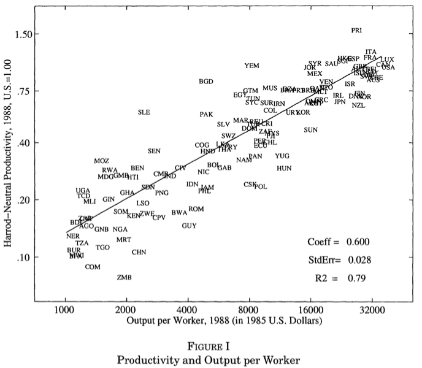
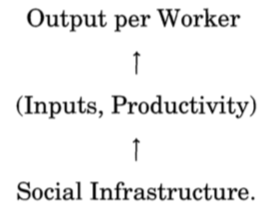

```{r setup, include=FALSE}
options(htmltools.dir.version = FALSE)
knitr::opts_chunk$set(echo=F,
                      message=F,
                      warning=F,
                      fig.retina = 3,
                      fig.align = "center")
library("tidyverse")
library("ggrepel")
library("fontawesome")
xaringanExtra::use_tile_view()
xaringanExtra::use_tachyons()
xaringanExtra::use_freezeframe()

update_geom_defaults("label", list(family = "Fira Sans Condensed"))
update_geom_defaults("text", list(family = "Fira Sans Condensed"))

set.seed(256)

theme_slides <- theme_light() + 
  theme(
    text = element_text(family = "Fira Sans", size = 24)
  )

```

class: inverse

# Outline

### [Real Productivity](#3)
### [Growth Models: A History](#13)
### [20th Century Neoclassical Growth Models](#24)
### [Working Tools](#52)

---

class: inverse, center, middle
# What About *Human* Capital?

---

# Exogenous Growth, With Human Capital I

.pull-left[

- Solow model(s) can't account for all differences between countries (based on $\frac{K}{L}$ ratio)

- What about if we add .hi[*human* capital] - skills and education embodied in people, such that it augments labor productivity?

]

.pull-right[

.center[

]

]

---

# Exogenous Growth, With Human Capital II

.pull-left[

$$Y_t=K_t^\alpha \left(A_tH_t\right)^{1-\alpha}$$

- Replacing $L$ with $AH$

- $A$ again grows at (exogenous) rate $g_A=g$

- $H_t = L_tG(E)$
    - Labor $L_t$ is affected by $G(E)$, where $E$ is .hi[education]
    - $G(E)$ is the function that describes how education affects labor $L_t$

- How to model $G(E)$? 

]

.pull-right[

.center[

]

]

---

# Exogenous Growth, With Human Capital II

.pull-left[

$$Y_t=K_t^\alpha \left(A_tH_t\right)^{1-\alpha}$$

- How to model $G(E)$? 

- Presumably positive (more education $\implies$ more human capital)

- Diminishing returns? Signalling theory of education?

]

.pull-right[

.center[

]

]

---

# Exogenous Growth, With Human Capital III

.pull-left[

$$Y_t=K_t^\alpha \left(A_tH_t\right)^{1-\alpha}$$

- The dynamics of this model are virtually identical to Solow's

- Good: easy to solve

- Bad: we fail to explain $g$ (still exogenously assumed)

]

.pull-right[

.center[

]

]

---

# Exogenous Growth, With Human Capital IV

.pull-left[

"In 1988 output per worker in the United States was more than 35 times higher than output per worker in Niger. In just over ten days the average worker in the United States produced as much as an average worker in Niger produced in an entire year."

"Differences among countries can be attributed to differences in human capital, physical capital, and productivity...**Different capital intensities** in the two countries **contributed a factor of 1.5** to the income differences, while **different levels of educational attainment contributed a factor of 3.1**. The **remaining difference - a factor of 7.7 remains as the productivity residual**, (p.83).

]

.pull-right[

.center[

]


.source[Hall, Robert E, and Charles I Jones, 1999, "Why Do Some Countries Produce So Much More Output Per Worker Than Others?" *Quarterly Journal of Economics* 114(1): 83-116]
]

---

# Exogenous Growth, With Human Capital V

.pull-left[

"Our hypothesis is that differences in capital accumulation, productivity, and therefore output per worker are **fundamentally related to differences in social infrastructure across countries**. By social infrastructure we mean the **institutions and government policies that determine the economic environment** within which individuals accumulate skills, and firms accumulate capital and produce output," (p. 84).

]

.pull-right[

.center[

]


.source[Hall, Robert E, and Charles I Jones, 1999, "Why Do Some Countries Produce So Much More Output Per Worker Than Others?" *Quarterly Journal of Economics* 114(1): 83-116]

]

---


class: inverse, center, middle

# Endogenous Growth

---

# The Romer Model I

.left-column[

.center[


Paul Romer

(1955-)

Economics Nobel 2018
]
]

.right-column[

> "**Growth in this model is driven by technological change** that arises **from intentional investment decisions made by profit-maximizing agents**. The distinguishing feature of the **technology** as an input is that it is neither a conventional good nor a public good; it **is a non-rival, partially excludable good.** Because of the nonconvexity introduced by a nonrival good, **price-taking competition cannot be supported.** Instead, the **equilibrium is one with monopolistic competition.**

> "The main conclusions are that the **stock of human capital determines the rate of growth,** that** too little human capital is devoted to research in equilibrium**, that **integration into world markets will increase growth rates**, and that **having a large population is not sufficient to generate growth,**" (pp.S71).

- Paper cited [28,747 times](https://scholar.google.com/scholar?q=endogenous+technological+change&hl=en&as_sdt=0&as_vis=1&oi=scholart)


.source[Romer, Paul M, 1990, "Endogenous Technological Change," *Journal of Political EConomy* 98(5-2): S71-S102]

]

---

# Aside: Paul Romer

.pull-left[
.center[


Source: [New York Times: Sept 5, 2019](https://www.nytimes.com/2019/09/05/upshot/paul-romer-burning-man-nobel-economist.html)
]
]

.pull-right[
.center[


Source: [Financial Times: Jan 25, 2018](https://www.ft.com/content/be72f8e2-0144-11e8-9650-9c0ad2d7c5b5)
]
]

---

# The Romer Model II

.left-column[

.center[


Paul Romer

(1955-)

Economics Nobel 2018
]
]

.right-column[

- We'll explore the *features* of Romer's model, equations and graphs are far too complicated<sup>.magenta[1]</sup>

- Romer's model builds on 30 years of macro models since Solow (1956):

.footnote[<sup>.magenta[1]</sup> But otherwise, his first 8 pages are quite easy and enjoyable to read!]
]

---

# Macro Models In the 30 Years Since Solow (1956)

- **Ramsey-Kass-Koopmans model** (1965): Solow model with .hi-purple[microfoundations]!
  - Savings rate $s$ is endogenized: 
  - "infinitely-lived" utility-maximizing individuals decide to supply labor and rent capital to cost-minimizing firms in order to earn income, which they can consume and save for future periods
  - single steady state equilibrium
  - groundwork for all modern macro dynamic stochastic general equilibrium (DSGE) models

--

- **Overlapping Generations (Diamond) model** (1965):
  - Individuals live for 2 periods only (work and retire), determine the savings rate
  - Multiple steady state equilibria possible
  - Economy subject to dynamic inefficiency

---

# The Motivations for Romer

- Problems with how Solow models the aggregate economy:

1. "Knowledge" (TFP) has a non-rival component to it

2. Markets/aggregate production function cannot possibly be competitive and constant returns to scale
    - Market power/monopolistic competition
    - Increasing returns to scale

3. Knowledge does not grow exogenously, but is the result of market forces and optimizing choices: people and firms face incentives to create and exploit it (or not)

---

class: inverse, center, middle

# Digression: The Economics of Ideas

---

# The Economic *Problem* with Ideas I

.pull-left[

.center[

]

]

--

.pull-right[

- Ideas have a .hi-purple[public good] aspect to them
  - .hi-purple[Nonrival]
  - .hi-purple[Nonexcludable]

- Possessors of ideas are unable to .hi-purple[appropriate] value from selling ideas
]

---

# The Economic *Problem* with Ideas II


.left-column[

.center[


Thomas Jefferson

(1743-1826)
]
]

.right-column[

> "He who receives an idea from me, receives instruction himself without lessening mine; as he who lights his taper at mine, receives light without darkening me. That ideas should freely spread from one to another over the globe, for the moral and mutual instruction of man, and improvement of his condition, seems to have been peculiarly and benevolently designed by nature, when she made them, like fire, expansible over all space, without lessening their density in any point, and like the air in which we breathe, move, and have our physical being, incapable of confinement or exclusive appropriation."

]

.source[Jefferson, Thomas, 13 Aug 1813, "Letter to Isaac MacPherson," ]


---

# High Fixed Costs, Low Marginal Costs I

.pull-left[

.center[

]
]

.pull-right[
.center[

]
]

- It costs about $1,000,000,000 and 10 years on average to create a new drug. Once discovered, it costs the firm (or it's competitors!) about $0.50/pill to manufacture.

---

# High Fixed Costs, Low Marginal Costs II

.pull-left[

.center[

]
]

--

.pull-right[
.center[


Source: [Washington Post (Sept 8, 2017)](https://www.washingtonpost.com/news/morning-mix/wp/2017/09/08/game-of-thrones-was-pirated-more-than-a-billion-times-far-more-than-it-was-watched-legally/)
]
]

---

# Positive Spillovers

.left-column[

.center[


.smallest[
William Nordhaus

(1941-)

Economics Nobel 2018
]
]
]

.right-column[

.smaller[
> "We conclude that [about 2.2%] of the social returns from technological advances over the 1948-2001 period was captured by producers, indicating that most of the benefits of technological change are passed on to consumers rather than captured by producers," (p.1)

]
]

.source[Nordhaus, William, 2004, ["Schumpeterian Profits in the American Economy: Theory and Measurement,"](https://www.nber.org/papers/w10433) *NBER Working Paper* 10433]

---

# The Economic Problem With Information

.pull-left[

.smallest[
- Information is very costly to generate, very easy to disseminate/imitate

- High fixed costs $f$, constant low/zero marginal costs $c$
 - Implies .hi-purple[economies of scale], falling average costs
 
$$AC(q)=\frac{f}{q}+c$$
]
]

.pull-left[
```{r}
mc=function(x){100}
ac=function(x){100+1500/x}
demand=function(x){500-10*x}
mr=function(x){500-20*x}
CS_1<-tribble(
  ~x, ~y,
  0, 500,
  0, 20,
  48,20
)
ggplot(data.frame(x=c(0,10)), aes(x=x))+
  #geom_polygon(data=CS_1,aes(x=x,y=y),fill="blue",alpha=0.3)+
  stat_function(fun=demand, geom="line", size=2, color = "blue")+
    geom_label(aes(x=45,y=demand(45)), color = "blue", label="Demand", size = 3)+
    stat_function(fun=mr, geom="line", size=2, color = "darkblue")+
    geom_label(aes(x=22.5,y=mr(22.5)), color = "darkblue", label=expression(MR(q)), size = 3)+
  stat_function(fun=mc, geom="line", size=2, color = "red")+
    geom_label(aes(x=45,y=mc(45)), color = "red", label=expression(MC(q)), size = 3)+
  stat_function(fun=ac, geom="line", size=2, color = "orange")+
    geom_label(aes(x=45,y=ac(45)), color = "orange", label=expression(AC(q)), size = 3)+

    geom_segment(x=20,xend=20,y=0,yend=300, linetype="dashed", size=1)+
  geom_segment(x=0,xend=20,y=300,yend=300, linetype="dashed", size=1)+

  geom_segment(x=40,xend=40,y=0,yend=100, linetype="dashed", size=1)+


      scale_x_continuous(breaks=c(0,20,40), #seq(0,52,4),
                       labels=c(0,expression(q[M]),expression(q[MC])),
                       limits=c(0,52),
                       expand=c(0,0))+
  scale_y_continuous(breaks=c(0,100,300), #seq(0,500,20),
                     limits=c(0,500),
                     expand=c(0,0),
                     label=c(0,expression(MC),expression(p[M])))+
  labs(x = "Output, q",
       y = "Price ($)")+
  theme_classic(base_family="Fira Sans Condensed", base_size=14)
```

]

---

# The Economic Problem With Information

.pull-left[
.smallest[
- Information is very costly to generate, very easy to disseminate/imitate

- High fixed costs $f$, constant low/zero marginal costs $c$
 - Implies .hi-purple[economies of scale], falling average costs
 
$$AC(q)=\frac{f}{q}+c$$
- $AC(q)>MC(q)$ always
  - Socially-efficient .hi-purple[marginal cost pricing *is not* profitable]
  - Producing $q_c$ where $p=MC$, is below $AC(q)$

]
]
.pull-right[
```{r}
mc=function(x){100}
ac=function(x){100+1500/x}
demand=function(x){500-10*x}
mr=function(x){500-20*x}
CS_1<-tribble(
  ~x, ~y,
  0, 500,
  0, 20,
  48,20
)
ggplot(data.frame(x=c(0,10)), aes(x=x))+
  geom_rect(xmin=0,xmax=40,ymin=ac(40),ymax=100, fill="black",alpha=0.7)+
  stat_function(fun=demand, geom="line", size=2, color = "blue")+
    geom_label(aes(x=45,y=demand(45)), color = "blue", label="Demand", size = 3)+
    stat_function(fun=mr, geom="line", size=2, color = "darkblue")+
    geom_label(aes(x=22.5,y=mr(22.5)), color = "darkblue", label=expression(MR(q)), size = 3)+
  stat_function(fun=mc, geom="line", size=2, color = "red")+
    geom_label(aes(x=45,y=mc(45)), color = "red", label=expression(MC(q)), size = 3)+
  stat_function(fun=ac, geom="line", size=2, color = "orange")+
    geom_label(aes(x=45,y=ac(45)), color = "orange", label=expression(AC(q)), size = 3)+

    geom_segment(x=20,xend=20,y=0,yend=300, linetype="dashed", size=1)+
  geom_segment(x=0,xend=20,y=300,yend=300, linetype="dashed", size=1)+

  geom_segment(x=40,xend=40,y=0,yend=ac(40), linetype="dashed", size=1)+
  geom_segment(x=0,xend=40,y=ac(40),yend=ac(40), linetype="dashed", size=1)+

  scale_x_continuous(breaks=c(0,20,40), #seq(0,52,4),
                       labels=c(0,expression(q[M]),expression(q[MC])),
                       limits=c(0,52),
                       expand=c(0,0))+
  scale_y_continuous(breaks=c(0,100,300), #seq(0,500,20),
                     limits=c(0,500),
                     expand=c(0,0),
                     label=c(0,expression(MC),expression(p[M])))+
  labs(x = "Output, q",
       y = "Price ($)")+
  theme_classic(base_family="Fira Sans Condensed", base_size=14)
```

]

---

# The Economic Problem With Information

.pull-left[

- If left to own devices, acts like a monopoly

- Creates inefficiency
  - Restrict output to $q_M$ where $MR(q)=MC(q)$
  - Mark up price to consumers' max WTP at $p_M$
  - Small .hi-blue[consumer surplus]
  - Generates **DWL**
]

.pull-right[
```{r, monopolist}
mc=function(x){100}
ac=function(x){100+1500/x}
demand=function(x){500-10*x}
mr=function(x){500-20*x}
CS_s1<-tribble(
  ~x, ~y,
  0, 500,
  0, 300,
  20,300
)
DWL_s1<-tribble(
  ~x, ~y,
  20, 300,
  20, 100,
  40,100
)

ggplot(data.frame(x=c(0,10)), aes(x=x))+
  geom_polygon(data=CS_s1,aes(x=x,y=y),fill="blue",alpha=0.3)+
  geom_polygon(data=DWL_s1,aes(x=x,y=y),fill="black",alpha=0.7)+
  geom_rect(xmin=0,xmax=20,ymin=ac(20),ymax=300, fill="green",alpha=0.3)+
  stat_function(fun=demand, geom="line", size=2, color = "blue")+
    geom_label(aes(x=45,y=demand(45)), color = "blue", label="Demand", size = 3)+
    stat_function(fun=mr, geom="line", size=2, color = "darkblue")+
    geom_label(aes(x=22.5,y=mr(22.5)), color = "darkblue", label=expression(MR(q)), size = 3)+
  stat_function(fun=mc, geom="line", size=2, color = "red")+
    geom_label(aes(x=45,y=mc(45)), color = "red", label=expression(MC(q)), size = 3)+
  stat_function(fun=ac, geom="line", size=2, color = "orange")+
    geom_label(aes(x=45,y=ac(45)), color = "orange", label=expression(AC(q)), size = 3)+

  geom_segment(x=20,xend=20,y=0,yend=300, linetype="dashed", size=1)+
  geom_segment(x=0,xend=20,y=300,yend=300, linetype="dashed", size=1)+

  geom_segment(x=0,xend=20,y=ac(20),yend=ac(20), linetype="dashed", size=1)+

  scale_x_continuous(breaks=c(0,20,40), #seq(0,52,4),
                       labels=c(0,expression(q[M]),expression(q[MC])),
                       limits=c(0,52),
                       expand=c(0,0))+
  scale_y_continuous(breaks=c(0,100,300), #seq(0,500,20),
                     limits=c(0,500),
                     expand=c(0,0),
                     label=c(0,expression(MC),expression(p[M])))+
  labs(x = "Output, q",
       y = "Price ($)")+
  theme_classic(base_family="Fira Sans Condensed", base_size=14)
```

]

---

# The Economic Problem With Information

.pull-left[

- But now consider a **second firm**, with same $MC(q)=c$ but **no fixed costs** $f$!
  - Doesn't have to invest in R&D, just copy the first firm!

- If by itself, could maximize profits at $p_m$
  - But so long as it can charge $p<AC(q)$ of the first firm, can capture the market and push the first firm out of business
]

.pull-right[
```{r}
ggplot(data.frame(x=c(0,10)), aes(x=x))+
  geom_polygon(data=CS_s1,aes(x=x,y=y),fill="blue",alpha=0.3)+
  geom_polygon(data=DWL_s1,aes(x=x,y=y),fill="black",alpha=0.7)+
  geom_rect(xmin=0,xmax=20,ymin=mc(20),ymax=300, fill="green",alpha=0.3)+
  stat_function(fun=demand, geom="line", size=2, color = "blue")+
    geom_label(aes(x=45,y=demand(45)), color = "blue", label="Demand", size = 3)+
    stat_function(fun=mr, geom="line", size=2, color = "darkblue")+
    geom_label(aes(x=22.5,y=mr(22.5)), color = "darkblue", label=expression(MR(q)), size = 3)+
  stat_function(fun=mc, geom="line", size=2, color = "red")+
    geom_label(aes(x=45,y=mc(45)), color = "red", label=expression(MC(q)), size = 3)+

  geom_segment(x=20,xend=20,y=0,yend=300, linetype="dashed", size=1)+
  geom_segment(x=0,xend=20,y=300,yend=300, linetype="dashed", size=1)+

  geom_segment(x=0,xend=20,y=ac(20),yend=ac(20), linetype="dashed", size=1)+

  scale_x_continuous(breaks=c(0,20,40), #seq(0,52,4),
                       labels=c(0,expression(q[M]),expression(q[MC])),
                       limits=c(0,52),
                       expand=c(0,0))+
  scale_y_continuous(breaks=c(0,100,300), #seq(0,500,20),
                     limits=c(0,500),
                     expand=c(0,0),
                     label=c(0,expression(MC),expression(p[M])))+
  labs(x = "Output, q",
       y = "Price ($)")+
  theme_classic(base_family="Fira Sans Condensed", base_size=14)
```

]

---

# Property Rights in Innovation

.pull-left[

- For these economic reasons, .hi[patent] (for ideas and inventions) and .hi[copyright] (for expressions) laws exist

- Grant *temporary* monopoly to holder in order to recover their fixed costs and provide incentive to undertake (risky and expensive) research/creativity

- A utilitarian *tradeoff* between incentives and access

]

.pull-right[

.center[


]

]

---

# The Economic *Problem* with Ideas II


.left-column[

.center[


Thomas Macaulay

(1800-1859)
]
]

.right-column[

> "It is then on men whose profession is literature, and whose private means are not ample, that you must rely for a supply of valuable books. Such men must be remunerated for their literary labour...It is desirable that we should have a supply of good books; we cannot have such a supply unless men of letters are liberally remunerated, and the least objectionable way of remunerating them is by means of copyright...The system of copyright has great advantages, and great disadvantages...Copyright is monopoly, and produces all the effects which the general voice of mankind attributes to monopoly...Monopoly is an evil...For the sake of the good we must submit to the evil; but the evil ought not to last a day longer than is necessary for the purpose of securing the good..."

]

.source[Macaulay, Thomas, 1841 Parliamentay speech against Serjeant Talfourd's 1841 Copyright Bill]

---

# This Implies Market Power

.left-column[

.center[


Paul Romer

(1955-)

Economics Nobel 2018
]
]

.right-column[

> "If all inputs were paid their value marginal product, the firm would suffer losses," (p.S76).

> "There is little doubt that much of the value to society of any given innovation or discovery is not captured by the inventor, and any model that missed these spillovers would miss important elements of the growth process. Yet it is still the case that private, profit-maximizing agents make investments in the creation of new knowledge and that they earn a return on these investments by charging a price for the resulting goods that is greater than the marginal cost of producing the goods," (p.S90).

]

.source[Romer, Paul M, 1990, "Endogenous Technological Change," *Journal of Political EConomy* 98(5-2): S71-S102]

---

# Are Intellectual Property Rights in the Model? 

.left-column[

.center[


Paul Romer

(1955-)

Economics Nobel 2018
]
]

.right-column[

> "Although other assumptions about secrecy and property rights could be considered, the equilibrium here is based on the assumption that anyone engaged in research has free access to the entire stock of knowledge. This is feasible because knowledge is a nonrival input. All researchers can take advantage of $A$ at the same time," (p.S83).

]

.source[Romer, Paul M, 1990, "Endogenous Technological Change," *Journal of Political EConomy* 98(5-2): S71-S102]

---


class: inverse, center, middle

# The Romer Model

---

# Romer Model: Assumptions I

.pull-left[

- Population (or labor supply) and the total stock of human capital in the population are fixed $(\bar{L}, \bar{H})$

- Four factors of production:

1. Labor $L$
2. Physical capital $K$
  - a stock of "machines" that can be accumulated
  - diminishing returns
3. Human capital $H$
  - rivalrous, embodied in $L$ and $K$
4. Technology $A$
  - nonrival, exists beyond individuals, grow indefinitely
  - a stock, like $K$, that can be accumulated
  - no restrictions on returns!
  - measured as countable "new designs" for capital

]

.pull-right[
.center[

]

]

---

# Romer Model: Assumptions II

- The economy has three sectors:

1. **Research sector**
    - Uses inputs $H$ and the existing stock of knowledge $A_{t-1}$ to produce new knowledge, $A_t$
    - Measured in "new designs" for capital $K$

--

2. **Intermediate goods sector**
    - Takes inputs $H$ and $A_t$ to produce $K$ for use in final goods sector

--

3. **Final goods sector**
    - uses $L$, $H$, and $K$ to produce final output $Y$

--

- Output can be consumed, or saved (to be used to make new capital, $K)$:
    $$Y_t=C_t+S_t$$

- Fixed supply of human capital is allocated to research sector or manufacturing based on relative manufacturing wages and return to new designs
$$\bar{H}=H_A+H_Y$$

---

# The Nature of "Knowledge" I

.pull-left[
- Knowledge $(A)$ is a stock that can be accumulated, like physical capital $(K)$

- To produce new knowledge, you need to use the existing stock of knowledge
    - i.e. need the idea of gravity to get relativity, we need both to get quantum mechanics, etc. 

]

.pull-right[

.center[

]

]

---

# The Nature of "Knowledge" II

.pull-left[

> "[A] college-educated engineer working today and one working 100 years ago have the same human capital, which is measured in terms of years of forgone participation in the labor market. The engineer working today is more productive because he or she can take advantage of all of the additional knowledge accumulated as design problems were solved during the last 100 years," (pp. S83-S84).

]

.pull-right[

.center[

]

]


---

# The Nature of "Knowledge" III

.pull-left[

$$\Delta A = \delta H_A A$$

- $\delta$: a productivity parameter
- $H_A$: fraction of human capital available $(\bar{H})$ allocated to research

- Knowledge need not exhibit constant returns to scale

- Would doubling human capital and doubling the existing stock of knowledge lead to *twice* the new knowledge produced?
 

]

.pull-right[

.center[

]

]

---

# The Nature of "Knowledge" IV

.pull-left[

- Takeaways from knowledge:

1. Devoting more human capital to research $(H_A)$ leads to more knowledge $\Delta A$

2. The larger the total stock of knowledge $(A)$, the higher the productivity of labor in the research sector

]

.pull-right[

.center[

]

]

---

# The Model's Equilibrium

.left-column[

.center[


Paul Romer

(1955-)

Economics Nobel 2018
]
]

.right-column[

- In the model's equilibrium (p.S88):

1. Consumers decide between $C$ and $S$ based on interest rate $r$

2. Holders of $H$ decide whether to work in Research sector $(H_A)$ or in Manufacturing $(H_Y)$ based on existing stock of knowledge $A$, price of designs, and wages in manufacturing

3. Final goods producers choose cost-minimizing inputs of $L$, $H$, and $K$

4. Each firm owning $A$ (designs) sets prices to maximize profit given interest rate and market demand curves in final product market

5. Potential entrants to market consider price of designs in entry decision

6. Supply equals demand for each good

]

.source[Romer, Paul M, 1990, "Endogenous Technological Change," *Journal of Political EConomy* 98(5-2): S71-S102]

---

# Romer Model: Growth Rate

- As in full Solow model, growth rate of output per worker $\frac{Y}{L}$ is the growth rate of knowledge $(A)$, i.e. $g$

- Main problem with Solow (exogenous) growth model(s): $g$ is assumed as a constant number

- Romer *endogenizes* $g$, sp how does it grow?

--

$$g=\frac{\delta H - \Lambda \rho}{\sigma \Lambda + 1}$$

- $\Lambda = \frac{\alpha}{(1-\alpha-\beta)(\alpha+\beta)}$<sup>.magenta[1]</sup>
- $\delta$: a productivity parameter (of $H)$
- $\rho$: discount rate (from Ramsey-Kass-Koopmans model)
- $\sigma$: growth rate of utility (from Ramsey-Kass-Koopmans model)

.footnote[<sup>.magenta[1]</sup> `\\(\alpha\\)` and `\\(\beta\\)` are exponents from Cobb-Douglas production function: `\\(Y=H^\alpha L^\beta K^{1-\alpha-\beta}\\)`]

---

# Romer Model Implication I - R&D Is Critical

- Economies tend to undersupply human capital to research:

> The most obvious reason is that research has positive external effects. An additional design raises the productivity of all future individuals who do research, but because this benefit is nonexcludable, it is not reflected at all in the market price for designs. The second and an equally important reason...is that research produces an input that is purchased by a sector that engages in monopoly pricing. The markup of price over marginal cost forces a wedge between the marginal social product of an input used in this sector and its market compensation," (p.S96)

--

- Policy implications:

> "Within the confines of the model, the social optimum can be achieved by subsidizing the accumulation of A," (p.S97)

> "A subsidy to physical capital accumulation may be a very poor substitute for direct subsidies that increase the incentive to undertake research. In the absence of feasible policies that can remove the divergence between the social and private returns to research, a second-best policy would be to subsidize the accumulation of total human capital," (p.S99)

---

# Romer Model Implication II - Trade Liberalization

- A large population is *not* sufficient for greater technology (and thus, economic growth), it requires access to a *larger market* (division of labor)!

> If access to a large number of workers or consumers were all that mattered, having a large population would be a good substitute for trade with other nations. The model here suggests that what is important for growth is integration not into an economy with a large number of people but rather into one with a large amount of human capital, (p.S98)

> "The most interesting positive implication of the model is that an economy with a larger total stock of human capital will experience faster growth. This finding suggests that free international trade can act to speed up growth. It also suggests a way to understand what it is about developed economies in the twentieth century that permitted rates of growth of income per capita that are unprecedented in human history. The model also suggests that low levels of human capital may help explain why growth is not observed in underdeveloped economies that are closed and why a less developed economy with a very large population can still benefit from economic integration with the rest of the world," (p.S99)

---

# One Test of the Model: "Market Access" Literature

- Sokoloff (1988): counties in the U.S. in the 19<sup>th</sup> century that had access to navigable waterways had higher rates of patenting (proxy for innovation, adding to $A)$ than those that did not
    - Even clearer: counties that *gained* access to new waterway (i.e. a new canal) saw sharp increase in patenting!


.source[Sokoloff, Kenneth L, 1988, ["Inventive Activity in Early Industrial America: Evidence From Patent Records, 1790-1846,"]() *NBER Working Paper* 2707]

---

# Takeaways from Growth Models

.pull-left[

1. HICs have more output per worker and capital per worker than LICs

]

.pull-right[

.center[

]
]

---
# Takeaways from Growth Models

.pull-left[

1. HICs have more output per worker and capital per worker than LICs
2. The accumulation of physical capital itself explains a very small part of differences in income

]

.pull-right[

.center[

]
]

---

# Takeaways from Growth Models

.pull-left[

1. HICs have more output per worker and capital per worker than LICs
2. The accumulation of physical capital itself explains a very small part of differences in income
3. "Knowledge" or "TFP" explains the overhelming part of growth differences across the world

]

.pull-right[

.center[

]
]

---

# Takeaways from Growth Models

.pull-left[

1. HICs have more output per worker and capital per worker than LICs
2. The accumulation of physical capital itself explains a very small part of differences in income
3. "Knowledge" or "TFP" explains the overhelming part of growth differences across the world
4. Solow model predicts LICs should grow at faster rates than HICs

]

.pull-right[

.center[

]
]

---

# Takeaways from Growth Models

.pull-left[

1. HICs have more output per worker and capital per worker than LICs
2. The accumulation of physical capital itself explains a very small part of differences in income
3. "Knowledge" or "TFP" explains the overhelming part of growth differences across the world
4. Solow model predicts LICs should grow at faster rates than HICs
5. The evidence for (4) is mixed and controversial

]

.pull-right[

.center[

]
]

---

# Takeaways from Growth Models

.pull-left[

1. HICs have more output per worker and capital per worker than LICs
2. The accumulation of physical capital itself explains a very small part of differences in income
3. "Knowledge" or "TFP" explains the overhelming part of growth differences across the world
4. Solow model predicts LICs should grow at faster rates than HICs
5. The evidence for (4) is mixed and controversial
6. Growth literature suggests economies can grow faster by subsidizing the accumulation of capital, or human capital, or "knowledge"
    - The evidence that we are able to do this, or have been able to, is *quite poor*

]

.pull-right[

.center[

]
]

---

# Takeaways from Growth Models

.pull-left[

1. HICs have more output per worker and capital per worker than LICs
2. The accumulation of physical capital itself explains a very small part of differences in income
3. "Knowledge" or "TFP" explains the overhelming part of growth differences across the world
4. Solow model predicts LICs should grow at faster rates than HICs
5. The evidence for (4) is mixed and controversial
6. Growth literature suggests economies can grow faster by subsidizing the accumulation of capital, or human capital, or "knowledge"
    - The evidence that we are able to do this, or have been able to, is *quite poor*
7. An economy's "TFP" is more sensitive to its institutions and incentives than simply amassing $K$ or $H$ or $A$

]

.pull-right[

.center[

]
]

---

# Takeaways from Growth Models II

.center[

]

---

# Growth Models: An Appraisal

.pull-left[
- For all of their flaws, growth models are part of the "shared" language of development experts, policy makers, and macroeconomists

- Explain (some) mechanisms of growth that we can model and predict (some) consequence of (some) policy changes

- Give us a measure of how much we *can* explain based on what we understand, and how much we *cannot* explain and *need* to understand

> All models are wrong. Some are useful. - George Box

]

.pull-right[

.center[

]
]
