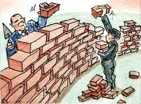

```{r setup, include=FALSE}
options(htmltools.dir.version = FALSE)
knitr::opts_chunk$set(echo=F,
                      message=F,
                      warning=F,
                      fig.retina = 3,
                      fig.align = "center")
library("tidyverse")
library("ggrepel")
library("fontawesome")
library("ggthemes")
xaringanExtra::use_tile_view()
xaringanExtra::use_tachyons()
xaringanExtra::use_freezeframe()

update_geom_defaults("label", list(family = "Fira Sans Condensed"))
update_geom_defaults("text", list(family = "Fira Sans Condensed"))

set.seed(256)

theme_slides <- theme_light() + 
  theme(
    text = element_text(family = "Fira Sans", size = 24)
  )

```

class: inverse

# Outline

### [Digression: Growth Regressions & Program Evaluation](#3)
### [The Theoretical Foundations of Foreign Aid](#13)

---

# Unit III

.pull-left[

- In this unit, we will consider a lot of explanations for variation in GDP per capita

- Focus on things that are **external** or a country cannot control
  1. Foreign Aid (as recipient)
  2. Geographical features
]

.pull-right[
.center[

]
]

---

# Unit III

.pull-left[

- Today and next class (and discussion) will be about Foreign Aid

- But first, today, we will have to spend some time talking about the empirics of development literature
  - Growth regressions
  - Program evaluation

- All comes down to regression models
]

.pull-right[

]

---

class: inverse, center, middle

# Digression: Growth Regressions & Program Evaluation

---

# Growth Regressions

.pull-left[
.smallest[
- Development papers are very empirical

- Take data (of varying quality) from countries around the world and try to see: 

> .hi-turquoise[What factors explain variation in GDP per capita around the world?]

- .hi[Dependent variable] $\color{#e64173}{Y}$: GDP per capita (or growth rate)

- .hi[Independent variables] $\color{#e64173}{X_1, X_2, \cdots X_k}$: things that can plausibly affect GDP per capita
]
]

.pull-right[

.center[

]
]
---

# Linear Regression

.pull-left[
.smallest[
- .hi[Linear regression] is the process of fitting a line to data

$$Y=\beta_0+\beta_1X+u$$

- $\beta_0$: intercept $(Y$ when $X=0)$

- $\beta_1$: slope, the marginal effect of $X$ on $Y$: $\frac{\Delta Y}{\Delta X}$

- $u$: error term, contains *everything* other than $X$ that affects $Y$
]
]
.pull-right[

```{r, fig.retina=3}
x <- runif(100,1,9)
e <- rnorm(100,0,2.5)
y <- 12-0.5*x+e
df <- tibble(x,y)

p <- ggplot(df, aes(x=x,y=y))+
  geom_point()+
  scale_x_continuous(breaks = seq(0,20,1),
                     limits = c(0,10),
                     expand = c(0,0))+
  scale_y_continuous(breaks = seq(0,20,2),
                     limits = c(0,20),
                     expand = c(0,0))+
  theme_pander(base_family = "Fira Sans Condensed",
           base_size=20)

p2 <- p+
  geom_abline(slope=-1, intercept=14, color="red", size=1)+
  geom_abline(slope=-1, intercept=14, color="red", size=1)+
  geom_abline(slope=-0.125, intercept=10, color="orange", size=1)+
  geom_smooth(method="lm", se=F, color="green", size=2, fullrange = T)
  #geom_smooth(method="lm", se=F)
p2
```

]

---

# Linear Regression

.pull-left[

.smallest[
- This idea of a “line through data points” is simplified, just to give you intuition
  - Can be nonlinear, curves, etc.
  - More than one $X$ variable
  - More advanced methods and models

- If you want to know more, take my [econometrics class](http://metricsf21.classes.ryansafner.com)
]

.center[

]
]

.pull-right[
```{r}
p2
```
]

---

# Linear Regression: Example

.pull-left[

.smaller[
- Some data on economic freedom and gdp per capita

- Suppose we want to estimate a regression model

$$\widehat{\text{gdp per capita}} = \beta_0 + \beta_1 \, \text{ef}$$

]
]

.pull-right[

```{r}
library("tidyverse")
library("ggrepel")
library(here)
polfreedom<-read.csv(here("./static/data/freedomhouse2018.csv"))
econfreedom<-read.csv(here("./static/data/econfreedom.csv"))
polfreedom2<-polfreedom %>%
  select(Country.Territory, Total)

polfreedom2<-rename(polfreedom2,Country=Country.Territory)

# combine datasets
freedom<-left_join(econfreedom, polfreedom2, by="Country")

p3<-ggplot(data=freedom, aes(x=ef,y=gdp))+
  geom_point(aes(fill=continent,
                 text = Country),
             alpha = 0.9, # make points slightly transparent
             color = "white", # outline the points with a white border
             pch = 21, # this shape has an outline and a fill color
             size = 3)+
    scale_x_continuous(breaks = seq(0,10,2),
                     limits = c(0,10),
                     expand = c(0,0))+
  scale_y_continuous(labels=scales::dollar, breaks=seq(0,100000,20000))+
  guides(color = F, fill=F)+
labs(x = "Economic Freedom Score",
       y = "GDP per Capita ($)",
       caption = "Sources: Frasier Institute, Freedom House",
       title = "Economic Freedom & GDP per Capita",
       fill = "Continent")+
  theme_minimal(base_family = "Fira Sans Condensed")+
  theme(legend.position = "bottom",
        plot.title = element_text(face = "bold", size = rel(1.5))
        )
p3
```
]

---

# Linear Regression: Example

.pull-left[

.smallest[
```{r}
fit <- lm(gdp ~ ef, data = freedom)
```

- Estimated regression equation:

$$
\widehat{\text{GDP per capita}} = -86,400 + 14704 \, \text{ef}
$$
- Intercept $(\beta_0)$: -86,400
  - Predicted GDP per capita for an economic freedom score of 0
  - Not often interpretable

- Slope $(\beta_1)$: 14,704
  - The marginal effect of economic freedom on GDP per capita
  - A 1 point increase in Economic Freedom (0-10) increases GDP per capita by $14,704

]
]
.pull-right[
```{r}
p3+geom_smooth(method = "lm", color="black")
```
]

---

# How to Read a Regression Table

.pull-left[

.smallest[
- Regression results are presented in a table like this
  - Estimates of $\beta_0$ and $\beta_1$
  - Standard errors of $\beta_0$ and $\beta_1$ in parentheses below
  - Indicate statistical significance (with asterisks)
  - Measures of regression fit $R^2$, $\sigma$, etc.

- Often includes multiple models (columns) and multiple independent variables (rows)
]
]

.pull-right[
```{r}
library(huxtable)
huxreg("GDP per capita" = fit,
       coefs = c("Intercept" = "(Intercept)",
                 "Economic Freedom" = "ef"),
       statistics = c("N" = "nobs",
                      "R-Squared" = "r.squared",
                      "SER" = "sigma"),
       number_format = 2)
```
]

---

# How to Read a Regression Table

.pull-left[

.smallest[
- Again, marginal effect of Economic Freedom on GDP per capita is 14704.

- $R^2$ indicates 34% of variation in GDP per capita is explained by this (very simple) model
]
]

.pull-right[
```{r}
library(huxtable)
huxreg("GDP per capita" = fit,
       coefs = c("Intercept" = "(Intercept)",
                 "Economic Freedom" = "ef"),
       statistics = c("N" = "nobs",
                      "R-Squared" = "r.squared",
                      "SER" = "sigma"),
       number_format = 2)
```
]

---

# Multivariate Regression: Motivation

.pull-left[

- Any good statistics class will repeat: .hi[correlation does not imply causation]

- **But it can, with the right tools**
  - Econometrics is all about using the right tools to actually make .hi[causal inferences] from sample data
]

.pull-right[
.center[

]
]


---

# Randomized Control Trials (RCTs) I

.pull-left[
.smallest[
- The *ideal* way to demonstrate causation is through a .hi-turquoise[randomized control trial (RCT)] or “random experiment”
  - *Randomly* assign experimental units (e.g. people, firms, etc.) into groups
  - .hi[Treatment group(s)] get a (kind of) treatment
  - .hi-purple[Control group] gets no treatment 
  - Compare results of treatment and control groups to observe the .hi-slate[average treatment effect (ATE)]
  
]
]

.pull-right[

.center[

]
]

---

# Random Control Trials (RCTs) II

.center[


Classic (simplified) procedure of a randomized control trial (RCT) from medicine
]

---

# Random Control Trials (RCTs) III

.center[

]

---

# Random Control Trials (RCTs) IV

.pull-left[

- .hi-turquoise[Random assignment] to groups ensures that the *only* differences between members of the treatment(s) and control groups is *receiving treatment or not*

]

.pull-right[

.pull-left[
.center[

Treatment Group
]
]

.pull-right[
.center[

Control Group
]
]
]

---

# Random Control Trials (RCTs) IV

.pull-left[

- .hi-turquoise[Random assignment] to groups ensures that the *only* differences between members of the treatment(s) and control groups is *receiving treatment or not*

- .hi-orange[Selection bias:] (pre-existing) differences between members of treatment and control groups *other* than treatment, that affect the outcome 

]

.pull-right[

.pull-left[
.center[

Treatment Group
]
]

.pull-right[
.center[

Control Group

.orange[(Selection Bias)]
]
]
]

---

# Random Assignment: The Silver Bullet

.pull-left[

- If treatment is .hi[randomly assigned] for a large sample, it eliminates selection bias!

- Treatment and control groups differ *on average* by nothing *except* treatment status

- Creates *ceterus paribus* conditions in economics: groups are identical *on average* (holding constant age, sex, height, etc.)

]

.pull-right[

.pull-left[
.center[

Treatment Group
]
]

.pull-right[
.center[

Control Group
]
]
]

---


background-image: url(../images/rctgoldstandard.png)
background-size: cover

---

# RCTs are All the Rage

.pull-left[
.center[

<blockquote class="twitter-tweet" data-lang="en"><p lang="en" dir="ltr">Professors Esther Duflo and Abhijit Banerjee, co-directors of MIT&#39;s <a href="https://twitter.com/JPAL?ref_src=twsrc%5Etfw">@JPAL</a>, receive congratulations on the big news this morning. They share in the <a href="https://twitter.com/hashtag/NobelPrize?src=hash&amp;ref_src=twsrc%5Etfw">#NobelPrize</a> in economic sciences “for their experimental approach to alleviating global poverty.”<br> <br>Photo: Bryce Vickmark <a href="https://t.co/NWeTrjR2Bq">pic.twitter.com/NWeTrjR2Bq</a></p>&mdash; Massachusetts Institute of Technology (MIT) (@MIT) <a href="https://twitter.com/MIT/status/1183752282988564480?ref_src=twsrc%5Etfw">October 14, 2019</a></blockquote> <script async src="https://platform.twitter.com/widgets.js" charset="utf-8"></script> 

]
]

.pull-right[
.center[
.smallest[
[Vox (Oct 14, 2019)](https://www.vox.com/future-perfect/2019/10/14/20913928/nobel-prize-economics-duflo-banerjee-kremer)
]


]
]

---

# But Not Everyone Agrees I

.left-column[

.center[


Angus Deaton

Economics Nobel 2015
]

]
.right-column[
.smaller[
> The RCT is a useful tool, but I think that is a mistake to put method ahead of substance. I have written papers using RCTs...[but] no RCT can ever legitimately claim to have established causality. My theme is that RCTs have no special status, they have no exemption from the problems of inference that econometricians have always wrestled with, and there is nothing that they, and only they, can accomplish.

]
]

.source[Deaton, Angus, 2019, [“Randomization in the Tropics Revisited: A Theme and Eleven Variations”](https://scholar.princeton.edu/sites/default/files/deaton/files/deaton_randomization_revisited_v2_2019_01.pdf), Working Paper]

---

# But Not Everyone Agrees II

.left-column[
.center[


Lant Pritchett

]
]

.right-column[
.smallest[
> “People keep saying that the recent Nobelists "studied global poverty." This is exactly wrong. They made a commitment to a method, not a subject, and their commitment to method prevented them from studying global poverty.”

> “At a conference at Brookings in 2008 Paul Romer (last years Nobelist) said: "You guys are like going to a doctor who says you have an allergy and you have cancer. With the skin rash we can divide you skin into areas and test variety of substances and identify with precision and some certainty the cause. Cancer we have some ideas how to treat it but there are a variety of approaches and since we cannot be sure and precise about which is best for you, we will ignore the cancer and not treat it.”

]
]

.source[[Source](https://www.facebook.com/lant.pritchett/posts/10218688602381690)]

---

# But Not Everyone Agrees III

.left-column[

.center[


Angus Deaton

Economics Nobel 2015
]

]
.right-column[

> “Lant Pritchett is so fun to listen to, sometimes you could forget that he is completely full of shit.”

]

.source[[Source](https://medium.com/@ismailalimanik/lant-pritchett-the-debate-about-rcts-in-development-is-over-ec7a28a82c17)]

---

# RCTs and External Validity

.pull-left[
.smaller[
- Even if a study is .hi-purple[internally valid] (used statistics correctly, etc.) we must still worry about .hi-purple[external validity]:

- Is the finding .hi-turquoise[generalizable] to the whole population?

- If we find something in India, does that extend to Bolivia? France?

- Subjects of studies & surveys are often .hi-purple[WEIRD]: .hi-purple[W]estern, .hi-purple[E]ducated, and from .hi-purple[I]ndustrialized .hi-purple[R]ich .hi-purple[D]emocracies
]
]

.pull-right[
.center[


.smallest[
[APA (2010)](https://www.apa.org/monitor/2010/05/weird)
]
]
]

---

# RCTs and External Validity

.pull-left[
.center[

]

]

--

.pull-right[

<blockquote class="twitter-tweet"><p lang="en" dir="ltr">IN MICE<a href="https://t.co/mLuKBRhsAb">https://t.co/mLuKBRhsAb</a></p>&mdash; justsaysinmice (@justsaysinmice) <a href="https://twitter.com/justsaysinmice/status/1305905728591335424?ref_src=twsrc%5Etfw">September 15, 2020</a></blockquote> <script async src="https://platform.twitter.com/widgets.js" charset="utf-8"></script> 

[In Mice twitter account](https://twitter.com/justsaysinmice?lang=en)
]

---

# The Quest for Causal Effects I

.pull-left[
- RCTs are considered the “gold standard” for causal claims

- But society is not our laboratory (probably a good thing!)

- We can rarely conduct experiments to get data
]

.pull-right[
.center[

]
]

---

# The Quest for Causal Effects II

.pull-left[
- Instead, we often rely on .hi-purple[observational data]

- This data is *not random*!

- Must take extra care in forming an .hi[identification strategy]

- To make good claims about causation in society, we must get clever! 
]

.pull-right[
.center[

]
]

---

# Natural Experiments

.pull-left[

- Economists often resort to searching for .hi[natural experiments]

- Some events beyond our control occur that separate *otherwise similar* entities into a "treatment" group and a "control" group that we can compare 

- e.g. natural disasters, U.S. State laws, military draft 
]

.pull-right[
.center[

]
]

---

# Clever Research Designs Identify Causality

```{r, fig.retina=3, fig.align="center", fig.width = 15}
ggplot(data = tibble(x=c(0,10),
                     y=c(0,10)))+
  aes(x = x,
      y = y)+
  geom_text(x=1,y=0.75, label="Correlation", size =10, color = "#fde0dd")+
  geom_text(x=5,y=0.75, label="Causation", size = 10, color = "#7a0177")+
  
  
  geom_text(x=1,y=1.5, label="Differences", size =5, color = "#fde0dd")+
  geom_text(x=1,y=1.25, label="Pre-Post", size =5, color = "#fde0dd")+
  geom_text(x=2,y=1.75, label="Multiple Regression", size =5, color = "#fbb4b9")+
  geom_text(x=2,y=1.25, label="Matching", size =5, color = "#fbb4b9")+
    geom_text(x=3,y=2, label="Fixed Effects", size =5, color = "#f768a1")+
    geom_text(x=3.5,y=2.25, label="Diff-in-Diff", size =5, color = "#c51b8a")+
  geom_text(x=4,y=1.25, label="Natural Experiments", size =5, color = "#c51b8a")+
  geom_text(x=3.5,y=1.5, label="Regression Discontinuity", size =5, color = "#c51b8a")+
  geom_text(x=5,y=1.75, label="RCTs", size =5, color = "#7a0177")+
  annotate("segment", x = 1, xend = 5, y = 1, yend = 1, colour = "black", size=2, alpha=1, arrow=arrow(length=unit(0.5,"cm"), ends="last", type="closed"))+
  scale_x_continuous(breaks=seq(0,6,1),
                     limits=c(0,6))+
  scale_y_continuous(breaks=seq(0,3,1),
                     limits=c(0.5,2.3))+
  theme_void()
```

---

# Multivariate Econometric Models Overview

.smallest[
$$Y_i = \beta_0 + \beta_1 X_{1i} + \beta_2 X_{2i} + \cdots + \beta_kX_{ki} +u_i$$
]

--

.smallest[
- $Y$ is the .hi[dependent variable] of interest
    - AKA "response variable," "regressand," "Left-hand side (LHS) variable"
]

--

.smallest[
- $X_1$ and $X_2$ are .hi[independent variables]
    - AKA "explanatory variables", "regressors," "Right-hand side (RHS) variables", "covariates"
]
--

.smallest[
- Our data consists of a spreadsheet of observed values of $(X_{1i}, X_{2i}, Y_i)$
]

--

.smallest[
- To model, we .hi-turquoise["regress Y on `\\(X_1\\)` and `\\(X_2\\)`"]
]
--
.smallest[
- $\beta_0, \beta_1, \cdots, \beta_k$ are .hi-purple[parameters] that describe the population relationships between the variables
  - We estimate $k+1$ parameters (“betas”)

]

---
# What are Good Independent Variables? I

.pull-left[

- Previous GDP per Capita

- Investment share of GDP

- Macroeconomic variables

- Foreign Aid

- Geography

- Culture

- Political institutions

]

.pull-right[

.center[

]
]

---

# What are Good Independent Variables? II

.pull-left[

- Recall we are limited by the data we can find and measure

- A lot of variables used are .hi-purple[proxy] variables that are correlated with something we care about, but can't measure
  - Inflation rate
  - Ethnolinguistic fractionalization
  - Region dummy variables
  - "Black market premium on foreign exchange"
  - Polity IV index of political institutions

]

.pull-right[
.center[

]
]

---

# "Kitchen-Sink" Regressions

.center[


Burnside and Dollar (2000: 852)
]

.source[Burnside, Craig and David Dollar, 2000, "Aid, Policies, and Growth," *American Economic Review* 90(4): 847-868]

---

# "Kitchen-Sink" Regressions

.smallest[
$$
\begin{align*}
\text{GDP per capita growth} &= \beta_0 + \beta_1 \text{Initial GDP} + \beta_2 + \text{Ethnic fractionalization}+ \\
& \beta_3 \text{Assassinations} + \beta_4 \text{Distance from equator} + \cdots \\
\end{align*}
$$
]

---

# How to Read a Regression Table I

.pull-left[
.center[

]
]

.pull-right[
- Each column is a particular model

- Number next to each variable (row) is the **marginal effect** of that variable on outcome variable
    - Holding other included variables constant
    - *A 1 unit change in that variable $\implies$ a (that number) change in outcome variable*

- Number in parentheses below it is the standard error of the estimate
    - If it is less than half of the estimate, **statistically significant**

]

.source[Burnside, Craig and David Dollar, 2000, "Aid, Policies, and Growth," *American Economic Review* 90(4): 847-868]

---

# How to Read a Regression Table II

.pull-left[
.center[

]
]

.pull-right[

- $R^2$: goodness of fit of regression
  - Percent of overall variation in outcome explained by the model
  - Higher is better (and rarer in the real world)
]

.source[Burnside, Craig and David Dollar, 2000, "Aid, Policies, and Growth," *American Economic Review* 90(4): 847-868]

---

class: inverse, center, middle

# Foreign Aid, A History

---

# Aid for Growth

.pull-left[

- We restrict our exploration to **foreign aid for the purpose of causing economic growth/development**

- NOT aid for humanitarian crises or natural disaster recovery

- NOT aid for military/peacekeeping efforts

- NOT aid for specific causes (i.e. reduce malaria)
    - Note these might be related to economic growth!
]

.pull-right[
.center[

]

]

---

# Foreign Aid: A Timeline I

.pull-left[

- Historical ideas behind foreign aid as a necessary, desirable, or admirable goal of rich, Western countries

- A moral imperative to “bring civilization” to lesser developed countries
  - Imperialism, colonialism, scientific racism

- Rudyard Kipling, “The White Man's Burden” (1899)
]

.pull-right[
.center[

]
]

---

# Foreign Aid: A Timeline II

.pull-left[

- 1940s-1950s: World War II ends

- 1945-1951: Marshall Plan to rebuild war-torn Europe

- 1946: Harrod-Domar model -> "financing gap"
]

.pull-right[
.center[

]
]

---

# Foreign Aid: A Timeline III

.pull-left[
- 1950s-1960s:

- 1960 Rostow's stages of growth model

- Cold War starts, “Red scare” in U.S.

- Foreign aid to “Rhird World” takes off, in part to protect it from Soviets
]

.pull-right[
.center[

]
]

---

# The *Invention* of "Development" and Foreign Aid

.pull-left[
.center[


John F. Kennedy addressing USAID
]
]

.pull-right[

.smaller[
“There is no escaping our obligations: our moral obligations as a wise leader and good neighbor in the interdependent community of free nations – our economic obligations as the wealthiest people in a world of largely poor people, as a nation no longer dependent upon the loans from abroad that once helped us develop our own economy – and our political obligations as the single largest counter to the adversaries of freedom.” – John F. Kennedy

- Foreign Assistance Act of 1961 creates U.S. Agency for International Development (USAID)
]
]

.source[Source: [USAID](https://www.usaid.gov/who-we-are/usaid-history)]

---

# Foreign Aid: A Timeline III

.pull-left[

- Before 1980s:
- Protectionist trade-policies
- Import-substitution industrialization

]

.pull-right[
.center[

]
]

---

# La Decada Perdida

.pull-left[
.center[

]
]

.pull-left[

- 1982: Mexico announces it can no longer finance its debts

- 1980s Latin American debt crisis

- Also in Africa and Middle East

]

---

# 1980s: The Rise of Structural Adjustment Lending

.pull-left[

- IMF and World Bank begin to make general loans (instead of for specific projects) to developing countries, **conditional on "structural adjustment"**

- Governments would be required to make growth-enhancing policy changes in exchange for loans

- What were these? Eventually became known as...
]

.pull-right[
.center[

]
]

---

# 1990s: The Washington Consensus

.center[

]

.source[Rodrik, Dani, 2006, "Goodbye Washington Consensus, Hello Washington Confusion?" *Journal of Economic Literature* 44(4): 973-987]

---

# Criticism of IMF, SAL, and Washington Consensus

.center[

]

---

# Foreign Aid Today I

.center[


Source: [USAID Explorer](https://explorer.usaid.gov)
]


---

# Foreign Aid Today II

.center[


Source: [USAID Explorer](https://explorer.usaid.gov/aid-trends.html)
]

---

# Foreign Aid Today III

.center[

]

---

# Foreign Aid Today IV

.pull-left[

- 57% of American voters believe we give too much foreign aid (2017) [Source: Rasmussen Reports](http://www.rasmussenreports.com/public_content/politics/general_politics/march_2017/most_see_u_s_foreign_aid_as_a_bad_deal_for_america)
- 6% say it's not enough
- 27% say it's about right

- Foreign aid is less than 1% of our federal spending

]

.pull-right[

.center[

]
]

---

# Foreign Aid Today V

.center[

]

---

class: inverse, center, middle

# The Theoretical Foundations of Foreign Aid

---

# The Harrod-Domar Model

.left-column[

.center[
 

**L**: Roy Harrod (1900-1978)

**R**: Evsey Domar (1914-1997)

]
]

.right-column[
.smaller[
- **“Knife's Edge” equilibrium**: a single savings rate and ICOR that permits stable growth
    - Growth too low $\implies$ depression
    - Growth too high $\implies$ hyperinflation

- Highly simplistic, yet extremely influential
    - Focus on unconsumed *surplus* to be used for investment
    - GDP growth rate $\propto$ Investment share of GDP
    - Tendency to think "Development" $=$ Growth $=$ Industrialization
    - Ripe for top-down development policy & planning
]
]


---

# The Harrod-Domar Model

.left-column[

.center[
 

**L**: Roy Harrod (1900-1978)

**R**: Evsey Domar (1914-1997)

]
]

.right-column[

- .hi[“Financing gap”] between “required” investment rate (predicted from model) and a country's *actual* saving rate

- Low income countries can't increase savings $\implies$.hi-turquoise[foreign aid] from countries with higher savings will lead directly to rapid growth<sup>.red[1]</sup>

]

.footnote[<sup>.red[1]</sup> **Remember this argument!**]

---

# The Harrod-Domar Model IV

.left-column[
.center[


William Easterly

1957-

]
]
.right-column[

> “To sum up, Domar's model was not intended as a growth model, made no sense as a growth model, and was repudiated as a growth model. So it was ironic that Domar's growth model became, and continues to be today, the most widely applied growth model in economic history,” (p.28).

]
.source[Easterly, William, 2010, *The Elusive Quest for Growth: Economists Adventures and Misadventures in the Tropics* Cambridge: MIT Press]

---

# The Poverty Trap Argument

.pull-left[

- .hi[Poverty trap] argument:

- In order to escape poverty, people must invest in capital goods to improve productivity

- In order to invest, people must first save some of their income

- Low-income people need to spend all of their income on subsistence

- Thus, they are trapped in a poverty trap
]

.pull-right[
.center[

]
]
