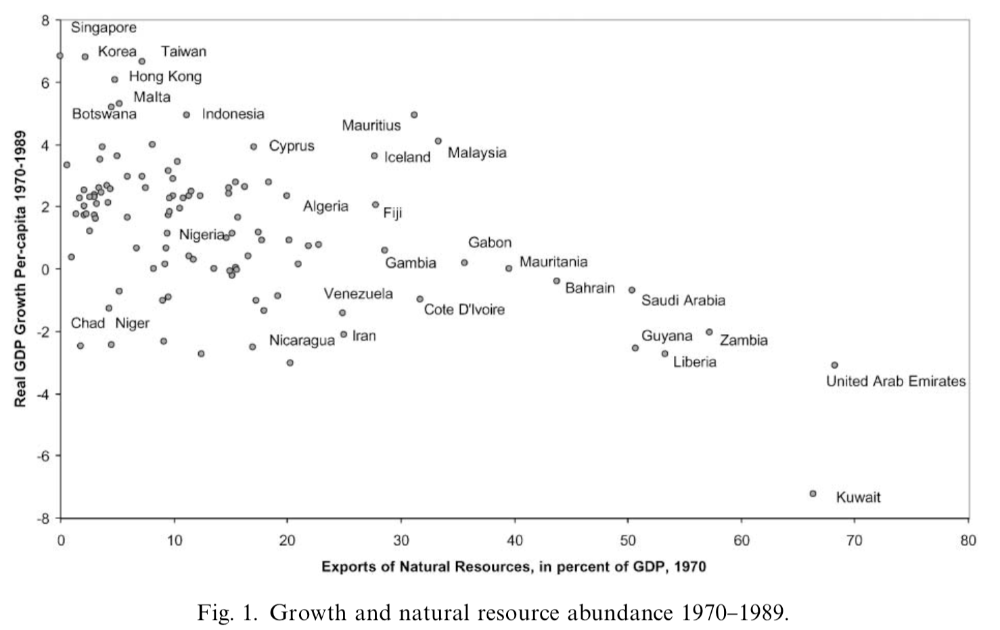
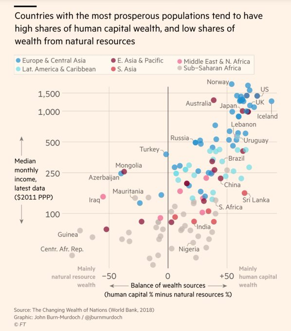
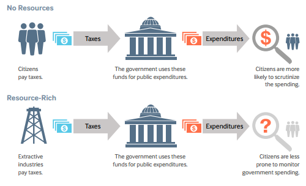
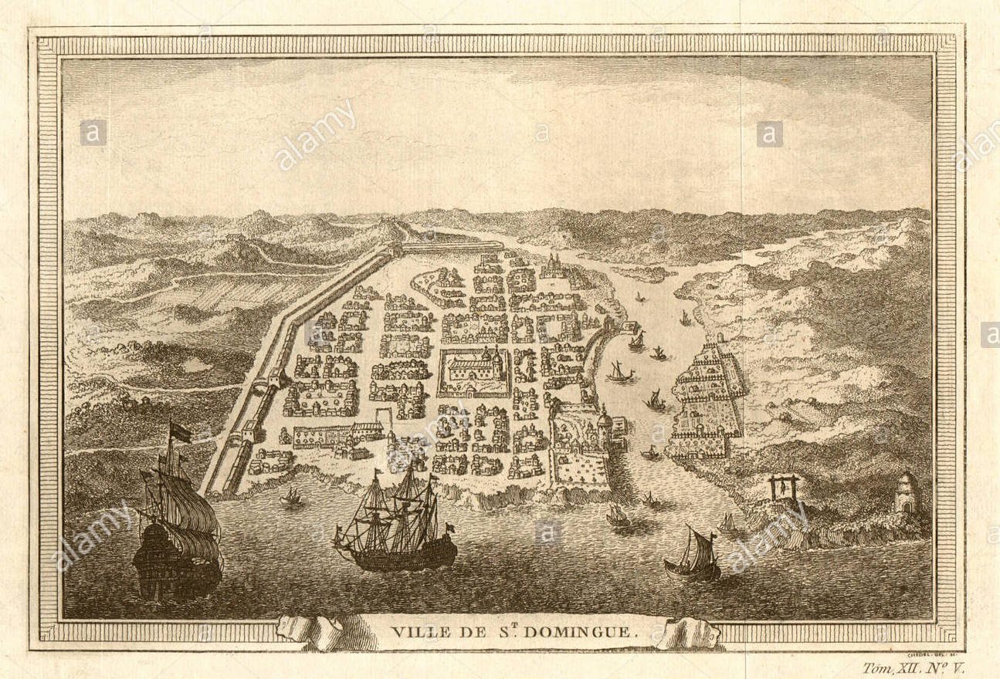
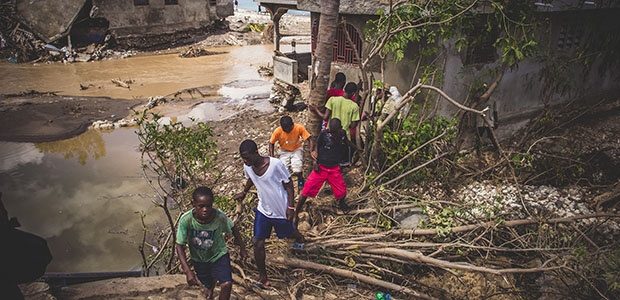
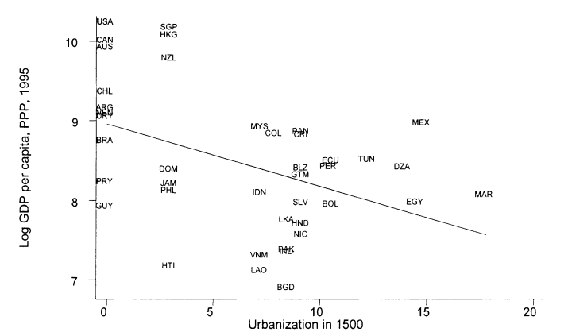
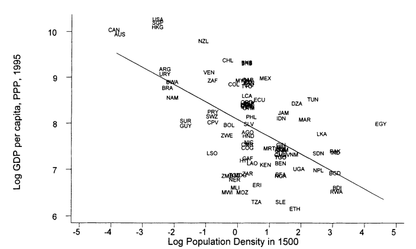
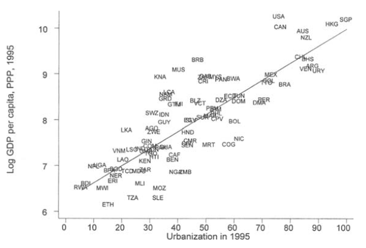
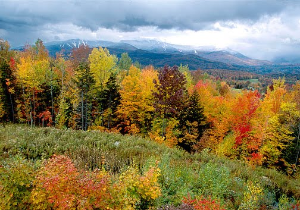

```{r setup, include=FALSE}
options(htmltools.dir.version = FALSE)
knitr::opts_chunk$set(echo=F,
                      message=F,
                      warning=F,
                      fig.retina = 3,
                      fig.align = "center")
library("tidyverse")
library("ggrepel")
library("fontawesome")
library("ggthemes")
xaringanExtra::use_tile_view()
xaringanExtra::use_tachyons()
xaringanExtra::use_freezeframe()

update_geom_defaults("label", list(family = "Fira Sans Condensed"))
update_geom_defaults("text", list(family = "Fira Sans Condensed"))

set.seed(256)

theme_slides <- theme_light() + 
  theme(
    text = element_text(family = "Fira Sans", size = 24)
  )

```

class: inverse

# Outline

### [The Curse of Resources](#3)
### [Is Geography Destiny? The Reversal of Fortune](#12)

---

class: inverse, center, middle

# The Curse of Resources

---

# The Curse of Resources I

> "The curse of natural resources [is] the observation that countries rich in natural resources tend to perform badly," (p. 826).

> "Empirical support for the curse of natural resources is not bulletproof, but it is quite strong. First, casual observation suggests that there is virtually no overlap in the set of countries that have large natural resource endowments and the set of countries that have high levels of GDP," (p.828).


.source[Sachs, Jeffrey D. and Andrew M. Warner, 2001, "The Curse of Natural Resources," *European Economic Review* 45: 827-838]

---

# The Curse of Resources II

.center[

]

.source[Sachs, Jeffrey D. and Andrew M. Warner, 2001, "The Curse of Natural Resources," *European Economic Review* 45: 827-838]

---

# The Curse of Resources III

> "The figure shows that none of the countries with extremely abundant natural resources in 1970 grew rapidly for the next 20 years. This fact holds up using a variety of measures of resource abundance. Moreover, most of the countries that did grow rapidly during this period started as resource poor, not resource rich," (p.829).

.source[Sachs, Jeffrey D. and Andrew M. Warner, 2001, "The Curse of Natural Resources," *European Economic Review* 45: 827-838]

---


# The Curse of Resources IV

> "Just as we lack a universally accepted theory of economic growth in general, we lack a universally accepted theory of the curse of natural resources. Most current explanations for the curse have a crowding-out logic. Natural Resources crowd-out activity x. Activity x drives growth. Therefore Natural Resources harm growth. Since there is a diversity of views regarding the second of these statements (what exactly drives growth), we have a similar diversity of views on the natural resource question," (p.833).

.source[Sachs, Jeffrey D. and Andrew M. Warner, 2001, "The Curse of Natural Resources," *European Economic Review* 45: 827-838]

---

# The Curse of Resources V

.pull-left[

.smallest[
- Economic issues of having a lot of natural resources (commodities):

- What if commodity prices fall on the global market?
  - 30-40 years decline in commodity prices
  - at mercy of international markets

]
]

.pull-right[

.center[

]
]
---

# The Curse of Resources VI

.center[
<iframe src="https://ourworldindata.org/grapher/real-commodity-price-index-metals?time=1953..2015&country=~OWID_WRL" loading="lazy" style="width: 100%; height: 600px; border: 0px none;"></iframe>
]

---

# The Curse of Resources VII

.pull-left[

.smallest[
- Economic issues of having a lot of natural resources (commodities):

- Resource could be dead-end sector
  - oil extraction & exporting may not generate positive spillovers to other industries (factor markets with educated, talented workers; complementary goods, etc.)
  - may not benefit your own citizens (foreign workers)
  - crowd out investment in other important industries, infrastructure

]
]

.pull-right[

.center[

]
]

---

# The Curse of Resources VIII

.pull-left[

.smallest[
- Economic issues of having a lot of natural resources (commodities):

- Susceptible to control by elites
  - dictatorship can easily control extraction of resource 
  - less so with other forms of production

- Encourage armed conflict
  - target for other countries (or rival non-State ethnic groups internally) to expropriate

]
]

.pull-right[

.center[

]
]

---

# The Curse of Resources IX

.center[

]

---

# The Curse of Resources: Effect on Institutions

.center[

]

---

class: inverse, center, middle

# Is Geography Destiny? The Reversal of Fortune

---

# St. Domingue, "The Eden of the Western World"

.pull-left[

- produced 30% of world's sugar and over 50% of world's coffee

- foreign trade was equal to that of the U.S.

- cities larger than Boston, newspapers, museums, concert halls, markets with world luxuries

]

.pull-right[
.center[

]
]

---

# Today We Call it Haiti...Poorest Country in Western Hem.

.center[

]

---

# 1500: Tropical Countries Wealthier than Temperate Countries

.center[

]

.source[Acemoglu, Daron, Simon Johnson, and James A. Robinson, (2002), "Reversal of Fortune: Geography and Institutions in the Making of the Modern World Income," *Quarterly Journal of Economics* 117(4): 1231-1294]

---

# 1500: Tropical Countries Wealthier than Temperate Countries

.center[

]

.source[Acemoglu, Daron, Simon Johnson, and James A. Robinson, (2002), "Reversal of Fortune: Geography and Institutions in the Making of the Modern World Income," *Quarterly Journal of Economics* 117(4): 1231-1294]

---

# Urbanization is Strongly Related to Development

.center[

]

.source[Acemoglu, Daron, Simon Johnson, and James A. Robinson, (2002), "Reversal of Fortune: Geography and Institutions in the Making of the Modern World Income," *Quarterly Journal of Economics* 117(4): 1231-1294]

---

# The Reversal of Fortune I 

> "This paper documents a reversal in relative incomes among the former European colonies. For example, the Mughals in India and the Aztecs and Incas in the Americas were among the richest civilizations in 1500, while the civilizations in North America, New Zealand, and Australia were less developed. Today the United States, Canada, New Zealand, and Australia are an order of magnitude richer than the countries now occupying the terri- tories of the Mughal, Aztec, and Inca Empires," (p.1231).

> "Figure I shows a negative relationship between the percent of the population living in towns with more than 5000 inhabitants in 1500 and income per capita today. Figure II shows the same negative relationship between log population density (number of inhabitants per square kilometer) in 1500 and income per capita today," (p.1232).

.source[Acemoglu, Daron, Simon Johnson, and James A. Robinson, (2002), "Reversal of Fortune: Geography and Institutions in the Making of the Modern World Income," *Quarterly Journal of Economics* 117(4): 1231-1294]

---

# Alternative Explanations I

.pull-left[
- .hi[“Simple Geography hypothesis”]:

- *Time invariant* effects of geography (e.g. climate and disease)

- **Prediction**: nations relatively wealthy in 1500 should be relatively wealthy today

]

.pull-right[
.center[



]
]

.source[Acemoglu, Daron, Simon Johnson, and James A. Robinson, (2002), "Reversal of Fortune: Geography and Institutions in the Making of the Modern World Income," *Quarterly Journal of Economics* 117(4): 1231-1294]

---

# Alternative Explanations II

.pull-left[
.smaller[
- .hi[“Sophisticated Geography hypothesis”] or .hi[“temperate drift hypothesis”]:

- *Time-varying* effects of geography

- Certain geog. characteristics that were useful for 1500 are no longer useful

- Tropical areas had agricultural productivity advantage before 1500

- Later agricultural technologies benefited agriculture in temperate areas
    - heavy plow, crop rotation, domesticated animals, high yield crops, etc
]
]

.pull-right[
.center[


]
]

.source[Acemoglu, Daron, Simon Johnson, and James A. Robinson, (2002), "Reversal of Fortune: Geography and Institutions in the Making of the Modern World Income," *Quarterly Journal of Economics* 117(4): 1231-1294]

---

# Alternative Explanations III

.pull-left[
- Other sophisticated geography-based hypotheses

- Presence of cheap energy reserves (i.e. coal)

- Location near the sea/rivers

- Cause industrialization
]

.pull-right[
.center[


]
]

.source[Acemoglu, Daron, Simon Johnson, and James A. Robinson, (2002), "Reversal of Fortune: Geography and Institutions in the Making of the Modern World Income," *Quarterly Journal of Economics* 117(4): 1231-1294]

---

# AJR: These Hypotheses Fail to Explain the Reversal
.smallest[

> "The reversal in relative incomes weighs against [the] simple version of the geography hypothesis," (p.1233).

> "Although plausible, the temperate drift hypothesis cannot account for the reversal. First, the reversal in relative incomes seems to be related to population density and prosperity before Europeans arrived, not to any inherent geographic characteristics of the area. Furthermore, according to the temperate drift hypothesis, the reversal should have occurred when European agricultural technology spread to the colonies. Yet, while the introduction of European agricultural techniques, at least in North America, took place earlier, the reversal occurred during the late eighteenth and early nineteenth centuries, and is closely related to industrialization. Another version of the sophisticated geography hypothesis could be that certain geographic characteristics, such as the presence of coal reserves or easy access to the sea, facilitated industrialization...But we do not find any evidence that these geographic factors caused industrialization. Our reading of the evidence therefore provides little support to various sophisticated geography hypotheses either," (p.1233-1234).

]

.source[Acemoglu, Daron, Simon Johnson, and James A. Robinson, (2002), "Reversal of Fortune: Geography and Institutions in the Making of the Modern World Income," *Quarterly Journal of Economics* 117(4): 1231-1294]

---

# AJR: It's Institutions!

.smallest[
> "An alternative view, which we believe provides the best explanation for the patterns we document, is the "institutions hypothesis," relating differences in economic performance to the organization of society. Societies that provide incentives and opportunities for investment will be richer than those that fail to do so... As we discuss in more detail below, we hypothesize that a cluster of institutions ensuring secure property rights for a broad cross section of society, which we refer to as institutions of private property, are essential for investment incentives and successful economic performance. In contrast, extractive institutions, which concentrate power in the hands of a small elite and create a high risk of expropriation for the majority of the population, are likely to discourage investment and economic development. Extractive institutions, despite their adverse effects on aggregate performance, may emerge as equilibrium institutions because they increase the rents captured by the groups that hold political power." (p.1234-5).

]

- Much more on this later!

.source[Acemoglu, Daron, Simon Johnson, and James A. Robinson, (2002), "Reversal of Fortune: Geography and Institutions in the Making of the Modern World Income," *Quarterly Journal of Economics* 117(4): 1231-1294]
