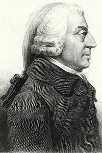

```{r setup, include=FALSE}
options(htmltools.dir.version = FALSE)
knitr::opts_chunk$set(echo=F,
                      message=F,
                      warning=F,
                      fig.retina = 3,
                      fig.align = "center")
library("tidyverse")
library("ggrepel")
library("fontawesome")
library("ggthemes")
xaringanExtra::use_tile_view()
xaringanExtra::use_tachyons()
xaringanExtra::use_freezeframe()

update_geom_defaults("label", list(family = "Fira Sans Condensed"))
update_geom_defaults("text", list(family = "Fira Sans Condensed"))

set.seed(256)

theme_slides <- theme_light() + 
  theme(
    text = element_text(family = "Fira Sans", size = 24)
  )

```

class: inverse, center, middle

### [Escape from Feudalism (c.??-c.1500)](#)
### [Mercantilist Europe (c.1500-c.1800)](#)
### [Colonization](#)
### [Classical Economics and the Rejection of Mercantilism](#)

---

class: inverse, center, middle

# Escape from Feudalism (c.??-c.1500)

---

# A Lot of Theories of European Institutional Origins

.center[

]

---

# Let's Explore Three (Among Many) Explanations

.pull-left[
1. Adam Smith's Explanation

2. War and State Capacity

3. Other Key Historical Events

]

.pull-right[
.center[

]
]

---

# Adam Smith's Explanation I

.left-column[
.center[


Adam Smith

1723-1790
]
]

.right-column[

.quitesmall[

> "In order to understand [the kings’ grant of independence to the towns], it must be remembered, that in those days the sovereign of perhaps no country in Europe, was able to protect, through the whole extent of his dominions, the weaker part of his subjects from the oppression of the great lords.

> "The inhabitants of cities and burghs, considered assingle individuals, had no power to defend themselves: but by entering into a league of mutual defence with their neighbours, they were capable of making no contemptible resistance."

]

.source[Smith, Adam, 1776, [*An Enquiry into the Nature and Causes of the Wealth of Nations*](https://www.econlib.org/library/Smith/smWN.html)]

]

---

# Adam Smith's Explanation II

.left-column[
.center[


Adam Smith

1723-1790
]
]

.right-column[

.smaller[
> "The lords despised the burghers...The wealth of the burghers never failed to provoke their envy and indignation, and [the lords] plundered them upon every occasion without mercy or remorse. The burghers naturally hated and feared the lords. The king hated and feared them too; but though perhaps he might despise, he had no reason either to hate or fear the burgher," (Book III, Chapter III).

]

.source[Smith, Adam, 1776, [*An Enquiry into the Nature and Causes of the Wealth of Nations*](https://www.econlib.org/library/Smith/smWN.html)]
]

---

# Adam Smith's Explanation III

.left-column[
.center[


Adam Smith

1723-1790
]
]

.right-column[

.quitesmall[

> "Mutual interest, therefore, disposed [the burghers] to support the king, and the king to support them against the lords. They were the enemies of his enemies, and it was his interest to render them as secure and independent of those enemies as he could. By granting them magistrates of their own, the privilege of making bye-laws for their own government, that of building walls for their own defence, and that of reducing all their inhabitants under a sort of military discipline, he gave them all the means of security and independency of the barons which it was in his power to bestow. Without the establishment of some regular government of this kind, without some authority to compel their inhabitants to act according to some certain plan or system, no voluntary league of mutual defence could either have afforded them any permanent security, or have enabled them to give the king any considerable support," (Book III, Chapter III).

]

.source[Smith, Adam, 1776, [*An Enquiry into the Nature and Causes of the Wealth of Nations*](https://www.econlib.org/library/Smith/smWN.html)]

]

---

# Adam Smith's Explanation IV

.left-column[
.center[


Adam Smith

1723-1790
]
]


.right-column[

.quitesmall[
> "In countries such as France or England, where the authority of the sovereign, though frequently very low, never was destroyed altogether, the cities had no opportunity of becoming entirely independent. They became, however, so considerable that the sovereign could impose no tax upon them, besides the stated farm-rent of the town, without their own consent. They were, therefore, called upon to send deputies to the general assembly of the states of the kingdom, where they might join with the clergy and the barons in granting, upon urgent occasions, some extraordinary aid to the king. Being generally, too, more favourable to his power, their deputies seem, sometimes, to have been employed by him as a counter-balance in those assemblies to the authority of the great lords. Hence the origin of the representation of burghs in the states-general of all the great monarchies in Europe," (Book III, Chapter III).

]

.source[Smith, Adam, 1776, [*An Enquiry into the Nature and Causes of the Wealth of Nations*](https://www.econlib.org/library/Smith/smWN.html)]

]

---

# Adam Smith's Explanation V

.left-column[
.center[


Adam Smith

1723-1790
]
]

.right-column[

- Three players:
  1. king
  2. noblity (lords)
  3. towns

- Nobles control vast manors and estates in the countryside

- Towns are full of freemen (with no lords), grow wealthy from trade

- Lords hate towns, towns hate lords
]

.source[Smith, Adam, 1776, [*An Enquiry into the Nature and Causes of the Wealth of Nations*](https://www.econlib.org/library/Smith/smWN.html)

Weingast, Barry R, 2017, "Adam Smith's Theory of Violence and the Political-Economics of Development," Manuscript]

---

# Adam Smith's Explanation VI

.left-column[
.center[


Adam Smith

1723-1790
]
]

.right-column[
.smallest[
- King and towns find a mutually-beneficial exchange against common enemy: the lords:
  - King exempts towns from feudal ties to lords (effectively grants independence)
  - Allows towns to govern themselves, and pledges mutual protection against lords, in exchange for regular taxes to the King

- Towns choose governance that benefits themselves: stronger property rights, rule of law, justice, military defense against lords
  - Don't get too excited: they are a clear oligarchy, not a democracy!
]
]

.source[Smith, Adam, 1776, [*An Enquiry into the Nature and Causes of the Wealth of Nations*](https://www.econlib.org/library/Smith/smWN.html)

Weingast, Barry R, 2017, "Adam Smith's Theory of Violence and the Political-Economics of Development," Manuscript]

---

# Adam Smith's Explanation VII

.left-column[
.center[


Adam Smith

1723-1790
]
]

.right-column[

- King gained increased fiscal capacity (regular tax revenue from towns) and military capacity to weaken the lords

- a lot more wealth, people start buying their way out of feudal dues
  - "bastard feudalism"

- Merchants and townspeople have enough wealth and power to have a seat at the table

- King requires consent of Parliaments, not just of landowning Lords, but also of towns and merchants

]

.source[Smith, Adam, 1776, [*An Enquiry into the Nature and Causes of the Wealth of Nations*](https://www.econlib.org/library/Smith/smWN.html)

Weingast, Barry R, 2017, "Adam Smith's Theory of Violence and the Political-Economics of Development," Manuscript]

---

# War and State Capacity I

.left-column[
.center[


Charles Tilly

1929-2008
]
]

.right-column[

> *Wars made the State and the State made war.*

- Constant warfare between small European States created an evolutionary selection mechanism for political-economic success via state capacity

.center[

]
]

.source[Tilly, Charles, 1992, *Coercion, Capital, and European States: A.D. 970-1992*]

---

# War and State Capacity II

.center[
States in Europe around 1500


]

---

# War and State Capacity III

.right-column[
.center[

]
]

.left-column[

- Threat of war 
- $\rightarrow$ need for large expenditures on military
- $\rightarrow$ strong centralized States
- $\rightarrow$ expand rule, bureaucracy, industrialized economy
- $\rightarrow$ strong States survive, weak States imitate or perish

]


---

# War and State Capacity IV

.pull-left[
.center[

]
]

.pull-right[
.smaller[
- Military technology, *gunpowder*, especially *cannon* shift dynamics of Medieval warfare

- Defensive advantages and walled cities no longer effective!

- Economies of scale for large-scale warfare: mass infantry, artillery

- Waging a successful war becomes very capital-intensive, expensive endeavor

- Central management of mass conscripts by monarch replaces private armies of nobles
]
]


---

# War and State Capacity V

.pull-left[
.center[

]
]

.pull-right[

- Cash-strapped rulers need to rapidly invest in fiscal capacity to stay afloat

- Hard to borrow money and finance State/military operations
  - high interest rates for monarchs from high risk of default or confiscation!
  - debt financing wars play a bigger role in world economic history than you imagine...
    - keep an eye out for the Dutch Netherlands and England

- Need more effective revenue sources: regular taxation, centrealized bureaucracy, encourage towns to buy their way out of feudal dues to lords

]

---

# War and State Capacity VI

.pull-left[
.center[


*Liberty Leading the People* by Eugene Delacroix (1830)
]
]

.pull-right[

- Sentiment changes:
  - citizens more willing to acquiesce to taxes if at war
  - common external threat puts aside petty domestic differences
  - ratchet effect after war is over, people are used to more government power

- *Very* eventually: fighting not for your Lord, or even for your king
  - but for your *country*, or for *God*, or for *an idea*
]

---

# War and State Capacity: Europe vs. China I

.pull-left[
.center[

]
]

.pull-right[
.smallest[
- A dominant Empire is less stable in Europe than China

- Geographic divisions (rivers, mountains) and defensive advantages in Europe

- More historic threats in Europe
  - Germanic and Turkic Tribes (North/East), Vikings (North), Arabs (South)

- China has had a single unidirectional threat for centuries (until British Opium Wars in 1830s)
  - Nomadic steppe tribes to the North in Central Asia (Xiongnu, Mongols)
]

.source[Ko, Chiu Yu, Mark Koyama, and Tuan-Hwee Sng, 2017, "Unified China and Divided Europe," *International Economic Review* 59(1): 285-327]

]

---

# War and State Capacity: Europe vs. China II

.pull-left[

.center[

]
]

.pull-right[

.center[

]
]

.source[Mellinger, Andrew D., Jeffrey Sachs, and John L. Gallup, (1999), "Climate, Water Navigability, and Economic Development," *CID Working Paper* No. 24]

---

# War and State Capacity: Europe vs. China III

.pull-left[

.center[

]
]

.pull-right[

.center[

]
]

.source[Ko, Chiu Yu, Mark Koyama, and Tuan-Hwee Sng, 2017, "Unified China and Divided Europe," *International Economic Review* 59(1): 285-327]

---

# War and State Capacity: Europe vs. China IV

.center[

]

.source[Ko, Chiu Yu, Mark Koyama, and Tuan-Hwee Sng, 2017, "Unified China and Divided Europe," *International Economic Review* 59(1): 285-327]

---

# War and State Capacity: Religious Wars I

.pull-left[
.center[
The "Holy Roman Empire" in 1648


]
]

.pull-right[
- .hi[Protestant Reformation] in Christianity (Catholics vs. Cathars, Huguenots, Hussites, Lutherans, Calvinists, Anglicans)

- Constantly shifting alliances between nobles, kings, the pope against religious opponents

- Thirty Years War (1618-1648) fought on basis of religion
  - One of the most devastating wars in human history, 8 million deaths, 20% of German population died

]

---

# War and State Capacity: Religious Wars II

.pull-left[
.center[

]
]

.pull-right[
.smallest[
- .hi[1648 Peace of Westphalia] puts an official end to State-sanctioned religious warfare
  - Ends Thirty Years War, and Eighty Years War

- "*Cuius regio, euis religio*"

- Recognizes the .hi[nation-state] as the sovereign actor in the world, other entities cannot interfere with a nation-state's internal affairs (i.e. religion)

- Territorial borders established between States

- Balance of power: nation-states create credible commitment to ally against any one state seeking domination
]

]

---

# War and State Capacity: Summary I

.smaller[
> "Understanding economic history is critical for comprehending the importance of state capacity. **In historical terms, the emergence of well functioning states is a relatively recent phenomenon.** For many premodern polities, even **the term state is an anachronism: there was no state in much of Europe prior to the late middle ages.** Otto Heinze observed that feudal rulers ‘lacked the attributes of sovereignty—that is, independence beyond its borders and exclusive rights within them’ (Hintze, 1906, 1975, p. 192). In medieval Europe, characterized by fragmented political authority, overlapping and competing legal jurisdictions, and private armies—the modern concept of a state—has little empirical purchase (Strayer, 1970). **The word 'state' only came to acquire its modern meaning in English at the end of the sixteenth century** (Skinner, 2009). This was not merely a semantic change; when 'the word 'state', l'etat, stato' or Der Staat came into usage in the early modern period **it was 'a word for a new political experience'** (Oakeshott, 2006, p. 361)," (p.2).

]

.source[Koyama, Mark and Noel D. Johnson, 2016, "States and Economic Growth: Capacity and Constraints," *Explorations in Economic History*, forthcoming]

---

# War and State Capacity: Summary II

> "Perhaps the most important function of the state is to provide defense. Frequently this is defense against aggression by other states. Premodern polities were often at war. In the early modern period, particularly bellicose states like Russia and France were at war more often than they were at peace (Voigtlander and Voth, 2013). **Warfare was economically costly, typically involving the devastation of agriculture land**—as in the chevauchée of the Hundred Years War, for example—and often the destruction of towns and cities that resisted a siege. It seems likely that **the ability of early modern states after 1700 to establish territorial borders and limit the destructiveness of warfare played an important role in allowing Smithian economic growth to take place**," (pp.8-9).

.source[Koyama, Mark and Noel D. Johnson, 2016, "States and Economic Growth: Capacity and Constraints," *Explorations in Economic History*, forthcoming]

---

# Other Key Historical Events

.pull-left[
.smallest[
- A number of key historical events and technoloical developments 
  1. The Crusades
  2. The Black Death
  3. The Reformation
  4. The Age of Discovery

- Would Industrial Revolution begin in Western Europe without them??

- Role of **path dependency** in history

- Are these the *only* important events? Of course not. Just the most-talked about.
]
]

.pull-right[
.center[

]
]

---

# The Crusades I

.pull-left[

- First Crusade 1095, goal of retaking the Holy Land from Arabs

- Lost Jerusalem to Saladin in 1187, never recaptured

- At least 9 crusades by 1291

]

.pull-right[
.center[

]
]

---

# The Crusades II

.pull-left[

- "Outremer" Crusader kingdoms in Levant for 200 years

- Last (in some form) until 1300

- Outlet for peasants, nobles, merchants, etc. fleeing hardships of Europe

- "International" institutions
  - Knights Templar
  - Knights Hospitalier

]

.pull-right[
.center[

]
]

---

# The Crusades III

.pull-left[

- Increase European interaction with rest of the world via Arabs (who trade with India and China)

- (Re)discovery of classical philosophy, mathematics, literature, art from Arabs (who retained it from Ancient Greece and Rome)

.center[

]
]

.pull-right[
.center[


]
]

---

# The Black Death I

.pull-left[
.center[

]
]

--

.pull-right[

- Bubonic plague ravages Europe (esp. 1340s-1350s)

- 75-200 million die (30-60% of European population)

- Absolutely enormous social, political, economic consequences
  - Some good in the long run??
]

---

# The Pre-Black Death Malthusian Economy I

.pull-left[

- Malthusian Dynamics:

- Land scarcer than labor

- Diminishing returns to land

- Commercial Revolution $\implies$ population growth

- Movement to frontiers, clearing forests, bringing more marginal land into cultivation

]

.pull-right[
.center[

]
]

.source[North, Douglass C. and Robert Paul Thomas, (1973), *The Rise of the Western World: A New Economic History*, p 12-13]

---


# The Pre-Black Death Malthusian Economy II

.pull-left[

- Change in relative factor prices & bargaining power
  - Land-intensive goods (agriculture) real prices and rents increase
  - Labor-intensive goods real prices and wages decrease

- More $\pi$ for lords to buy back and (hire professionals to) manage land, and sell produce than to rent land out to others
]

.pull-right[
.center[

]
]

.source[North, Douglass C. and Robert Paul Thomas, (1973), *The Rise of the Western World: A New Economic History*, p 12-13]

---

# The Pre-Black Death Malthusian Economy III

.pull-left[

- Malthusian constraint is hit: population with diminishing returns to land and labor $>$ growth in output

- Great Famine of 1315-1317 in Europe

]

.pull-right[
.center[

]
]

.source[North, Douglass C. and Robert Paul Thomas, (1973), *The Rise of the Western World: A New Economic History*, p 12-13]

---

# Other Variables are Changing Too

.center[

]

---

# The Black Death Consequences I

.pull-left[
.center[

]
]

.pull-right[

- Reverses the effects of the Commercial Revolution from decimated population

- Real wages increase, real rents decrease, agricultural prices decrease

- Drastic shift in bargaining power from lords to peasants
  - Peasants gain longer leases and more direct property rights in land

- Scarce labor $\rightarrow$ incentive to seek out labor-saving innovations
]

---

# The Black Death Consequences II

.pull-left[
.center[

]
]

.pull-right[
.smallest[
- Lords attempt to force a return to "normal"

- **1351 Statute of Laborers** in England: fix price controls, force down wages

- Leads to Peasant Revolt (1381)

- Manorialism fades away slowly, Lords and peasants need more *flexibility* in prices and contracts to change with circumstances (not immutable custom)

- Peasants become more "independent contractor" than feudal serf

- Europe recovers by 15<sup>th</sup> Century
]

]

---

# Other Key Historical Events: The Reformation I

.pull-left[
.center[


]
]

.pull-right[
.smallest[
- Printing press emerges in Europe around 1450 via Johannes Gutenberg in Mainz
  - Prints the first "Gutenberg Bible" 

- Martin Luther publishes *95 Theses* against the Catholic church in 1517 Wittenberg

- Luther is far from the first dissident within the Catholic church with a following

- But he is the first to be protected by a powerful group of dissident lords away from the reaches of the Holy Roman Emperor
  - plus he is the first with a printing press!
]
]

---

# Other Key Historical Events: The Reformation II

.center[


.quitesmall[
Over the next 300 years, religious wars overlaid on political and military competition between early European states
]
]


---

# Other Key Historical Events: The Age of Discovery I

.center[


Byzantine Empire falls in 1453 to Ottoman Turks, which cuts off Europe's access to the Eastern trade; search for sea-routes to India and China begin
]

---

# Other Key Historical Events: The Age of Discovery II

.center[

]

---

# Other Key Historical Events: The Age of Discovery III

.pull-left[
.center[

]
]

.pull-right[

- Trade (and later colonization) with world is immensely profitable

- "Discovery" of New World & Atlantic trade
  - Colonies ship raw materials back to Europe in exchagne for manufactured goods
]

---

# Other Key Historical Events: The Age of Discovery IV

.pull-left[
.center[

]
]

.pull-right[

- Europe recovers from the Black Death, population growth from economic improvements

- Land-abundant, labor-scarce colonies are an "escape valve" for Malthusian pressures in land-scarce, labor-abundant Europe

- Also an escape valve for some religious dissident groups (Puritans, Quakers, etc.)

]

---

# Other Key Historical Events: The Age of Discovery IV

.pull-left[
.center[


The Amsterdam Stock Exchange (1601)
]
]

.pull-right[

- Towns become specialized and very wealthy cities

- .hi[The Middle Class] emerges in terms of wealth, power, and social status
  - Not peasants
  - Not landowners or aristocratic nobles
  - Small-property-holding townspeople growing wealthy from manufacturing, shipping, or colonial trading ventures
]

---

# Other Key Historical Events: The Age of Discovery V

.pull-left[
.center[

]
]

.pull-right[

.quitesmall[
> "The rise of Western Europe after 1500 is due largely to growth in countries with access to the Atlantic Ocean and with substantial trade with the New World, Africa, and Asia via the Atlantic. This trade and the associated colonialism affected Europe not only directly, but also indirectly by inducing institutional change. Where “initial” political institutions (those established before 1500) placed significant checks on the monarchy, the growth of Atlantic trade strengthened merchant groups by constraining the power of the monarchy, and helped merchants obtain changes in institutions to protect property rights. These changes were central to subsequent economic growth," (p.546)
]
]

.source[Acemoglu, Daron, Simon Johnson, and James Robinson, 2005, "The Rise of Europe: Atlantic Trade, Institutional Change, and Economic Growth," *American Economic Review* 95(3): 546-579]

---

# Other Key Historical Events: The Age of Discovery V

.center[

]

.source[Acemoglu, Daron, Simon Johnson, and James Robinson, 2005, "The Rise of Europe: Atlantic Trade, Institutional Change, and Economic Growth," *American Economic Review* 95(3): 546-579]

---

class: inverse, center, middle

# Mercantilist Europe (c.1500-c.1800)

---

# Mercantilism I

.pull-left[
.center[

]
]

.pull-right[
.smallest[
- .hi-purple[Feudalism] fades away *slowly*: feudal custom and obligatory service replaced by cash payment and flexible contracts

- Rising merchant class grows *outside* of landlord-serf & patronage-dominated customs
  - in some countries (Netherlands & England), become part of the elite

- A new political-economic ideology of nationally-managed trade to replace feudalism: .hi[mercantilism]
]
]
---

# Mercantilism: The Rise of a New Class I

.pull-left[
.center[

]
]

.pull-right[
.center[

]
]

---

# Mercantilism: The Rise of a New Class II


.left-column[
.center[


Karl Marx (1818-1883)

Friedrich Engels (1820-1895)

]
]

.right-column[

.font90[
> "The feudal system of industry, in which industrial production was monopolised by closed guilds, now no longer sufficed for the growing wants of the new markets. The manufacturing system took its place. The guild-masters were pushed on one side by the manufacturing middle class; division of labour between the different corporate guilds vanished in the face of division of labour in each single workshop," $(\S2$ Proletarians and Communists)
]
]

.source[Marx, Karl and Friedrich Engels, 1848, [*Manifesto of the Communist Party*](https://www.marxists.org/archive/marx/works/1848/communist-manifesto/)]

---

# Mercantilism: The Rise of a New Class III


.left-column[
.center[


Karl Marx (1818-1883)

Friedrich Engels (1820-1895)

]
]

.right-column[

.font90[
> "The bourgeoisie, wherever it has got the upper hand, has put an end to all feudal, patriarchal, idyllic relations. It has pitilessly torn asunder the motley feudal ties that bound man to his "natural superiors," and has left remaining no other nexus between man and man than naked self-interest, than callous "cash payment." It has drowned the most heavenly ecstasies of religious fervour, of chivalrous enthusiasm, of philistine sentimentalism, in the icy water of egotistical calculation. It has resolved personal worth into exchange value, and in place of the numberless indefeasible chartered freedoms, has set up that single, unconscionable freedom---Free Trade," $(\S2$ Proletarians and Communists)
]
]

.source[Marx, Karl and Friedrich Engels, 1848, [*Manifesto of the Communist Party*](https://www.marxists.org/archive/marx/works/1848/communist-manifesto/)]

---

# Mercantilism: The Rise of a New Class IV


.left-column[
.center[


Karl Marx (1818-1883)

Friedrich Engels (1820-1895)

]
]

.right-column[

.font90[
> "The bourgeoisie, during its rule of scarce one hundred years, has created more massive and more colossal productive forces than have all preceding generations together. Subjection of Nature's forces to man, machinery, application of chemistry to industry and agriculture, steam-navigation, railways, electric telegraphs, clearing of whole continents for cultivation, canalisation of rivers, whole populations conjured out of the ground---what earlier century had even a presentiment that such productive forces slumbered in the lap of social labour?," $(\S2$ Proletarians and Communists)
]
]

.source[Marx, Karl and Friedrich Engels, 1848, [*Manifesto of the Communist Party*](https://www.marxists.org/archive/marx/works/1848/communist-manifesto/)]

---

# Mercantilism as a Political-Economic Ideology I

.pull-left[
.center[

]
]

.pull-right[

- What does the new merchant class want?

- Commerce! Trade!

- But not just any commerce...like any self-interest elite, they want commerce favorable to themselves
  - Monopolies, privileged terms of trade

]

---

# Mercantilism as a Political-Economic Ideology II

.pull-left[
.center[

]
]

.pull-right[

- Nation-states (monarchs) as principle actors

- National economies, stimulated by activist State interventions

- *The wealth of nations* is the quantity of their "specie" (gold and silver; i.e. money)
  - More money $\implies$ hire more soldiers $\implies$ win more wars $\implies$ gain more wealth
]

---

# Mercantilism as a Political-Economic Ideology III

.pull-left[
.center[

]
]

.pull-right[

- .hi-purple[Wealth comes from international trade]! 
  - Particularly producing selling **manufactures** abroad

- A nation must maintain a .hi-purple["favorable balance of trade"]
  - export more than you import

- International trade between nations/empires is war by other means
]

---

# Mercantilism as a Political-Economic Ideology IV

.pull-left[
.center[

]
]

.pull-right[

- Total wealth of the world is fixed - one must gain at others' expense

- Goal of economic activity is production

- *Monetary* factors determine economic activity & growth
]

---

# Mercantilism as a “Philosophy” I

.pull-left[
.center[

]
]

.pull-right[
.smaller[
- Possibility of analyzing, understanding, and directing *the economy*
  - Scientific revolution in physics (Newton)

- Mechanistic causal model of the economy via government control

]
]

---

# Mercantilism as a “Philosophy” II

.pull-left[
.center[

]
]

.pull-right[
.smaller[
- Fundamental conflict between private interests and public welfare
  - Can't change human nature, but can direct it for national wealth and power
  - Government as key mechanism to manage fallen people for common good

- Wealth of nation depended on the poverty of the many
  - Keep low wages to encourage work, production
]
]

---

# Policy Implications of Mercantilism I

.pull-left[
.center[

]
]

.pull-right[
- Maximize country's stock of gold and silver

- Mine gold & silver at home

- Seek colonies with gold & silver mines

- Prohibit exports of gold & silver

- Export goods to import gold & silver (as payments for our exports)
]

---

# Policy Implications of Mercantilism II

.pull-left[
.center[

]
]

.pull-right[
.smallest[
- Encourage domestic manufacturing for export

- Import raw materials
  - better yet, acquire colonies that have these so you don't have to give other countries gold or silver for them!

- Limit imports of manufactured goods from other countries

- Limit exports of raw materials
  - other countries can use them to make their own manufactures for export
]
]

---

# Policy Implications of Mercantilism II

.left-column[
.center[


Thomas Mun

1571-1641

]
]

.right-column[

> "The ordinary means therefore to encrease our wealth and treasure is by Forraign Trade, wherein wee must ever observe this rule; to sell more to strangers yearly than wee consume of theirs in value [sic]"

]
.source[Mun, Thomas, 1664, *England's Treasure by Forraign Trade or the Ballance of our Forraign Trade is the Rule of our Treasure*]

---

# Policy Implications of Mercantilism III

.pull-left[
.center[

]
]

.pull-right[
.smallest[
- Grant monopolies to encourage domestic production

- Poach inventors from other countries (grant protections & exemptions from guild laws)

- Sales of monopoly privileges a major source of State revenue (less costly than taxation)
  - Especially in France

- Political considerations: monarchs give privileges to dominant commercial elites in exchange for loyalty

]
]
---

# Trading Monopolies I

.pull-left[
.smaller[
- Crown granted .hi-purple[Letters Patent]

- Created a chartered trading company that had a monopoly on a trade
  - e.g. sugar, salt, tea, tobacco
  - or found a colony

- Crown often gave these to powerful elites as patronage for support
  - often *sold* as a source of State revenue

- Not all that different from a guild
]
]

.pull-right[
.center[

]
]

---

# Trading Monopolies II

.left-column[
.center[


Lord Edward Coke

1552--1634

Chief Justice (King's Bench)

]
]

.right-column[

> "A monopoly is an institution or allowance by the king, by his grant, commission, or otherwise...to any person or persons, bodies politic or corporate, for the sole buying, selling, making, working, or using of anything, whereby any person or persons, bodies politic or corporate, are sought to be restrained of any freedom or liberty that they had before, or hindered in their lawful trade."

]

---

# Trading Monopolies III

> "[A man lives] in a house built with monopoly bricks, with windows...of monopoly glass; heated by monopoly coal (in Ireland monopoly timber), burning in a grate made of monopoly iron...He washed himself in monopoly soap, his clothes in monopoly starch. He dressed in monopoly lace, monopoly linen, monopoly leather, monopoly gold thread...His clothes were dyed with monopoly dyes. He ate monopoly butter, monopoly currants, monopoly red herrings, monopoly salmon, and monopoly lobsters. His food was seasoned with monopoly salt, monopoly pepper, monopoly vinegar...He wrote with monopoly pens, on monopoly writing paper; read (through monopoly spectacles, by the light of monopoly candles) monopoly printed books," (quoted in Acemoglu and Robinson 2011, pp.187-188).

.source[Hill, Christoper, (1961), *The Century of Revolution*]

---

# Trading Monopolies IV

.pull-left[

.center[

]
]

.pull-right[
.smallest[
- .green[**Example**:] British Navigation Acts
]

.quitesmall[
> "[N]o goods of the growth, production, or manufacture of Asia, Africa, or America, shall be imported only by ships that belong to the people of the British Commonwealth."
]

.smallest[
- All trade with Britain and her colonies must use British ships and British seamen

- Intended to target rival European empires (esp. Dutch)

- A major grievance for the American colonists
]
]

---

# Trading Monopolies V

.pull-left[
.center[

]

]

.pull-right[

- Such mercantilist-inspired laws upset a lot of merchants (not politically-connected to the crown)

- Lots of resistance: golden age of piracy, smuggling, "interloping"
  - How many "Founding Fathers" of the U.S. made their fortunes!

- Empires needed to continuously patrol the oceans with their navies against smugglers, pirates, and other Imperial navies

- Navies are expensive, often turned to **privateers** and **Letters of Marque**
]

---

# Trading Monopolies VI

.pull-left[
.center[

]

]

.pull-right[

> The Congress shall have Power...
> To define and punish Piracies and Felonies committed on the high Seas, and Offenses against the Law of Nations;
> To declare War, **grant Letters of Marque and Reprisal**, and make Rules concerning Captures on Land and Water;
> - Constitution of the United States, Article I, $\S$ 8, Clauses 10-11

]

---

# Colonization and Imperialism I

.center[
European Empires at their (anachronistic) *maximal* historical extent

]

---

# Colonization and Imperialism II

.pull-left[

.center[

]
]

.pull-right[
- Portugal (c.1498+), Spain (c. 1492+), France (1530s+), Netherlands (1540s+), Britain (1600s+) establish colonies in Africa, Caribbean, Latin America, and Southern Asia

- Between 15<sup>th</sup> and 20<sup>th</sup>, many wars and changes of hands and fortunes of different European colonial overlords

- Several waves of colonialism - some are for conquest, some are for trade, some are for settlement

- Recall the connection to mercantilist political and economic philosophy
]

---

# Colonization and Imperialism II

- Acemoglu, Johnson, and Robinson:
  - Europeans chose one of two colonization strategies
  - Strategy chosen in 16<sup>th</sup> century *strongly* affects whether those former-colony countries are wealthy & developed or not *today*

.center[


Acemoglu, Johnson, and Robinson, 2001: 1253
]

.source[Acemoglu, Daron, Simon Johnson, and James A Robinson, (2001), "The Colonial Origins of Comparative Development: An Empirical Investigation," *American Economic Review* 91(5): 1369-1401

Acemoglu, Daron, Simon Johnson, and James A Robinson, (2002), "Reversal of Fortune: Geography and Institutions in the Making of the Modern World Income Distribution," *Quarterly Journal of Economics* 117(4): 1231-1294

Acemoglu, Daron, Simon Johnson, and James A Robinson, (2005), "Institutions as a Fundamental Cause of Long-Run Growth," Chapter 6 in Phillippe Aghion and Steven N. Durlauf, eds, *Handbook of Economic Growth*

Acemoglu, Daron and James A Robinson, (2012), *Why Nations Fail: The Origins of Power, Prosperity, and Poverty*]

---

# Extractive Institutions I

.pull-left[
.center[

]
]

.pull-right[

- .hi[Extractive colonies]: focused on exploiting indigenous population to extract resources to export to mother country

- Examples: Latin America, West Indies, sub-Saharan Africa, India
]

---

# Extractive Institutions II

.pull-left[
.center[


Potosi silver mines in (modern day) Bolivia
]
]

.pull-right[

- Set up highly stratified colonial elite with monopolies and privileges and enslave indigenous peoples

- Ex: Spanish *encomienda* system rewarded conquistadors with land and forced labor from conquered indigenious peoples, especially for mining gold and silver through the *mita*
]

---

# Extractive Institutions III

.pull-left[
.center[


]
]

.pull-right[

- Monopolies and property rights only for privileged colonial elite

- Wealth from extracted minerals and coerced labor

- Colonial elites stood to lose a lot from innovation, experimentation, creative destruction

]

---

# Inclusive Institutions I

.pull-left[
.center[

]
]

.pull-right[
- .hi[Inclusive colonies]: focused on creating mini "Neo-Europes"

- Less indigenous population to coerce into labor, had to sustain themselves from European settlers

- Settlers demanded more inclusive institutions

- Examples: United States, Canada, Australia, New Zealand

]

---

# Inclusive Institutions II

.pull-left[
.center[

]
]

.pull-right[
- Set up local self-governing institutions, a society of small landholders

- Focused primarily on agriculture and producing cash crops

- Trade with the mother countries: sell raw materials & buy manufactures

]

---

# Inclusive Institutions III

.pull-left[
.center[

]
]

.pull-right[
- Colonies are **labor scarce** and **land abundant** (the exact opposite of late Medieval Europe!)

- Frontier opens up possibility of **exit**: if your colony's governance is not effective, leave and **go on your own**
  - Colonies constrained to have effective governance to avoid losing their populations
  - Requires including citizens in political and economic life
]

---

# Inclusive Institutions IV

.pull-left[
.center[

]
]

.pull-right[
.smaller[
- Economy and politics were (*relatively*) open to competition

- Stronger protection of property rights, rule of law, "town-hall" style meetings

- Incentives for experimentation, innovation, creative destruction

- Some settlers were refugees or (often religious) dissidents fleeing Europe 
  - strong desire for autonomy and liberty,
  - strong suspicion of tyranny and monopoly
]
]

---

# Why The Variation in Colonies? I

.center[
Population Density?


]

---

# Why The Variation in Colonies? II

.center[
Geography? Suitability for agriculture vs. resource extraction?


]

---

# Why The Variation in Colonies? III

.center[
Disease?


]


---

# Why The Variation in Colonies? IV

.pull-left[
.center[
Hernan Cortes conquering the Aztecs


]
]

.pull-right[
- More dense indigenous population $\implies$ existing coercive States

- Conquer the indigenous ruling elite and use its *existing* system of exploiting indigenous population (become the *new* stationary bandit)

]

---

# Why The Variation in Colonies? V

.pull-left[
.center[

]
]

.pull-right[

- AJR: Settler mortality determined colonial institutions, which determine modern day prosperity of poverty

.center[

]

.quitesmall[
- Clever use of **instrumental variables**:
]

.tiny[
- First Stage:  	
$$\widehat{\text{Expropriation Risk}_i}=\widehat{\gamma_0}+\widehat{\gamma_1}\ln(\text{Settler Mortality in 1500}_i)+\widehat{\gamma}Controls+\nu_i$$
- Second Stage:
$$\widehat{\text{ln(Present GDP per capita)}}=\hat{\beta_0}+\hat{\beta_1}\widehat{\text{Expropriation Risk}_i}+\cdots+\hat{\beta_k}\text{Controls}+\epsilon_i$$
]
]

.source[Acemoglu, Daron, Simon Johnson, and James A Robinson, (2001), "The Colonial Origins of Comparative Development: An Empirical Investigation," *American Economic Review* 91(5): 1369-1401]

---

# Why The Variation in Colonies? VI

.center[

]

.source[Acemoglu, Daron, Simon Johnson, and James A Robinson, (2001), "The Colonial Origins of Comparative Development: An Empirical Investigation," *American Economic Review* 91(5): 1369-1401]

---

# Colonization: Persistent Long-Run Effects I

- (Not very surprisingly) countries today that were predominantly extractive colonies have had more troubled histories and are less developed than countries that were predominantly inclusive colonies     
.pull-left[
.center[

]
]

.pull-right[
.center[

]
]

---

# Colonization: Persistent Long-Run Effects II

.pull-left[

- In extractive colonies, Europeans **divided and conquered** local indigenous groups (to prevent them from uniting to resist)

- Alternatively, exploit *existing* extractive institutions of coercive labor (Incan *mita* system, African slave trade)
  - supplant the existing stationary bandit with a new European (or European-friendly) stationary bandit

- Centuries of extractive institutions make colonial elite very wealthy and unequal relative to rest of society

]

.pull-right[
.center[

]
]

---

# Colonization: Persistent Long-Run Effects III

.pull-left[

- Decolonization and independence (1820s in Latin America; 1960s in Africa)

- Local ruling elites continue the extractive institutions from colonialism and become the new stationary bandits

]

.pull-right[
.center[

]
]

---

# Assessing the Legacy of Imperialism I

.pull-left[
.center[

]
]

.pull-right[

On the one hand, European colonization often

- built centralized bureaucracy and state capacity

- ended violent infighting between indigenous groups

- introduces ideas, technology

- increases trade, provides some public goods
]

---

# Assessing the Legacy of Imperialism I

.pull-left[
.center[

]
]

.pull-right[

On the other hand,

- often violent conquest

- many institutions built for extraction and tribute 

- often heavily monopolized and regulated economies

- coercive, racist, subjugation of peoples
]

---

class: inverse, center, middle

# Classical Economics and the Rejection of Mercantilism

---

# Classical Economics Emerges in Opposition

.pull-left[
.smallest[
- .hi[Classical Economics] (1770s-1870) emerges through *joint opposition to mercantilism*
  - Half of Smith's *Wealth of Nations* (1776) is about why mercantilism is stupid

- Wealth $\neq$ money, but a nation’s ability to consume (by production and trade)

- Monopolies & tariffs benefit a small group of domestic producers at expense of everyone else

- Colonies/empire are expensive, often immoral

- .hi[(Classical) Liberalism]: individual liberty, autonomy, democracy, free trade, equality, & pluralism; opposition to slavery, monopoly, & intolerance
]
]
.pull-right[
.center[

]
]

---

# Mercantilism: Objectives

.left-column[
.center[


Adam Smith

1723-1790
]
]
.right-column[

> “The great object of the mercantile system is to diminish as much as possible the importation of foreign goods for home consumption, and to increase as much as possible thee exportation of the produce of domestic industry. Its two great engines for enriching the country, therefore, were restraints upon importation, and encouragements to exportation,”

]

.source[Smith, Adam, 1776, *An Enquiry into the Nature and Causes of the Wealth of Nations*, (Book IV, Chapter 1: Of the Principle of the Mercantile System)]

---

# Mercantilism: Has a Cost

.left-column[
.center[


Adam Smith

1723-1790
]
]
.right-column[

> “No regulation of commerce can increase the quantity of industry in any society beyond what its capital can maintain. It can only divert a part of it into a direction into which it might not otherwise have gone; and it is by no means certain that this artificial direction is likely to be more advantageous to the society than that into which it would have gone of its own accord,”

]

.source[Smith, Adam, 1776, *An Enquiry into the Nature and Causes of the Wealth of Nations*, (Book IV, Chapter 1: Of the Principle of the Mercantile System)]

---
# Mercantilism: Wrong on the Source of Wealth

.left-column[
.center[


David Hume

1711-1776
]
]

.right-column[

> “Money is not, properly speaking, one of the subjects of commerce; but only the instrument which men have agreed upon to facilitate the exchange of one commodity for another. It is none of the wheels of trade: It is theoilwhich renders the motion of the wheels moresmooth and easy,” (p.135 in *Reader*) 

> “If we consider any one kingdom by itself, it is evident, that the greater or less plenty of money is of no consequence; since the prices of commodities are always proportioned to the plenty of money”

.source[Hume, David, 1752, “On Money” in *Political Discourses*]

]

---

# Mercantilism: Wrong on the Wealth of Nations I

.left-column[
.center[


Adam Smith

1723-1790
]
]
.right-column[

> “We trust with perfect security that the freedom of trade, without any attention of government, will always supply us with the wine which we have occasion for: and we trust with equal security that it will always supply us with all the gold and silver which we can afford to purchase or to employ,”

]

.source[Smith, Adam, 1776, *An Enquiry into the Nature and Causes of the Wealth of Nations*, (Book IV, Chapter 1: Of the Principle of the Mercantile System)]

---

# Mercantilism: Wrong on Trade

.left-column[
.center[


Adam Smith

1723-1790
]
]
.right-column[
.smallest[
> “As every individual, therefore, endeavours as much as he can...to employ his capital [in] that industry that its produce may be of the greatest value; every individual necessarily labours to render the annual revenue of the society as great as he can. He generally, indeed, neither intends to promote the public interest, nor knows how much he is promoting it. By preferring the support of domestic to that of foreign industry...and by directing that industry in such a manner as its produce may be of the greatest value, .hi[he intends only his own gain], and he is in this, as in many other cases, .hi[led by an invisible hand to promote an end which was no part of his intention]....hi[By pursuing his own interest he frequently promotes that of the society] more effectually than when he really intends to promote it..”

]
]
.source[Smith, Adam, 1776, *An Enquiry into the Nature and Causes of the Wealth of Nations*, Book IV, Chapter 2: Of restraints upon the importation from foreign countries of such goods as can be produced at home]

---

# Mercantilism: Wrong on *Managing* Trade

.left-column[
.center[


Adam Smith

1723-1790
]
]
.right-column[

> “The statesman, who should attempt to direct private people in what manner they ought to employ their capitals, would not only load himself with a most unnecessary attention, but assume an authority which could safely be trusted, not only to no single person, but to no council or senate whatever, and which would nowhere be so dangerous as in the hands of a man who had folly and presumption enough to fancy himself fit to exercise it.”

]

.source[Smith, Adam, 1776, *An Enquiry into the Nature and Causes of the Wealth of Nations*, Book IV, Chapter 2: Of restraints upon the importation from foreign countries of such goods as can be produced at home]

---

# Mercantilism: Wrong on the *Balance of Trade* I

.left-column[
.center[


David Hume

1711-1776
]
]

.right-column[


.smallest[
- Explodes mercantilist “balance of trade” doctrine via his great .hi[“price-specie flow mechanism”]:

> “Suppose four-fifths of all the money in Great Britain be annihilated in one night...what would be the consequence? Must not the price of all labour and commodities sink in proprtion, and everything be sold as cheap? What nation could then dispute with us in any foreign market...which to us would afford sufficient profit? In how little time, therefore, must this bring back the money which we had lost, and raise us to the level of all the neighbouring nations? Where, after we arrived, we immediately lose the advantage of the cheapness of labour and commodities; and the farther flowing in of money is stopped by our fulness and repletion,” (pp.146-147 in *Reader*)

]

.source[Hume, David, 1752, “Of the Balance of Trade” in *Political Discourses*]

]

---

# Mercantilism: Wrong on the *Balance of Trade* II

.left-column[
.center[


David Hume

1711-1776
]
]

.right-column[

.smallest[
- Gives the example inversely to underline the process:

> “Again, suppose, that all the money of Great Britain were multiplied fivefold in a night, must not the contrary effect follow? Must not all labour and commodities rise to such an exorbitant height, that no neighbouring nations could afford to buy from us; while their commodities, on the other hand, became comparatively so cheap, that, in spite of all the laws which could be formed, they would be run in upon us, and our money flow out; till we fall to a level with foreigners, and lose that great superiority of riches, which had laid us under such disadvantages?” (p.147 in *Reader*)

]

.source[Hume, David, 1752, “Of the Balance of Trade” in *Political Discourses*]

]

---

# Mercantilism: Wrong on the *Balance of Trade* III

.left-column[
.center[


Adam Smith

1723-1790
]
]
.right-column[
.smallest[

> “Nothing, however, can be more absurd than this whole doctrine of the balance of trade, upon which, not only these restraints, but almost all the other regulations of commerce are founded. When two places trade with one another, this doctrine supposes that, if the balance be even, neither of them either loses or gains; but if it leans in any degree to one side, that one of them loses and the other gains in proportion to its declension from the exact equilibrium. Both suppositions are false. A trade which is forced by means of bounties and monopolies may be and commonly is disadvantageous to the country in whose favour it is meant to be established, as I shall endeavour to show hereafter.  But that trade which, without force or constraint, is naturally and regularly carried on between any two places is always advantageous, though not always equally so, to both.”

]
]
.source[Smith, Adam, 1776, *An Enquiry into the Nature and Causes of the Wealth of Nations*, Book IV, Chapter 3: Of the extraordinary Restraints upon the Importation of Goods of almost all Kinds, from those Countries with which the Balance is supposed to be Disadvantageous, Part II]

---

# Mercantilism: Wrong on The *Balance of Trade* IV

.left-column[
.center[


Frederic Bastiat

1801-1850
]
]
.right-column[

> “[A]ccording to the theory of the balance of trade, France has a quite simple means of doubling her capital at any moment.  It suffices merely to pass its products through the customhouse, and then throw them into the sea.  In that case the exports will equal the amount of her capital; imports will be nonexistent and even impossible, and we shall gain all that the ocean has swallowed up,” ([The Balance of Trade](http://www.econlib.org/library/Bastiat/basEss13.html\#Chapter 13l) 1848).

]

---

# Mercantilism: Wrong on The *Balance of Trade* V

.left-column[
.center[


Frederic Bastiat

1801-1850
]
]
.right-column[

> “The truth is we should reverse the principle...and calculate the national profit from foreign trade in terms of the excess of imports over exports...But this theory, which is the correct one, leads directly to the principle of free trade...Assume, if it amuses you, that foreigners flood our shores with all kinds of useful goods, without asking anything from us; even if our imports are *infinite* and our exports *nothing*, I defy you to prove to me that we should be the poorer for it,” ([The Balance of Trade](http://www.econlib.org/library/Bastiat/basEss13.html\#Chapter 13l) 1848).

]

---

# Mercantilism: Wrong on The Point of Production

.left-column[
.center[


Adam Smith

1723-1790
]
]
.right-column[
.smaller[
> “.hi[Consumption is the sole end and purpose of all production]; and the interest of the producer ought to be attended to only so far as it may be necessary for promoting that of the consumer. The maxim is so perfectly self-evident that it would be absurd to attempt to prove it. But in .hi[the mercantile system] the interest of the .hi[consumer is almost constantly sacrificed to that of the producer]; and it seems to consider production, and not consumption, as the ultimate end and object of all industry and commerce.”

]

]

.source[Smith, Adam, 1776, *An Enquiry into the Nature and Causes of the Wealth of Nations*, Book IV, Chapter 9: Conclusion of the Mercantile system]

---

# Mercantilism: A Corporate Welfare Scheme I

.left-column[
.center[


Adam Smith

1723-1790
]
]
.right-column[

> “It cannot be very difficult to determine who have been the contrivers of this whole mercantile system; not the consumers, we may believe, whose interest has been entirely neglected; but the producers, whose interest has been so carefully attended to; and among this latter class our merchants and manufacturers have been by far the principal architects.”

]

.source[Smith, Adam, 1776, *An Enquiry into the Nature and Causes of the Wealth of Nations*, Book IV, Chapter 9: Conclusion of the Mercantile system]

---

# Mercantilism: A Corporate Welfare Scheme II

.left-column[
.center[


Frederic Bastiat

1801-1850
]
]
.right-column[
.smallest[
> From the Manufacturers of Candles, Tapers, Lanterns, Candlesticks, Street Lamps, Snuffers and Extinguishers, and from the Producers of Tallow, Oil, Resin, Alcohol, and Generally of Everything Connected with Lighting.

> To the Honorable Members of the Chamber of Deputes.
> We are suffering from the ruinous competition of a foreign rival who apparently works under conditions far superior to our own for the production of light that he is *flooding* the *domestic market* with it at an incredibly low price; for the moment he appears, our sales cease, all the consumers turn to him, and a branch of French industry whose ramifications are innumerable is all at once reduced to complete stagnation.

]

.source[Bastiat, Frederic, 1845, [The Candlemakers Petition](http://bastiat.org/en/petition.html).]
]
---

# Mercantilism: A Corporate Welfare Scheme III

.left-column[
.center[


Frederic Bastiat

1801-1850
]
]
.right-column[

.smallest[
> We ask you to be so good as to pass a law requiring the closing of all windows, dormers, skylights, inside and outside shutters, curtains, casements, bulls'-eyes, deadlights, and blinds - in short, all openings, holes, chinks, and fissures through which the light of the sun is wont to enter houses, to the detriment of the fair industries with which, we are proud to say, we have endowed the country, a country that cannot, without betraying ingratitude, abandon us today to so unequal a combat.

> [This will] encourage industry and increase employment...If you grant us a monopoly over the production of lighting during the day...we shall buy large amounts of tallow, charcoal, oil, resin, wax...and moreover, we and our numerous suppliers, having become rich, will consume a great deal and spread prosperity into all areas of domestic industry.

]
.source[Bastiat, Frederic, 1845, [The Candlemakers Petition](http://bastiat.org/en/petition.html).]
]

---

# End the Artificial Restrictions I

.left-column[
.center[


Adam Smith

1723-1790
]
]
.right-column[
.smaller[

> “Let the same natural liberty of exercising what species of industry they please, be restored to all his Majesty's subjects...break down the exclusive privileges of corporations, and repeal the statute of apprenticeship, both which are real encroachments upon natural liberty, and add to these the repeal of the [anti-migration laws] so that a poor workman, when thrown out of employment either in one trade or in one place, may seek for it in another trade or in another place without the fear either of a prosecution or of a removal.”

]

.source[Smith, Adam, 1776, *An Enquiry into the Nature and Causes of the Wealth of Nations*, Book IV, Chapter 9: Conclusion of the Mercantile system]

]

---

# End the Artificial Restrictions II

.left-column[
.center[


Adam Smith

1723-1790
]
]
.right-column[

> “The natural effort of every individual to better his own condition...is so powerful, that it is alone, and without any assistance, not only capable of carrying on the society to wealth and prosperity, but of surmounting a hundred impertinent obstructions with which the folly of human laws too often encumbers its operations.”

]

.source[Smith, Adam, 1776, *An Enquiry into the Nature and Causes of the Wealth of Nations*, Book IV, Chapter V]

---

# Mercantilism: Wrong on Colonies I

.left-column[
.center[


Adam Smith

1723-1790
]
]
.right-column[

.smaller[

> “Of all those expensive and uncertain projects, however, which bring bankruptcy upon the greater part of the people who engage in them, there is none perhaps more ruinous than the search after new silver and gold mines. It is perhaps the most disadvantageous lottery in the world, or the one in which the gain of those who draw the prizes bears the least proportion to the loss of those who draw the blanks: for though the prizes are few and the blanks many, the common price of a ticket is the whole fortune of a very rich man.”

]
]
.source[Smith, Adam, 1776, *An Enquiry into the Nature and Causes of the Wealth of Nations*, Book IV, Chapter VII, Part I: Of the Motives for establishing new Colonies]

---

# Mercantilism: Wrong on Colonies II

.left-column[
.center[


Adam Smith

1723-1790
]
]
.right-column[

> ”Folly and injustice seem to have been the principles which presided over and directed the first project of establishing those colonies; the folly of hunting after gold and silver mines, and the injustice of coveting the possession of a country whose harmless natives, far from having ever injured the people of Europe, had received the first adventurers with every mark of kindness and hospitality.”

]

.source[Smith, Adam, 1776, *An Enquiry into the Nature and Causes of the Wealth of Nations*, Book IV, Chapter VII, Part I: Of the Motives for establishing new Colonies]

---

# Mercantilism: Wrong on Colonies III

.left-column[
.center[


Adam Smith

1723-1790
]
]
.right-column[
.quitesmall[
> “To prohibit a great people, however, from making all that they can of every part of their own produce...is a manifest violation of the most sacred rights of mankind. Unjust, however, as such prohibitions may be, they have not hitherto been very hurtful to the colonies...

> “We must carefully distinguish between the effects of the colony trade and those of the monopoly of that trade. The former are always and necessarily beneficial; the latter always and necessarily hurtful. But the former are so beneficial that the colony trade, though subject to a monopoly, and notwithstanding the hurtful effects of that monopoly, is still upon the whole beneficial, and greatly beneficial; though a good deal less so than it otherwise would be...Under the present system of management, therefore, Great Britain derives nothing but loss from the dominion which she assumes over her colonies.”

]
]
.source[Smith, Adam, 1776, *An Enquiry into the Nature and Causes of the Wealth of Nations*, Book IV, Chapter VII, Part II: Causes of Prosperity of new Colonies]

---

# Mercantilism: Wrong on Slavery

.left-column[
.center[


Adam Smith

1723-1790
]
]
.right-column[

> “Fortune never exerted more cruelly her empire over mankind, than when she subjected those nations of heroes to the refuse of the jails of Europe, to wretches who possess the virtues neither of the countries which they come from, nor of those which they go to, and whose levity, brutality, and baseness, so justly expose them to the contempt of the vanquished.”


.source[Smith, Adam, 1749, *Theory of Moral Sentiments*, Part V, Chapter 2: Of the Influence of Custom and Fashion upon Moral Sentiments]

]

---

# Adam Smith on The System of Natural Liberty

.left-column[
.center[


Adam Smith

1723-1790
]
]
.right-column[
.smallest[
> “It is thus that .hi[every system which endeavours, either by extraordinary encouragements] to draw towards a particular species of industry a greater share of the capital of the society than what would naturally go to it, .hi[or, by extraordinary restraints], .hi[force from a particular species of industry some share of the capital which would otherwise be employed in it], is in reality .hi[subversive of the great purpose which it means to promote.] .hi[It retards, instead of accelerating, the progress of the society] towards real wealth and greatness; and diminishes, instead of increasing, the real value of the annual produce of its land and labour.”

]
]

.source[Smith, Adam, 1776, *An Enquiry into the Nature and Causes of the Wealth of Nations*, Book IV, Chapter IX: Of the Agricultural Systems, or of those Systems of Political Œconomy which Represent the Produce of Land as either the Sole or the Principal Source of the Revenue and Wealth Every Country]

]

---

# Adam Smith on The System of Natural Liberty

.left-column[
.center[


Adam Smith

1723-1790
]
]
.right-column[

.smallest[
> “All systems either of preference or of restraint, therefore, being thus completely taken away, .hi[the obvious and simple system of natural liberty] establishes itself of its own accord. .hi[Every man, as long as he does not violate the laws of justice, is left perfectly free to pursue his own interest his own way], and .hi[to bring both his industry and capital into competition with those of any other man], or order of men. The sovereign is completely discharged from a duty, in attempting to perform which he must always be exposed to innumerable delusions, and for the proper performance of which no human wisdom or knowledge could ever be sufficient; the duty of superintending the industry of private people, and of directing it towards the employments most suitable to the interest of the society,"

]
.source[Smith, Adam, 1776, *An Enquiry into the Nature and Causes of the Wealth of Nations*, Book IV, Chapter IX: Of the Agricultural Systems, or of those Systems of Political Œconomy which Represent the Produce of Land as either the Sole or the Principal Source of the Revenue and Wealth Every Country]

]

---

# Adam Smith on The System of Natural Liberty

.left-column[
.center[


Adam Smith

1723-1790
]
]
.right-column[
.smallest[
> “According to the system of natural liberty, .hi[the sovereign has only three duties] to attend to; three duties of great importance, indeed, but plain and intelligible to common understandings: .hi[first, the duty of protecting the society from violence and invasion] of other independent societies; .hi[second], the duty of .ji[protecting], as far as possible, .hi[every member of the society from the injustice or oppression of every other member] of it, or the duty of .hi[establishing an exact administration of justice]; and, .hi[third], the duty of .hi[erecting and maintaining certain public works and certain public institutions] which it can never be for the interest of any individual, or small number of individuals, to erect and maintain; because the profit could never repay the expense to any individual or small number of individuals, though it may frequently do much more than repay it to a great society.”

]
]
.source[Smith, Adam, 1776, *An Enquiry into the Nature and Causes of the Wealth of Nations*, Book IV, Chapter IX: Of the Agricultural Systems, or of those Systems of Political Œconomy which Represent the Produce of Land as either the Sole or the Principal Source of the Revenue and Wealth Every Country]

]

---

# Adam Smith on Free Trade

.left-column[
.center[


Adam Smith

1723-1790
]
]
.right-column[

> “If a foreign country can supply us with a commodity cheaper than we ourselves can make it, better buy it of them with some part of the produce of our own industry, employed in a way in which we have some advantage...It is certainly not employed to the greatest advantage, when it is thus directed towards an object which it can buy cheaper than it can make...The industry of the country, therefore, is thus turned away from a more, to a less advantageous employment, and the exchangeable value of its annual produce...must necessarily be diminished by ever regulation”

]

.source[Smith, Adam, 1776, *An Enquiry into the Nature and Causes of the Wealth of Nations*, (Book IV, Chapter 1: Of the Principle of the Mercantile System)]

---

# Adam Smith on Free Trade

.left-column[
.center[


Adam Smith

1723-1790
]
]
.right-column[

> “Between whatever places foreign trade is carreid on, they all of them derive two distinct benefits from it. [Trade allows them to] satisfy a part of their wants, and increase their enjoyments. [Second], by opening a more extensive market for whatever part of the produce of their labour may exceed home consumption, it encourages them to improve its productive powers, and to augment its annual produce to the utmost, and thereby to increase the real revenue and wealth of society.”

]

.source[Smith, Adam, 1776, *An Enquiry into the Nature and Causes of the Wealth of Nations*, (Book IV, Chapter 1: Of the Principle of the Mercantile System)]

---

# Adam Smith: Two Exceptions to Free Trade

.left-column[
.center[


Adam Smith

1723-1790
]
]
.right-column[

.smallest[
- Smith gave two exceptions for when we should not have free trade:

> “The first is when some particular sort of industry is necessary for the defense of the country...Defense...is of much more importance than opulence”

- The second is when domestic goods are subject to taxes not levied on imported goods; imposing equivalent tariffs equalize the tax base

> “[Such a tariff] would leave the competition between foreign and domestic industry, after the tax, as nearly as possible upon the same footing as before it.”

]
]

.source[Smith, Adam, 1776, *An Enquiry into the Nature and Causes of the Wealth of Nations*, (Book IV, Chapter 1: Of the Principle of the Mercantile System)]

---

# Adam Smith: Strategic Trade Policy

.left-column[
.center[


Adam Smith

1723-1790
]
]
.right-column[

.quitesmall[

> “[I]t may sometimes be a matter of deliberation [how to remove tariffs] when some foreign nation restrains by high duties or prohibitions the importation of some of our manufactures into their country. Revenge in this case naturally dictates retaliation, and that we should impose the like duties and prohibitions upon the importation of some or all of their manufactures into our country...nations accordingly seldom fail to retaliate in this manner.”

> “There may be a good policy in retaliations of this kind...The recovery of a great foreign market will generatlly more than compensate the transitory inconveniency of paying dearer during a short time for some sorts of goods. To judge whether such retaliations are likely to produce such an effect...[belongs] to the skill of that insidious and crafty animal, vulgarly called the statesman or politician, whose councils are directed by the momentary fluctuations of affairs.”

]

.source[Smith, Adam, 1776, *An Enquiry into the Nature and Causes of the Wealth of Nations*, (Book IV, Chapter 2]
]

---

# James Mill on Free Trade

.left-column[
.center[


James Mill

1773-1836
]
]
.right-column[

.quitesmall[

> “The commerce of one country with another, is in fact merely an extension of that division of labour by which so many benefits are conferred upon the human race. As the same country is rendered the richer by the trade of one province with another; as its labour becomes thus infinitely more divided, and more productive than it otherwise have been; and as the mutual supply to each other of all the accommodations which one province has and another wamts, multiplies the accommodations of the whole, and the country becomes thus in a wonderful degree more opulent and happy; the same beautiful train of consequences is observable in the world at large...The labour of the human race thus becomes much more productive, and every species of accommodation is afforded in much greater abundance”

]

.source[Mill, James, 1808, *Commerce Defended*]
]

---

# James Mill: Imports are Benefits, Exports are Costs

.left-column[
.center[


James Mill

1773-1836
]
]
.right-column[

.quitesmall[

> “If we import, we must pay for what we import, with the produce of a portion of our labour exported. But why not employ that labour in raising the same portion at home? The answer is, because it will procure more [goods] by going in the shape of commodities to purchase [goods] abroad, than if it had been employed in raising it at home...A law, therefore, to prevent the importation of [goods], can have only one effect,—to make a greater portion of the labour of the community necessary for the production of its [goods].”

> “The benefit which is derived from exchanging one commodity for another, arises, in all cases, from the commodity *received*, not from the commodity given...[A country] gains nothing in parting with its commodities.” (1821, *Outline of Political Economy*)

]

.source[Mill, James, 1814, *Corn Laws*]
]

---

# John Stuart Mill: The Cosmopolitanism of Free Trade

.left-column[
.center[


John Stuart Mill

1806-1873
]
]

.right-column[

.smallest[

> “[T]he economical benefits of commerce are surpassed in importance by those of its effects which are intellectual and moral. IT is hardly possible to overrate the value, for the improvement of human beings, of things which bring them into contact with persons dissimilar to themselves, and with modes of thought and action unlike those with which they are familiar...it is indispensable to be perpetually comparing [one’s] own notions and customs with the experience and example of persons in different circumstances...there is no nation which does not need to borrow from others” 

]

.source[Mill, John Stuart, 1825, *The Corn Laws*]
]

---

# John Stuart Mill: The Costs of Protectionism

.left-column[
.center[


John Stuart Mill

1806-1873
]
]

.right-column[

.smallest[

> “[Domestic protection would] render the labour and capital of the country less efficient in production than they would otherwise be; and compel a waste...All is sheer loss, to the country as well as to the consumer.”

> “The alternative is not between employing our own country-people and foreigners, but between employing one class and another of our own country-people [because] the imported commodity is always paid for, directly or indirectly, with the produce of our own industry.”

]

.source[Mill, John Stuart, 1825, *The Corn Laws*]
]
